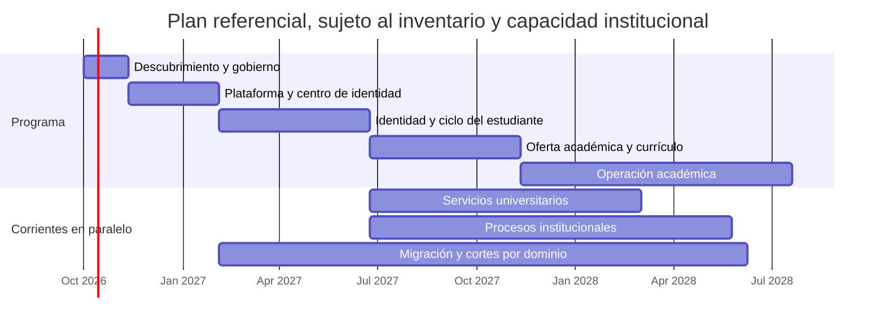

# Cronograma inicial del programa

El patrocinador amplió el alcance funcional a gestión de aspirantes/estudiantes, currículos, asignaturas y calificaciones, perfiles docentes, pagos y recibos, espacios y aulas, biblioteca, permisos de acceso físico, notificaciones y catálogos territoriales. La matriz de capacidades y sus dependencias queda en [alcance ampliado solicitado](discovery/sponsor-university-platform-scope-2026-10.md); son requisitos de producto por validar con los responsables institucionales, no evidencia de que esos módulos estén implementados o aceptados.

Duraciones relativas; no son una fecha contractual. Se recalibran cuando UPTC entregue inventario de aplicaciones y bases, calidad y volumen de datos, responsables de dominio, contratos, dependencias de identidad, restricciones de contratación y tamaño de equipos. El inventario público DTIC de 2024 evidencia variedad de procesos, pero no sirve como cronograma actualizado.

## Etapas y actividades

| Etapa | Actividades principales | Duración indicativa | Resultado verificable |
|---|---|---:|---|
| 0. Descubrimiento y gobierno | Inventariar sistemas, dueños, bases e interfaces; determinar si esta plataforma corresponde, reutiliza o complementa el nuevo sistema académico UPTC formulado como alternativa a SIRA e identificar la relación del sistema «Inscríbete», reportado como implementado para 2026-II; confirmar el canal efectivo de admisiones 2027-I; talleres por proceso; clasificación de datos; reglas actuales; identidad institucional; seguridad, continuidad y contratación; mapa de dependencias | 4–6 semanas | Catálogo vigente, relación formal entre iniciativas, dueños por dominio, riesgos, alcance priorizado y cronograma base aprobado |
| 1. Plataforma y diseño transversal | Monorepo `open-university-os` con dos monolitos desplegables; Java 25/SDKMAN; React/Vite/SCSS; Spring Boot modular con i18n; Compose Watch; MySQL/Flyway; auditoría de estructura; C4; Centro de Identidad Visual | 8–12 semanas | Aplicaciones arrancables, configuración de marca gobernada, permisos locales de preview, bitácora de estructura de solo lectura, propuesta de grupos sin publicación y mediciones de latencia documentadas |
| 2. Identidad y ciclo del estudiante | Descubrir primero pregrado presencial; validar responsables, norma compilada, calendario y convocatoria, sistemas maestros, identificadores, datos mínimos, permisos y excepciones. Después implementar por cortes aprobados: admisión/matrícula, trámites de estudiante y expediente | 3–5 meses (referencial, tras acceso a dueños y sistemas) | Primer recorrido presencial aprobado y probado con datos sintéticos; conciliación y rollback definidos. Sin modelar FESAD/virtual o posgrado por analogía |
| 3. Oferta académica y currículo | Programas, sedes/modalidades, versiones de malla, currículo, asignaturas, primer corte técnico para proponer grupos por periodo y asignatura; después validar prerrequisitos, créditos y equivalencias | 3–5 meses | Catálogo versionado, borradores de grupo auditables sin publicación ni matrícula y migración de ensayo conciliada |
| 4. Operación académica | Periodos, grupos, matrícula, carga de cursos, programación, horarios, calificaciones, certificados y grados | 5–9 meses | Flujo académico completo por cohortes piloto y criterios de corte |
| 5. Servicios universitarios | Bienestar, salud, restaurante, residencias, biblioteca y otros servicios confirmados; pagos e integraciones donde aplique | 4–9 meses por corrientes paralelas | Flujos de servicio integrados y responsables operativos formados |
| 6. Procesos institucionales | Talento humano, finanzas, presupuesto, adquisiciones, inventarios, investigación, extensión, gestión documental, planeación y reportes | 6–12+ meses por corrientes paralelas | Procesos inventariados implementados, conciliados y aceptados por sus dueños |
| 7. Migración, corte y retiro | Ensayos repetibles, calidad y conciliación, pruebas de reversa, paralelo controlado, aceptación, corte y retiro por dominio | 3–6+ meses por dominio, solapados | Acta de corte, fuentes oficiales actualizadas, operación estabilizada y legado retirado según retención |

## Vista temporal de alto nivel

Las fechas del diagrama son una ilustración relativa iniciada el 1 de octubre de 2026, no una fecha autorizada de inicio. El programa completo podría abarcar aproximadamente 18–36+ meses con equipos de dominio y trabajo paralelo; un único equipo, integraciones complejas o datos de baja calidad pueden ampliarlo. La etapa 0 debe resolver también el solapamiento con el nuevo sistema académico reportado por UPTC antes de ampliar dominios que compartan su alcance. Cada hito depende de pruebas de aceptación y ventanas de corte aprobadas, no solo del calendario.

## Línea base de entregas locales v0 — 1–2 de octubre de 2026

Esta sección conserva el estado histórico de las primeras entregas, cuando frontend y backend aún se publicaban por separado. La integración inicial del monorepo `open-university-os` se publicó en el commit `8f42c88`, alcanzable desde `origin/develop`; las referencias a repositorios y workflows separados en los hitos fechados abajo describen esa historia.

| Entrega | Estado en los repositorios de desarrollo | Alcance y gate restante |
|---|---|---|
| Frontend y backend coordinados | Código público en `open-university-frontend` y `open-university-backend`; ambos exponen únicamente `origin/develop`. El backend apunta al SHA de frontend publicado y Compose integra las dos aplicaciones para la vista previa. | Sigue siendo entorno de desarrollo. No es un despliegue UPTC ni tiene SSO institucional; publicar el código no habilita datos ni trámites reales. |
| Integración continua | Workflow por repositorio: frontend corre `npm test`, build con presupuestos y lint; backend selecciona Java 25 desde `.sdkmanrc`, ejecuta Maven `verify` y contratos MySQL 8.4 en un servicio efímero. Ambos workflows usan permisos de solo lectura y acciones fijadas por SHA. | Primeras ejecuciones hospedadas en verde: [frontend, `c4b8bbf`](https://github.com/jdsalasca/open-university-frontend/actions/runs/36862607258) y [backend, `690d1b0`](https://github.com/jdsalasca/open-university-backend/actions/runs/36862633880). El perfil de latencia sigue controlado aparte y no es un SLO certificado. |
| Identidad y permisos | Migración V21 agrega `university_user.user_id` y convierte cada vínculo OIDC opaco en referencia a ese usuario; `/api/v1/me` devuelve `userId`, la consola consulta/selecciona por UUID y las asignaciones usan identidad canónica. La auditoría conserva actor `user_id` y el vínculo `identity_id` concreto; las mutaciones comprueban su relación. | Preview local: perfil Compose `local-preview` emite una sesión developer efímera para inspeccionar consolas, con `/api/v1/me` como fuente de permisos y revocación al salir. OIDC, mapeo productivo y provisión permanecen vacíos; la identidad local no es rol funcional UPTC ni asignación en base. La matriz institucional, asociación/fusión de vínculos y perfiles del ciclo estudiantil requieren aprobación; no hay PII. Ver [ADR-0004](architecture/decisions/ADR-0004-local-preview-developer-session.md). |
| Catálogo de pregrado presencial | CSV prevalidado sin escritura con resumen y muestra de hasta 10 asignaturas; confirmación vuelve a validar y crea borrador, revisión de entradas, cola administrativa por cursor (25 por respuesta, máximo 100), publicación protegida e interfaces públicas para versiones publicadas y su detalle; actualmente vacío. | Formato y códigos deben mapearse con la fuente maestra y los responsables antes de cargar la oferta oficial. |
| Vista de React del catálogo | Ruta `/#programas` con estados vacío/red/error, búsqueda local por código/nombre y adscripción académica vigente (unidad/sede), detalle tabular accesible de asignaturas con búsqueda y filtro de semestre en servidor (máximo 100 por página), y cola administrativa con cursor desde backend, estable ante publicaciones concurrentes. Las ubicaciones del CSV quedan como metadatos de origen y no se muestran como afiliación actual. | Es preview local. El flag autoritativo `programs.available` sigue en `false` y la pantalla no habilita operación institucional. |
| Estructura y periodos | Ruta `/#academia`; árbol de facultades/unidades, sedes, relaciones y programas ordenado desde prioridades persistidas. Cinco editores permiten corregir prioridad con valor esperado y referencia. Formularios protegidos crean facultades raíz tipo `FACULTY`, unidades hijas y su primera relación en una transacción, lugares raíz con tipo explícito, relaciones fechadas entre unidades/lugares y afiliaciones de programa; controles auditados pueden acortar relaciones o reasignar un programa entre unidades/sedes con corte inclusivo, afiliación sucesora y auditoría en una transacción. La consola relee el snapshot administrativo completo (vigencias futuras e históricas) y requiere `academic:structure:read` + `academic:structure:write`. Las escrituras generan eventos auditados. React ahora crea periodos `REGULAR` e `INTERSEMESTRAL` como borradores, carga actividades en revisiones de calendario, pide confirmación para publicar una revisión inmutable, aprueba una revisión publicada con referencia propia y permite abrir/cerrar el periodo con controles separados. La lectura de estados e historial requiere `academic:period:read`; las escrituras requieren `academic:period:write`; la interfaz muestra la administración y sus acciones cuando ambos permisos están presentes. | No hay catálogo institucional ni periodos oficiales cargados. OIDC y grupos internos siguen vacíos; los controles no se activan localmente hasta configurar un proveedor autorizado. Crear raíces no crea afiliaciones y los vínculos jerárquicos no asignan programas; cerrar una relación no elimina sus extremos. La reasignación técnica reutiliza `academic_program_affiliation` y conserva el `program_id`; reglas, destinos y actos oficiales siguen pendientes de validación institucional. Crear, aprobar, abrir o cerrar periodo no publica oferta ni permite inscripción; esos módulos siguen pendientes. Boletines UPTC de 2025 describen una actualización SIRA que cubre PAE, planes, oferta y horarios; revisar ese solapamiento antes de cargar catálogo oficial o diseñar esos módulos. |
| Bitácora de estructura académica | Hito técnico integrado en `develop` (`/#academia`): `GET /api/v1/admin/academic-structure/audit-events` consulta eventos existentes con cursor opaco y filtros por entidad/acción; presenta fecha, acción, actor opaco, referencia y resumen; `academic:structure:read` se exige en API y React. | Entrega de desarrollo con siete pruebas de panel, una de integración React, dos de contrato de cliente y cuatro pruebas MockMvc; página limitada a 100, índices aditivos V20, sin tabla nueva ni datos estudiantiles. OIDC sigue cerrado por defecto y la aceptación institucional queda pendiente. La lectura aborta y limpia filas al perder permiso. |
| Borradores de oferta académica | V23 guarda grupos propuestos asociados a periodos existentes y entradas de currículos publicados; `/#academia` permite consultar, crear, editar con control de versión y revisar auditoría paginada. | Capacidad y fechas son propuestas. No hay publicación, disponibilidad, docentes, espacios, horario, inscripción ni matrícula. Requiere autorización real, maestros y reglas UPTC validados, decisión sobre SIRA/Fase III/UPTConecta y aceptación de las áreas antes de habilitar operación. |
| Preferencia visual clara/oscura | El shell React ofrece un selector accesible `Automático`, `Claro` y `Oscuro` en todas las rutas; el modo automático sigue `prefers-color-scheme`, y solo la preferencia visual explícita se guarda localmente mediante Zustand. Los tokens semánticos de SCSS adaptan shell, formularios, auditoría y superficies sin cambiar la identidad institucional publicada. Los estados y errores del Centro de Identidad Visual conservan contraste WCAG AA en tema oscuro. | Hito de interfaz sin nueva API ni tabla: 7 pruebas del store, una prueba del selector, integración en el shell y suites existentes; dos pruebas Node compilan SCSS y validan contraste AA de estados/errores. Build verificado bajo los presupuestos: entry 276 627 B JS / 16 248 B CSS; `/#programas` 324 967 B JS / 38 485 B CSS; OIDC diferido 68 637 B JS. El tamaño de bundle no certifica velocidad de carga ni el SLO institucional. |
| Ciclo de vida del estudiante | Descubrimiento público ampliado para **inscripción y selección de pregrado presencial**: Acuerdos 053/2008 y 031/2021; Resoluciones 19/28 de 2014; tabla ACRA; calendario 2027-I; cupos 015/2021–2941/2021–5362/2025; vía normalista 026/2009, 1577/2019 y 3418/2019. `/#admisiones` muestra la agenda estática 2027-I como respaldo, consulta convocatorias versionadas, permite elegir entre las publicadas y descargar una instantánea `.ics` con fuentes atribuidas. La consola prepara, revisa y publica calendarios completos por revisión. | La ruta sigue siendo informativa y el `.ics` no se sincroniza. No consulta ni crea aspirantes, expediente, inscripción, selección o matrícula. La consola exige permisos OIDC todavía no configurados y no incluye datos semilla. ACRA y Registro Académico siguen como áreas sugeridas, pendientes de designación como dueños funcionales o custodios técnicos. Relación entre «Inscríbete», SIRA y Fase III, portal 2027-I, fuente maestra, reglas, campos, privacidad y recursos requieren validación institucional. 2027-I no se asume como corte de reemplazo. Ver [hallazgo de Inscríbete](discovery/uptc-inscribete-2026.md). |
| Laboratorio local de experiencia de admisiones | En el preview Vite DEV, `/#admisiones` presenta cuatro tarjetas accesibles con descripción: aspirante, equipo, calendario público y catálogo territorial. Las rutas de aspirante y equipo quedan destacadas; la navegación lateral anuncia ambas experiencias. La ficha sintética recorre una bandeja con búsqueda y filtros; el equipo inicia la revisión, selecciona un motivo fijo de ajuste, la persona aspirante confirma la respuesta demo y el equipo puede reanudar/finalizar. | Entrega navegable para evaluar UX, no inscripción UPTC: sin PII, permisos falsos, postulaciones API, PIN, documentos, pagos ni decisiones; recargar limpia la sesión demo. El build de producción excluye el módulo y tiene una guarda sobre el manifest. Los gates G0–G3 no cambian. Ver [diseño](superpowers/specs/2026-10-02-admissions-experience-lab-design.md) y [flujo](architecture/process-flows.md#laboratorio-local-de-experiencia-de-admisiones-solo-dev). |
| Prototipo de semana y asignaturas | Componentes con seis materias y siete encuentros sintéticos conservados para pruebas aisladas; `/#estudiante-demo` ya no es una ruta en `App.tsx`. | No es una consulta disponible ni está montado por el producto. La consulta real sigue pendiente de fuente maestra, contrato, permiso propio, aislamiento por usuario y validación institucional. Ver [diseño histórico](superpowers/specs/2026-10-02-student-academic-week-preview-design.md) y [estado](architecture/process-flows.md#semana-y-asignaturas-sintéticas--módulo-desconectado). |
| Guía pública de espacios | Ruta `/#espacios` carga una instantánea de lectura con seis sedes, once CREAD y siete puntos informativos de servicio/espacios obtenidos de fuentes oficiales; la búsqueda textual normaliza tildes y filtra lugares y recorridos oficiales por separado. Tipo y municipio afectan solo lugares; conteos, vacíos y limpieza del texto distinguen ambas listas. Enseña fuente/fecha y expone enlace externo de mapa solo después de clic para ubicaciones con dirección publicada. La ficha de Música presenta capacidades anunciadas por área y conserva la diferencia entre pisos en las fuentes. El Comunicado UPTC n.º 252 agrega el anuncio de nuevas áreas de bienestar de Ciencias de la Salud con su procedencia. Las opciones municipales se deduplican y ordenan desde los lugares publicados; un municipio que desaparece en una nueva instantánea deja de limitar los resultados. Etiqueta/visibilidad desde branding y endpoint anónimo `GET /api/v1/spaces`. | Vista local informativa; fuentes consultadas el 1, 3 y 4 de octubre de 2026 y actualizaciones originales conservadas cuando se publican. No es inventario exhaustivo, tabla MySQL, edición administrativa, mapa incrustado, geolocalización, coordenadas, navegación interior, disponibilidad ni garantía de accesibilidad. Rondón, Música y Ciencias de la Salud omiten el mapa cuando no existe una dirección postal publicada. Confirmar ubicación de Música y designar responsable antes de una operación institucional. Ver [diseño](superpowers/specs/2026-10-01-space-guide-design.md) y [descubrimiento de espacios](discovery/uptc-space-reservations.md). |
| Directorio público de servicios estudiantiles | Ruta `/#estudiantes` presenta once fichas estáticas de Bienestar, Biblioteca, sistemas y servicios académicos, con búsqueda local insensible a mayúsculas/tildes, filtros, contador accesible y estado vacío recuperable. Añade una agenda cronológica con los 18 hitos públicos de pregrado 2026-II que ACRA muestra para varias modalidades y poblaciones, procedencia/fechas y descarga `.ics`. El exportador compartido conserva la lógica de fin inclusivo ya usada por admisiones. | Instantánea informativa consultada el 5 de octubre de 2026; ACRA la muestra actualizada el 17 de septiembre. Enlaces externos se abren solo por clic. Sin API, PII, formularios, préstamos, reservas, persistencia ni estado de una persona. No afirmar dueño institucional formal a partir de la fuente. Ver [revisión y calendario](discovery/uptc-student-services-directory-2026-10.md) y [flujo](architecture/process-flows.md#directorio-público-de-servicios-estudiantiles). |
| Catálogo territorial de referencia | API de lectura con snapshot DANE DIVIPOLA/MGN 2025: 33 departamentos y 1.122 entidades; códigos como texto y categorías preservadas. Incluye selector separado en /#admisiones únicamente en Vite DEV. | Instantánea atribuida; años por fila 2024/2025. Sin MySQL ni llamada externa en ejecución, sin colegios ni datos de aspirantes. La revisión del directorio escolar encontró consulta interactiva DUE, base nominal publicada hasta 2022 y cifras agregadas hasta 2024, pero ningún contrato actual de integración validado. No importar el archivo 2022 ni automatizar el portal; ver [revisión de fuente escolar](discovery/uptc-school-directory-source-review-2026-10.md). |
| Latencia MySQL | Siete perfiles de medición con Java 25.0.4/SDKMAN y MySQL 8.4 desechable, más uno contra el MySQL 8.4 de Compose con Java 25.0.4.1; 10.000 filas sintéticas, 10 calentamientos, 50 muestras y concurrencia 1. Las 24 medias documentadas están entre 9,746 y 25,258 ms; los ocho contratos MySQL pasaron en la revalidación local más reciente, incluido el perfil de estructura. | Las medias locales observadas cumplen `<50 ms`; la revalidación desechable más reciente midió 12,789 ms para cola de borradores, 11,149 ms sin filtro y 18,432 ms con filtro por subcadena. Máximos/p99 aislados de 170,006 ms (cola) y 175,024 ms (búsqueda) aparecieron en corridas anteriores distintas y no reaparecieron en las revalidaciones posteriores documentadas. Con 50 muestras nearest-rank p99 es el máximo; la causa queda sin determinar. No se certifican percentiles estables ni SLO de UPTC. Ver [línea base y corrida vigente](performance-baseline.md), [runbook](runbook/local-development.md#contrato-y-perfil-mysql-de-paginación-curricular), [mediciones detalladas](superpowers/specs/2026-09-30-curriculum-mysql-search-performance.md), [especificación de paginación](superpowers/specs/2026-09-30-curriculum-server-pagination-design.md) y [ADR-0002](architecture/decisions/ADR-0002-curriculum-search-snapshots.md). |
| Latencia lectura de estructura | Contrato MySQL 8.4 con 100 unidades, 20 sedes y 1.000 afiliaciones sintéticas; 10 calentamientos, 50 muestras y concurrencia 1. Mide servicio/JDBC y respuesta JSON MockMvc por separado. | Cuatro corridas promediaron 16,083/30,425 ms (Compose), 12,745/27,597 ms (contenedor temporal SDKMAN), 14,208/27,675 ms (Compose) y 12,201/26,970 ms (contenedor temporal SDKMAN), servicio/JDBC y MockMvc respectivamente; todas pasan el gate local `<50 ms`. No caracterizan volumen UPTC, concurrencia institucional, red/TLS, navegador ni hardware productivo. Ver [línea base](performance-baseline.md), [especificación](superpowers/specs/2026-10-01-academic-structure-read-performance.md) y [runbook](runbook/local-development.md). |
| Carga por pantalla React | Build limpio del 1 de octubre de 2026 tras `npm ci`: entry de 265,98 kB JS y 19,28 kB CSS; `/#programas` suma 295,99 kB JS y 41,47 kB CSS (337,46 kB combinados), 28,7 % menos bytes brutos que el bundle único previo. `npm run build` mide el manifiesto y falla si entry (280 kB JS/21 kB CSS), ruta de programas (325 kB JS/48 kB CSS) u OIDC diferido (75 kB JS) rebasan sus presupuestos preventivos. | La medición acredita tamaño de artefactos, no tiempo de descarga/renderizado, LCP, dispositivos móviles ni latencia de producción. Con OIDC configurado, el chunk agrega 68,64 kB JS (17,41 kB gzip); el beneficio principal es diferir su análisis hasta que arranca el shell. Los presupuestos son guardas locales de regresión, no un SLO del navegador. Ver [runbook](runbook/local-development.md#carga-por-pantalla-react). |
| Carga por pantalla React tras `/#estudiantes` | Build de producción verificado el 5 de octubre de 2026: entry 281.174 B JS / 22.650 B CSS; `StudentServicesPage` continúa como chunk diferido de 16.920 B JS / 10.800 B CSS (4.590 / 2.350 B gzip); helper iCalendar compartido 2.760 B JS (1.400 B gzip); ruta `/#programas` 343.776 B JS / 55.055 B CSS más 62.382 B JSON; OIDC diferido 68.637 B JS. `npm run build` verificó los presupuestos vigentes. | El aumento en la ruta de estudiantes incorpora el calendario y el exportador compartido; la agenda sigue fuera del entry inicial. Los tamaños no miden tiempo de descarga/renderizado, LCP ni SLO institucional. Ver [build/guardas del frontend](../frontend/scripts/check-bundle-budget.mjs) y [capturas de la entrega](evidence/round-2026-10-05-student-calendar/README.md). |

La plantilla sin filas [academic-curriculum-template.csv](templates/academic-curriculum-template.csv) documenta el contrato de importación técnico; no es un formato exportado de un legado ni una lista de programas aprobada. La [revisión de fuentes públicas para catálogo y registro](discovery/academic-curriculum-source-survey.md) confirma planes por cohorte y formatos públicos heterogéneos, sin un export maestro único localizado en esta revisión. Un extracto indexado de una página de programa describe además una transición del plan 2018 al 2026; el contrato actual versiona mallas por cohorte pero no define equivalencias ni migraciones individuales entre planes. Ese flujo requiere reglas aprobadas por los responsables curriculares. El hito H5 requiere validar fuentes/campos con los responsables y no se considera cumplido solo porque exista el endpoint o la interfaz.

### Secuencia de trabajo para habilitar estructura y periodos

Los incrementos de software ya disponibles en `develop` son una base técnica, no una habilitación institucional. Las duraciones siguientes son estimaciones relativas al acceso a las áreas dueñas y a datos no productivos; se ajustan en conjunto con ACRA, Secretaría General, DTIC y responsables de facultad/sede.

| Orden | Actividad | Duración indicativa | Dependencia y criterio de salida |
|---:|---|---:|---|
| 1 | Confirmar catálogo maestro vigente de facultades, escuelas, unidades, sedes/campus y códigos estables; acordar dueño y procedencia de cada dato | 1–2 semanas | Responsable designado; fuente y reglas de vigencia aprobadas |
| 2 | Mapear el catálogo existente a unidades responsables y lugares; revisar jerarquía, orden y afiliaciones con facultades/sedes piloto | 1–2 semanas | Ningún programa duplicado; conteos y excepciones conciliados; aprobación de los dueños |
| 3 | Validar institucionalmente nomenclatura, fechas, actividades, órgano que aprueba y actos que habilitan apertura/cambios/cierre | 1–3 semanas | La UI y API ya permiten el flujo versionado con fechas/referencias ingresadas por un operador autorizado; falta aceptar catálogo de reglas, fuentes y responsables. No precargar el calendario ni inferir reglas intersemestrales. |
| 4 | Integrar SSO OIDC y mapear grupos institucionales a permisos de lectura/escritura de estructura y periodos | 2–4 semanas, en paralelo | DTIC valida issuer, audience, claims y matriz de mínimo privilegio; pruebas 401/403 pasan |
| 5 | Habilitar OIDC institucional y aceptar los formularios protegidos de maestros, relaciones, prioridades, cierres, reasignación y periodos. | 2–4 semanas | DTIC valida los grupos y permisos en el proveedor autorizado; ACRA/Registro y la autoridad académica validan proceso, nomenclatura y referencias. La reasignación cuenta con API, migración V19, formulario de confirmación y pruebas técnicas; faltan aceptación funcional de las reglas y una prueba de reversa antes de habilitar operación. No se crean usuarios ni tokens semilla. |
| 6 | Ejecutar aceptación del flujo regular e intersemestral en un entorno institucional no productivo; probar enmiendas, cierre, conciliación, respaldo y reversa | 2–3 semanas | Acta de aceptación de dueños; casos borde y concurrencia aprobados; rollback ensayado |
| 7 | Diseñar e implementar grupos/oferta, matrícula y controles de capacidad por curso; usar como antecedente comprobable el calendario intersemestral de 2024 (solicitud, comité curricular, aprobación de facultad, pago, programación/registro en SIRA, desarrollo, notas y cierre) y validar su vigencia, alcance y sistema actual con los dueños antes de configurarlo | 6–10+ semanas | Reglas y datos maestros aprobados; flujo vigente conciliado por modalidad/sede; el conteo de 20–35 y la excepción de 2024 no se aplican a otra cohorte sin confirmación normativa |

Las actividades 1–6 son gates para poner en operación la administración de la estructura y de calendarios. Los controles de transición, la edición auditada del orden, las altas raíz e hijas, la creación de relaciones entre entidades existentes, cierres fechados y reasignación atómica de programas ya se conectan a la API, pero permanecen cerrados hasta configurar OIDC y grupos aprobados y validar el proceso institucional. La alta hija crea la unidad y su primera relación en una transacción, con una sola referencia; la matriz de tipos padre/hija aún requiere validación institucional. El cierre identifica una versión por sus identidades estables e inicio; solo acorta `valid_through`, es idempotente para la misma fecha y registra `UNIT_RELATION_CLOSED`, `SITE_RELATION_CLOSED` o `PROGRAM_AFFILIATION_CLOSED` con actor y referencia. La reasignación compara el inicio y fin esperados, termina la fila fuente el día anterior, crea una sucesora con el mismo `program_id` y registra `PROGRAM_AFFILIATION_REASSIGNED` en la misma transacción; su ruta es `POST /api/v1/admin/academic-structure/programs/{programId}/affiliations/{affiliationId}/reassign`. No añade otra entidad de programa y rechaza destino inactivo, vigencia incompleta, versión obsoleta y solapamientos. La interfaz muestra el corte antes de confirmar y relee ambos snapshots tras éxito o conflicto sin reintentar el POST. La [especificación de reasignación](superpowers/specs/2026-10-01-program-affiliation-reassignment-design.md) y el [plan de implementación](superpowers/plans/2026-10-01-program-affiliation-reassignment.md) conservan el contrato y casos de aceptación. Con lectura administrativa, las afiliaciones futuras e históricas aparecen en una lista separada con su intervalo, mientras el árbol representa únicamente la vigencia actual. Al perder lectura se oculta la línea temporal y se muestra solo el árbol público vigente. Las relaciones jerárquicas no afilian programas; no se carga el maestro institucional antes de validar sus fuentes. La etapa 7 depende además de implementar oferta y matrícula, actualmente ausentes.

## Desglose del siguiente hito: pregrado presencial

Estimación de trabajo posterior a que UPTC designe responsables y facilite documentación no productiva. La investigación web localizó la Resolución 111/2026, el Acuerdo 053/2008, las Resoluciones 19/28 de 2014, tabla enlazada por ACRA y la cadena de cupos especiales 015/2021–2941/2021–5362/2025; también las derogatorias de Acuerdos 017/2001 y 120/2006 y del artículo 17 del Acuerdo 130. La página ACRA publica para 2027-I una vía normalista, con fuentes 026/2009, 1577/2019, 3418/2019 y Ley 2481/2025 que requieren modelado separado. UPTC reportó la implementación de «Inscríbete» para 2026-II, pero la relación con SIRA/Fase III y el portal de 2027-I no están identificados; resolver este punto es una dependencia de entrada y evita duplicar registro y documentos. También se localizó el Decreto 0617/2026, reglamentario de la Ley 2367/2024 sobre financiación progresiva de derechos de inscripción; el MEN anunció inicio en el primer semestre de 2027, pero sus páginas presentan diferencias de número de decreto y resumen de elegibilidad frente al acto firmado. ACRA publica venta de PIN para 2027-I y no explica su conciliación con el beneficio. El alcance, el reglamento operativo, recursos y tratamiento de PIN requieren validación formal y deben mantenerse separados de la selección. El MEN también reportó socialización de un proyecto de reglamento de la Ley 2481/2025 para las Escuelas Normales Superiores; no se localizó texto final en las fuentes consultadas. El siguiente trabajo es validar matriz y reglas operativas con ACRA, Secretaría General y Jurídica, no repetir la búsqueda inicial. No incluye espera de aprobaciones ni contratación y no constituye fecha comprometida.

El calendario 2027-I fija el cierre de inscripción para el 23 de octubre de 2026 y resultados para el 13 de noviembre. Como el desarrollo aún está en descubrimiento y sin contratos de datos/SSO aprobados, esta convocatoria no es el objetivo de reemplazo operativo. La fecha de un primer piloto debe seleccionarse con UPTC después de cerrar G0–G3.

| Orden | Actividad | Duración estimada | Dependencia / salida de control |
|---|---|---:|---|
| 1 | Validar la matriz pública ya localizada: Acuerdos 130 y 053/2008; Acuerdo 031/2021; Resoluciones 19/28 de 2014; tabla ACRA; Acuerdo 015/2021 y Resoluciones 2941/2021 y 5362/2025; Resolución 111/2026; Ley 2367/2024 y Decreto 0617/2026 para derechos de inscripción; derogatorias de 017/2001 y 120/2006; regímenes históricos 019/2000 y 061/2000; vigencia del Acuerdo 030/2007; y ruta normalista (Resolución 026/2009, 1577/2019, 3418/2019, Ley 2481/2025 y convenios vigentes) | 1–2 semanas | Matriz consolidada y aceptada por Secretaría General/Jurídica y dueño del proceso; reglas de selección, PIN, beneficio MEN, fondos/reglamento operativo, discrepancia Decreto 0616/0617 y elegibilidad, categorías de cupo, discapacidad, ruta normalista, erratas y reglas de cohorte aclaradas |
| 2 | Recorrer con ACRA y programas piloto el subproceso priorizado de inscripción y selección de aspirantes; documentar su límite con matrícula inicial y sus recursos/excepciones | 2–3 semanas | Flujo, actores, reglas, excepciones, plazos y punto de corte funcional aceptados |
| 3 | Con la participación funcional sugerida de ACRA/Registro Académico, DTIC, Vicerrectoría Académica e instancia del nuevo sistema, mapear el Departamento ACRA central y las funciones/contactos locales por seccional. La TRD y el Cuadro de Clasificación Documental 2025 reconocen la oficina productora ACRA, código 4130000, con series de convocatorias, historiales académicos y registros vinculados a SIRA; establecen plazos archivísticos de 2+8 años para convocatorias y 2+78 para historiales de pregrado/posgrado. Son evidencia archivística, no confirmación de sistema fuente operativo, dueño por entidad ni regla de borrado de bases activas. Inventariar el SGDEA y aclarar la sigla “SGDA” hallada en una referencia de Sogamoso; confirmar relación con Fase III y «Inscríbete», portal efectivo de 2027-I, productos vigentes, sistemas fuente, identidades y contratos de persona, aspirante y estudiante; perfilar calidad y volumen sin copiar datos personales a desarrollo | 2–3 semanas | Decisión formal de frontera y reutilización; mapa de sistemas e interfaces, catálogo minimizado y plan de ensayo/conciliación; RACI por entidad/sede; confirmar subseries, hitos de cómputo y disposición con Gestión Documental; aclarar retención de aspirantes no admitidos; validar campos antes de implementarlos |
| 4 | Aprobar autenticación, matriz actor-permiso, retención, trazabilidad, criterios de aceptación y escenarios sintéticos AAA | 1–2 semanas | Contratos de API y pruebas de aceptación firmados por responsables |
| 5 | Implementar la ruta vertical de inscripción y selección de pregrado presencial con TDD, migración Flyway, auditoría, observabilidad y diagramas actualizados, después de los gates normativos y de datos | 4–6 semanas | Flujo aprobado en entorno no productivo; casos felices y bordes de dos opciones, ponderación por versión, aptitud, empate, resultados históricos, cupos especiales, permisos y concurrencia; vía normalista separada solo si G1 la incluye, todo con datos sintéticos |
| 6 | Ensayar integración/migración, reversa y carga representativa; medir API y SQL por separado (promedio, p50/p95/p99) | 2–3 semanas | Informe de conciliación/performance y decisión de avanzar, corregir o no cortar |

Las actividades 2 y 3 pueden solaparse parcialmente. La duración nominal resultante es de unas 12–19 semanas desde el acceso a responsables y documentos, pero la decisión de relación con la Fase III institucional es una condición de entrada para construir cualquier módulo coincidente; si se demora, desplaza ese trabajo. Las aprobaciones y hallazgos también pueden ampliar el rango. El corte priorizado cubre inscripción y selección; la matrícula inicial queda como etapa posterior, no como parte asumida del primer flujo. No se ejecuta corte ni se usa una fuente productiva antes de aceptación explícita del dueño de dominio. Ver el [descubrimiento preliminar](superpowers/specs/2026-09-30-pregrado-admissions-process-discovery.md), el [hallazgo de Fase III](discovery/uptc-new-academic-system-phase-iii.md) y el [cronograma relativo propuesto](superpowers/plans/2026-09-30-pregrado-admissions.md).

## Cadencia y gates por dominio

1. Descubrimiento y propietario: proceso, estados, reglas, fuente oficial, datos y usuarios.
2. Especificación de aceptación y contrato del dominio.
3. Implementación en TDD y revisión de impacto arquitectónico, privacidad y rendimiento.
4. Perfilado, mapeo, limpieza autorizada y ensayos de migración con datos ficticios o debidamente anonimizados.
5. Aceptación funcional y reconciliación de control totals con el responsable de datos.
6. Operación paralela de lectura o sombra; una sola fuente de escritura oficial.
7. Corte reversible, monitorización, estabilización y retiro de legado según archivo/retención.

## Hitos próximos

- H0: inventario institucional vigente, relación formal con la iniciativa UPTC de nuevo sistema académico/Fase III y propietarios de dominios identificados.
- H1: monorepo `open-university-os` reproducible, con SDKMAN Java 25 y Compose local (completado en `8f42c88`).
- H2: Centro de Identidad Visual con administración autorizada, vista previa, publicación y auditoría.
- H3: autenticación federada y roles UPTC confirmados. La Resolución 4222/2023 publica la función de identidad digital de la cuenta institucional; los planes DTIC enumeran A-RI-P20 para Gestión de Identidad y Acceso y enlazan la provisión/eliminación de credenciales administrativas con procedimientos de vinculación y entrega de cargos. Las Resoluciones 4529/2023, 1372/2023 y 1375/2025 identifican gobierno de seguridad y protección de datos. La evidencia pública consultada todavía no entrega la matriz de permisos funcionales de este producto ni define issuer, claims, grupos, ámbitos por cargo/unidad, asignación/revocación o responsabilidad por sistema; se requiere validación de DTIC y de los dueños. El modelo híbrido de asignaciones locales con ámbitos tipados está propuesto, no aprobado, en la [especificación de identidad](superpowers/specs/2026-10-01-identity-and-scoped-access-proposal.md).
- H4: ruta de inscripción y selección de aspirantes de **pregrado presencial** probada en un entorno UPTC no productivo. El patrocinador priorizó el subproceso; matrícula inicial queda para una etapa posterior. Ya se investigaron las normas ordinarias, especiales y de normalistas publicadas para 2027-I, incluidas derogatorias, la Ley 2481/2025 y rutas por convenio. UPTC reportó la implementación de «Inscríbete» con PIN y repositorio documental para 2026-II, mientras la Resolución 111/2026 nombra SIRA para el proceso 2027-I; la relación entre ambos y la Fase III y el portal efectivo requieren decisión formal antes de construir. El MEN socializó un proyecto de reglamentación para la Ley 2481, sin texto final localizado. El Decreto 0617/2026 regula financiación progresiva de derechos de inscripción y el MEN anuncia inicio en 2027-I, pero el comunicado confunde el número del decreto y resume elegibilidad de forma distinta al acto firmado; la convocatoria UPTC 2027-I publica venta de PIN sin documentar el cruce operativo. Reglamentación, fondos y tratamiento de PIN requieren validación formal y se mantienen separados de selección. Falta consolidar vigencia, ponderaciones, cupos/discapacidad, selección normalista, operación, cohorte piloto, sistemas maestros, contrato de datos y permisos. Ver [descubrimiento del ciclo](discovery/student-lifecycle-baseline.md), la [especificación preliminar de admisiones](superpowers/specs/2026-09-30-pregrado-admissions-process-discovery.md), el [plan relativo](superpowers/plans/2026-09-30-pregrado-admissions.md), el [control de Fase III](discovery/uptc-new-academic-system-phase-iii.md), el [hallazgo de Inscríbete](discovery/uptc-inscribete-2026.md) y la [plantilla de validación institucional](discovery/pregrado-presencial-validacion-institucional.md).
- H5: catálogo de programas, mallas, versiones curriculares y asignaturas aprobado.
- H6: primer corte de dominio ejecutado con conciliación y reversa ensayada.

## Entregas funcionales que siguen

Estas capacidades amplían la vista previa hacia la vida universitaria; el orden refleja dependencias entre identidad, maestros y operación. Las páginas oficiales UPTC ya publican servicios de inscripción de materias, registro de notas, consulta de horarios/calificaciones, notificaciones y SIRA/UPTConecta; esto confirma solapamientos, no sus APIs, sistemas fuente ni disponibilidad operativa actual. No se fijan fechas hasta validar relaciones, datos maestros, responsables, volumen y capacidad de los equipos.

| Orden | Entrega | Primer corte útil | Dependencia antes de operación |
|---|---|---|---|
| 1 | Guía de espacios (v0 inicial) | Directorio navegable de 23 ubicaciones publicadas y cinco rutas oficiales para consultar préstamo, asignación o alquiler; búsqueda por texto, tipo y municipio, atribución y enlace de mapa solo para direcciones publicadas. La ficha de Música muestra por separado las capacidades anunciadas y las fuentes que discrepan sobre el piso. El Auditorio Goranchacha enlaza su comunicado de apertura y muestra el aforo aproximado publicado como anuncio. La sección de rutas no consulta cupos, no recibe solicitudes ni confirma reservas. | No es un inventario universitario completo. La ubicación de Música requiere confirmación de Biblioteca. La capacidad de Goranchacha no indica disponibilidad. Para edificios, coordenadas, accesibilidad, edición institucional, reglas vigentes o disponibilidad, confirmar dueño de datos y ciclo de mantenimiento. No representar rutas interiores desde el directorio actual. |
| 1a | Directorio público de servicios estudiantiles | Búsqueda sin tildes y filtro por categoría sobre cuatro fichas públicas de Bienestar y Biblioteca; contador y recuperación de estado vacío. | Preview informativo estático. Validar contenido, vigencia y responsable editorial con las áreas antes de tratarlo como catálogo oficial. Sin backend, datos personales, trámites ni disponibilidad. |
| 2 | Usuarios, identidad y permisos por ámbito | La base técnica de sesión, catálogo cerrado de roles, scopes universitarios y consola de asignación/revocación auditada ya está implementada. El alcance solicitado fija un solo `user_id` canónico para aspirantes, admitidos, estudiantes, docentes, administrativos y egresados; el esquema técnico actual conserva solo identidad federada opaca y requiere un diseño de evolución antes de registrar personas o aspirantes. | El [diseño híbrido de acceso](superpowers/specs/2026-10-01-identity-and-scoped-access-proposal.md) continúa pendiente y debe reconciliarse con el requisito de usuario canónico de [alcance ampliado](discovery/sponsor-university-platform-scope-2026-10.md). DTIC define proveedor, issuer/subject, claims, MFA, revocación y provisión inicial; Talento Humano valida la fuente de cargos; las áreas aprueban la matriz actor–acción–ámbito. No habilitar operación con la configuración local vacía ni duplicar cuentas por perfil. |
| 3 | Facultades, programas y árbol académico | Maestro temporal de facultades/unidades/sedes y afiliaciones de programas, con carga, relaciones ordenadas y cambios auditados. La vista `/#academia` ofrece altas iniciales, orden, cierres de relaciones, reasignación compuesta auditada y ciclo administrativo de periodos. La reasignación conserva la identidad del programa y cierra/crea afiliaciones en una transacción, con pruebas de concurrencia y conflicto; su diseño queda registrado en la [especificación](superpowers/specs/2026-10-01-program-affiliation-reassignment-design.md). | No hay maestro UPTC ni calendario oficial cargados. Siguen pendientes el dueño y la fuente maestra por entidad, códigos oficiales, jerarquía, sedes regionales, vigencias, referencias y aceptación. No completar el árbol con datos públicos incompletos ni usar SQL manual para reasignar. |
| 4 | Mallas, currículos y asignaturas | Importar CSV versionado, validar antes de guardar y previsualizar una comparación informativa de solo lectura con la última versión publicada de la identidad exacta; clasifica nuevas, retiradas, modificadas y sin cambio, con conteos completos y hasta diez ejemplos por categoría. El backend verifica publicación, identidad de programa, consistencia de conteos y unicidad de códigos antes de comparar. El flujo permite crear borrador, auditar y publicar desde `/#programas`; la comparación no crea borrador ni evento ni altera el contrato HTTP. | Export oficial y licencia/permiso, códigos y claves de equivalencia aprobados por coordinación curricular. Versionar por cohorte; homologar entre planes solo con matriz normativa y autoridad curricular. No declarar el preview como oferta oficial ni inferir equivalencias. |
| 4a | Catálogos territoriales de referencia | Endpoints públicos de lectura de DIVIPOLA, con códigos textuales y fuente atribuida; el selector de prototipo ya no está montado en la aplicación. | El snapshot DANE no es directorio de colegios ni maestro institucional UPTC. La última base escolar nominal pública encontrada corresponde a 2022; el boletín 2025 solo ofrece agregados 2015–2024. Obtener un contrato/extracto vigente autorizado y validar actualización/campos antes de incorporarlo a una inscripción real. Ver [revisión de fuente escolar](discovery/uptc-school-directory-source-review-2026-10.md). |
| 5 | Admisiones y selección | El primer incremento administra convocatorias informativas versionadas, permite preparar borradores, publicar revisiones con referencia y consultar hasta 100 calendarios publicados; la ruta conserva 2027-I como respaldo y permite exportar un `.ics` personal. El siguiente corte debe completar inscripción y selección sin mezclar matrícula inicial. | Gates G0–G3 del [plan de admisiones](superpowers/plans/2026-09-30-pregrado-admissions.md); resolver relación con SIRA, «Inscríbete» y Fase III, sistema efectivo 2027-I, dueño, PIN/documentos, privacidad, normas y fuente. Los permisos no están asignados y no hay datos reales ni seeds; no operar una segunda inscripción antes del acuerdo formal. |
| 6 | Oferta, grupos, cupos e inscripción de materias | Primer corte técnico disponible: borradores auditables de grupo asociados a periodo y asignatura curricular publicada. Siguiente alcance: definir publicación y capacidad efectiva, mostrar opciones al estudiante y gestionar inscripción; mantener intersemestral y ordinario separados. | Confirmar proceso actual, ventanas/citas, cupos, prioridades, prerequisitos, repeticiones, topes, cancelación, concurrencia, pagos y fuentes en SIRA/UPTConecta. La página pública de inscripción de materias no autoriza inferir estos casos. |
| 7 | Mis asignaturas y horario | Consulta del estudiante autenticado de inscripciones propias, horarios, ubicación, estado y fecha de actualización. | Identidad vinculada a la fuente maestra de matrícula; permiso de lectura propio; contrato autorizado y prueba de aislamiento entre cuentas. SIRA/UPTConecta ya anuncian capacidades relacionadas; ver [revisión de fuentes docentes y notas](discovery/uptc-teacher-profile-and-grade-systems-review-2026-10.md). |
| 8 | Perfil y asignación de docentes | Perfil profesional de lectura con adscripción aprobada, y gestión de quién dicta cada grupo, separando datos públicos del expediente laboral. | SIRD gestiona información laboral/docente; páginas públicas muestran extractos heterogéneos. Identificar fuente, dueño, campos publicables, vigencia, permisos y autorización de foto/contacto; asignación docente requiere contrato separado. Ver [revisión de fuentes](discovery/uptc-teacher-profile-and-grade-systems-review-2026-10.md). |
| 9 | Registro y consulta de notas | El antiguo formulario con grupos y referencias `DEMO-*` permanece aislado para pruebas; `/#calificaciones-demo` no está registrado en `App.tsx`. | No está disponible como flujo de producto ni calcula o publica resultados. Antes de una operación real, UPTC debe confirmar relación con SIRA, fuente de grupo, autorización docente-grupo, calendario, escala, redondeo, intentos, cierres, reclamos, correcciones, auditoría y autoridad. |
| 10 | Programación y asignación de salones | El cliente de propuesta de aulas y sus escenarios sintéticos no están conectados a una página de producto; `/#aulas-demo` no está registrado en `App.tsx`. | No consulta inventario, horarios ni reservas. La operación futura requiere inventario vigente, datos de grupos, reglas de prioridad, responsables y conciliación con SIRA/Mesa de Servicio. La asignación académica se separa del préstamo/alquiler (ver [descubrimiento de reservas](discovery/uptc-space-reservations.md)). |
| 11 | Reserva y préstamo de espacios | Solicitud/consulta de préstamo o alquiler por tipo de recurso, con unidad responsable, revisión de disponibilidad y aprobación visible. | Las fuentes publican flujos distintos para auditorios, escenarios deportivos, salas de biblioteca, aulas de informática y espacios de personal. Validar vigencia normativa, responsables, inventario/aforo, disponibilidad, tarifas, datos requeridos y canal actual antes de habilitar solicitudes o reservas; ver [descubrimiento de reservas](discovery/uptc-space-reservations.md). |
| 12 | Notificaciones institucionales segmentadas | El backend publica avisos inmutables con referencia institucional y auditoría y sirve «mis avisos» según los ámbitos vigentes; la interfaz ofrece la lectura en `/#avisos` (solo sesión) y la consola `/#avisos-admin` para publicar con `notices:write`, que oculta el formulario sin ese permiso. Ningún perfil concede todavía `notices:read`/`notices:write`; preferencias, lectura, vencimiento según el canal aprobado. | Identificar alcance vigente de notificaciones de UPTConecta, canal institucional, responsable editorial, audiencias autorizadas, consentimiento/urgencia, manejo de datos de contacto y auditoría. No guardar correos/teléfonos ni enviar mensajes reales en la vista local. |
| 13 | Catálogo y circulación de biblioteca | Base técnica local en `/#biblioteca`: títulos con autores, ejemplares con código de barras, préstamo con la fecha de vencimiento que fija la unidad prestadora, devolución y retiro de circulación con actor y referencia auditables, listado de préstamos pendientes con marca de vencido y búsqueda de títulos por nombre con comodines tratados como literales. La consola separa `library:read` de `library:write` y revalida la sesión ante 401/403. | No hay inventario UPTC ni sistema bibliotecario conectado: el maestro debe venir del responsable institucional. Antes de operar hay que validar el sistema fuente, códigos de barras, reglas de préstamo/renovación/multas, perfiles del bibliotecario, privacidad de lectores y la búsqueda autorizada del `user_id` del lector (hoy no existe, así que el préstamo no se ofrece en la interfaz). No cargar inventario de ejemplo como oficial, no publicar disponibilidad ni cupos y no calcular plazos ni sanciones. Ver [alcance ampliado](discovery/sponsor-university-platform-scope-2026-10.md). |

La primera entrega funcional de admisiones (`/#admisiones`) informa la agenda de respaldo 2027-I, permite elegir convocatorias publicadas y descargar una instantánea `.ics`; la consola versiona calendarios con referencia y auditoría cuando se configure autorización institucional. No captura solicitudes, no se sincroniza y no determina admisión. La guía (`/#espacios`) muestra 24 ubicaciones con procedencia y cinco rutas oficiales; las capacidades de Música, el aforo aproximado de Goranchacha y las áreas de bienestar anunciadas en Ciencias de la Salud son avisos públicos, no un inventario ni una medida de disponibilidad. El catálogo y las relaciones académicas cuentan con operaciones locales, pero no datos oficiales. La consola de periodos ya gestiona su ciclo independiente; el nuevo panel crea únicamente borradores auditables de grupos y no los publica ni habilita cupos o matrícula. La base técnica de identidad y permisos por ámbito quedó entregada y se mantiene cerrada hasta completar sus gates institucionales. Las siguientes entregas deben cerrar recorridos funcionales —validación de oferta/publicación, inscripción, consulta de asignaturas, perfiles docentes y notas— con interfaces y pruebas, pero sin crear una segunda fuente para procesos ya publicados por SIRA, UPTConecta o «Inscríbete». El perfilado de rendimiento queda para después, como pidió el patrocinador, de consolidar los flujos funcionales y sus contratos.

Los componentes de prototipo de semana estudiantil, calificaciones y asignación de aulas permanecen aislados para pruebas, pero `App.tsx` ya no registra esas rutas y el manifest de producción los excluye. No son herramientas operativas ni sustituyen inventarios, horarios o sistemas académicos oficiales.

## Hito integrado — 3 de octubre de 2026

| Entrega | Resultado verificable | Estado y siguiente paso |
| --- | --- | --- |
| Portada unificada | `/#resumen` es la entrada predeterminada y conserva `/#inicio` para identidad visual. Usa la marca pública y muestra accesos administrativos únicamente con los permisos efectivos de `/api/v1/me`; cada módulo mantiene su autorización en backend. | Funcionalidad y regla de ramas publicadas en `open-university-frontend` `develop`: `ddbfb618e5c4ca2a2a0603763c44c95d13e20678`, luego `ca10b71`. Sin permisos, no presenta enlaces administrativos. |
| Directorio público de pregrado | `/#programas` incorpora una instantánea JSON versionada con 79 programas en 11 facultades, 72 marcas literales «Programa ofertado», búsqueda, filtros y enlaces oficiales. Está separada del catálogo curricular interno y de MySQL. | Informativa; no acredita convocatoria, fechas, cupos ni admisión. La procedencia y mantenimiento quedan documentados en `discovery/uptc-undergraduate-directory-snapshot-2026-10.md`. |
| Prototipos fuera de producto | Las rutas de laboratorio sintético de admisiones, semana académica, calificaciones y asignación de aulas ya no se montan desde `App.tsx`; `/#admisiones` conserva calendario público y consola protegida. | No conectarlos a datos personales ni decisiones académicas sin fuente, contrato y aceptación institucional. |
| Validación local del frontend | `npm test`: 484 pruebas Vitest y 21 guardas auxiliares aprobadas; `npm run lint` y `npm run build` aprobados; presupuesto del bundle verificado. | La medición de bytes no certifica tiempos de carga ni el objetivo MySQL. El estado de la CI remota se consulta por el SHA publicado. |

La revalidación del 4 de octubre de 2026 conserva la discrepancia pública sobre los espacios de Música: el comunicado UPTC del 24 de marzo indica el segundo piso y la página de Biblioteca mantiene el primero. La apertura directa de las tres fuentes volvió a devolver HTTP 502 y no se obtuvo confirmación de la unidad responsable. No se elegirá una ubicación ni se inferirán dirección, mapa, reservas o disponibilidad; mientras esa atribución se valida, se puede avanzar en cortes funcionales independientes. Véase el documento [Revalidación de ubicación de Música](discovery/uptc-space-reservations.md).

## Hito integrado — 4 de octubre de 2026

| Entrega | Resultado verificable | Estado y siguiente paso |
| --- | --- | --- |
| Directorio de servicios estudiantiles | `/#estudiantes` amplía el directorio informativo con accesos a UPTC Conecta, SIRA/Campus Virtual, opciones institucionales de inscripción de materias y calendario público de pregrado. La ficha de fuentes documenta el alcance y los límites de cada enlace. | Frontend `develop` `16f3d81350d2bd4a1e2001ad5c95ed39575575b7`; 71 archivos de prueba y 491 pruebas aprobadas, lint/build aprobados; [Frontend CI](https://github.com/jdsalasca/open-university-frontend/actions/runs/37180088841) `success`. No captura credenciales, solicitudes, horarios ni notas personales. |
| Error accesible del directorio | El error de la carga inicial del directorio público de pregrado se anuncia con `role="alert"` y tiene prueba de regresión AAA. | Incluido en el mismo SHA frontend y la misma CI. |
| Acto oficial de admisiones 2027-I | El calendario informativo de `/#admisiones` enlaza el registro oficial de la Resolución 111 de 2026 en la Compilación Normativa UPTC. El enlace aparece únicamente en la agenda de respaldo 2027-I, abre en pestaña nueva y no interpreta el acto ni recibe solicitudes. | Frontend `develop` `95f6a0404fe6d03c216b252d3c795b6679b71a5a`; 71 archivos de prueba y 493 pruebas aprobadas, lint/build aprobados; [Frontend CI](https://github.com/jdsalasca/open-university-frontend/actions/runs/37181629590) `success`. El calendario se reconsultó el 4 de octubre; la fuente muestra actualización del 15 de septiembre. |
| Directorios públicos de pregrado y posgrado | `/#programas` permite cambiar del directorio de pregrado al snapshot atribuido de 139 programas de posgrado, con filtros en memoria, enlace a ficha y fechas visibles; no informa disponibilidad ni convocatoria. | Frontend `develop` `29154a99e26fb68ec08dd7ab9ed23e1815fc8471`; 75 archivos Vitest y 505 pruebas aprobadas, 28 verificadores Node, lint y build aprobados; [Frontend CI](https://github.com/jdsalasca/open-university-frontend/actions/runs/37197405853) `success`. Gitlink coordinado con backend; procedencia: [directorio público de posgrados](discovery/uptc-public-postgraduate-catalog-2026-10.md). |
| Documentación y coordinación | El backend enlaza la Resolución 111 de 2026 a su registro oficial en la compilación normativa, revalida la discrepancia de ubicación de Música y sincroniza el gitlink con el frontend publicado. | Backend `develop` `0034691cb3d12240c718f11c5f8e9cd2f2178f37`; [Backend CI](https://github.com/jdsalasca/open-university-backend/actions/runs/37197602769) `success`. El remoto expone solo `develop`. |
| Validación defensiva de comparación curricular | La previsualización ahora exige referencia publicada del mismo programa, identidad completa, cantidad de entradas coherente y códigos de asignatura únicos después de normalizar; limita muestras y valida campos modificados. Conserva API de solo lectura, sin tablas, borradores, eventos ni datos oficiales nuevos. | Backend `develop` `e03d7632bf4ad8576124fd2e4788d6d6e7ca91ab`; 420 pruebas backend aprobadas localmente y [Backend CI](https://github.com/jdsalasca/open-university-backend/actions/runs/37199892789) `success`, incluidos contratos MySQL. |
| Preview de desarrollo | Docker Compose mantiene React, Spring Boot y MySQL activos en la máquina; Compose Watch actualiza el frontend desde el checkout integrado. | En este checkout, `http://localhost:5173/` responde HTTP 200, `/actuator/health` informa `UP` y MySQL `healthy`. Esto verifica el preview local, no un despliegue productivo ni un SLO institucional. |
| Contexto en muestras curriculares | Las hasta diez muestras de cada categoría de comparación muestran código, nombre y semestre; las muestras de retiradas usan la versión publicada y las demás usan el CSV candidato. El cliente acepta respuestas antiguas sin ese contexto, rechaza metadatos parciales y conserva el flujo informativo de solo lectura. | Frontend `develop` `5770d66a3f32d62c8485f4afdc01b4c1667892b1`, [Frontend CI](https://github.com/jdsalasca/open-university-frontend/actions/runs/37201642083) `success`; backend `develop` `ff201730c961544b68bc5a21c0dca3a96286fefa`, [Backend CI](https://github.com/jdsalasca/open-university-backend/actions/runs/37201712511) `success`. No añade tablas, borradores, eventos ni decisiones curriculares. |
| Acceso directo al contenido por teclado | El enlace «Saltar al contenido principal» queda como primer control de teclado, aparece con foco visible y enfoca el `<main>` de la ruta activa, incluida la navegación entre módulos. | Frontend `develop` `f8e868a46a313bd0287a0641f31b6df38b0e1685`; [Frontend CI](https://github.com/jdsalasca/open-university-frontend/actions/runs/37232616441) `success`: 75 archivos Vitest y 510 pruebas, lint y build aprobados. El CSS inicial mide 21.991 B bajo el presupuesto de 22.000 B. Playwright comprobó foco y activación en escritorio y móvil; sin cambios de API ni datos. |
| Reducir el desplazamiento visual del catálogo público | `/#programas` muestra primero 24 tarjetas, permite ampliar en bloques de 24 y reinicia la ventana al cambiar filtros; el espacio del directorio diferido se reserva antes de cargar el catálogo curricular. En tres mediciones, el CLS pasó de 0,8507 a 0; el tema oscuro conserva contraste en las tarjetas y en el hero curricular. | Frontend `develop` `0939cfd8cd08a01dd9cf81b9b0c16a3f10b4c5fc`; [Frontend CI](https://github.com/jdsalasca/open-university-frontend/actions/runs/37234205453) `success`. El paquete de evidencia registra 511 pruebas en 76 archivos, lint, build y 36 guardas auxiliares aprobadas, además de capturas revisadas. Sin cambios de API o datos; el límite de CSS inicial queda en 22.400 B. Véase [medición CLS](evidence/round-2026-10-04-programs-layout-shift/README.md). |

## Conciliación previa de worktrees locales — 4 de octubre de 2026

> Registro histórico de la revisión del 4 de octubre. En ese momento aún había dos repositorios. El contenido siguiente queda supersedido por el monorepo y no describe el checkout o los remotos actuales.

Los dos repositorios remotos exponen únicamente `develop`. El backend está integrado en `a32921801fc07c496bd7e2f98882657e3ddef6cb`; su submódulo y el repositorio frontend están en `8ec1e979176eabaad0af273ded054a3701d2b348`. Ambos checkouts de `develop` estaban limpios y alineados con `origin/develop` al hacer esta revisión.

CI verificada para esos SHA: Backend CI `37205039697` aprobó `a329218`; Frontend CI `37204462207` aprobó `8ec1e97`. Compose mantiene los tres servicios activos: frontend HTTP 200 en `http://localhost:5175/`, Spring `/actuator/health` `UP` y MySQL `healthy`. Estas comprobaciones describen CI y preview local; no acreditan producción ni el objetivo preliminar de latencia.

El checkout histórico `agent/coordination-espejo` y otros snapshots locales conservan cambios y artefactos sin publicar. La comparación identificó implementaciones locales anteriores del directorio de servicios y de la comparación curricular; `develop` ya contiene versiones posteriores, con filtros, categorías, más servicios públicos atribuidos y muestras curriculares contextualizadas. No se copian snapshots antiguos sobre estas implementaciones. Se conserva el estado local para revisión y recuperación; la única rama remota sigue siendo `develop` en ambos repositorios.

Los directorios `.harness-moon/`, `.playwright-mcp/`, `output/` y los archivos `backend/time,uptime,level,tags*` son estado local, capturas o salidas de herramientas; no son artefactos de aplicación y no se publican. ACRA y Registro Académico siguen siendo áreas sugeridas, no dueños formalmente designados. Inscripción y selección, identidad personal, notas, matrícula y operaciones académicas requieren fuentes, contratos, responsables y aprobaciones institucionales verificables antes de conectar datos o reglas reales.

## Sincronización posterior del CLS — 4 de octubre de 2026

> Registro histórico de una sincronización anterior al monorepo. Los dos SHA y las referencias a gitlink abajo describen el estado observado el 4 de octubre, no la arquitectura vigente.

El frontend `develop` avanzó a `0939cfd8`, con [CI verde](https://github.com/jdsalasca/open-university-frontend/actions/runs/37234205453). El backend pasó por fast-forward de `36efe48` a `cd4a3de` y luego a `3f5b61b`; este último ya apunta el gitlink a `0939cfd8` y su [CI también está verde](https://github.com/jdsalasca/open-university-backend/actions/runs/37234422745). La hoja de ruta de este commit registra el resultado del catálogo y la sincronización coordinada.

El preview del checkout sincronizado sirve el frontend en `http://localhost:5173/`, el backend en `http://localhost:8080/` y MySQL en el puerto local `3307`. Estos servicios son de desarrollo con datos sintéticos y no son un despliegue institucional.

## Hito integrado - 5 de octubre de 2026: datos locales y nombre del proyecto

| Entrega | Resultado verificable | Estado y siguiente paso |
| --- | --- | --- |
| Proyecto Compose `open-university-os` | `compose.yaml` declara el nombre del proyecto y sus volumenes usan el prefijo `open-university-os_`. Se copiaron los volumenes existentes antes de levantar el stack nuevo, de modo que el historial Flyway y los datos de MySQL sobreviven al cambio de nombre. | Verificado en el stack local: MySQL 8.4 con 44 tablas, MongoDB 8 con `ping` correcto, backend `UP` y frontend HTTP 200. La base y el usuario MySQL conservan sus nombres históricos porque renombrarlos invalidaria los permisos ya concedidos en el volumen copiado. |
| MongoDB aprovisionado sin consumidor | El Compose levanta MongoDB 8 con volumen propio y entrega `MONGODB_URI` al backend. Ningún puerto Spring lo consume y no existe repositorio de documentos. | Infraestructura disponible, no funcionalidad NoSQL. Cada dominio que lo adopte debe registrar su propietario y su fuente de verdad; no se crea una segunda fuente de verdad por conveniencia. Ver [ADR-0005](architecture/decisions/ADR-0005-single-repository-open-university-os.md). |
| Perfil SQLite de pruebas | El perfil Spring `sqlite` arranca el backend sin contenedor mediante `sqlite-jdbc` con alcance `test` y Flyway desactivado. `SqliteProfileContextTest` verifica el arranque. | MySQL 8.4 sigue siendo el motor relacional objetivo y versiona el esquema con Flyway. SQLite existe para ejecutar pruebas aisladas, no como segunda base ni sustituto de los contratos MySQL. |
| Decisión de repositorio único | ADR-0005 establece el monorepo `open-university-os` con `backend/` y `frontend/`, un `develop` remoto y un workflow de CI. | Decisión ejecutada y publicada en `origin/develop`; `frontend/` es contenido versionado normal, `.gitmodules` ya no existe y el checkout no requiere repositorio de frontend anidado. |
| Monorepo publicado | `frontend/` dejó de ser un puntero git y pasó a ser contenido versionado del mismo repositorio; `.gitmodules` se eliminó y un workflow `.github/workflows/ci.yml` ejecuta los jobs `backend` y `frontend`. | Commit inicial integrado en `origin/develop`: `8f42c88f7ca0079c2e5b36cbf37d7978ff05c81e`; [Platform CI 37260405244](https://github.com/jdsalasca/open-university-os/actions/runs/37260405244) finalizó en éxito. La evidencia del corte registra 424 pruebas backend, 518 pruebas frontend, 36 guardas, build y lint aprobados. En el preview local actual, Compose levanta los cuatro servicios, API health `UP` y UI HTTP 200. Ver [ADR-0005](architecture/decisions/ADR-0005-single-repository-open-university-os.md) y [evidencia](evidence/round-2026-10-05-monorepo/README.md). El historial previo del frontend se conserva en su repositorio de origen. |

La medición de latencia local observada en esta ronda quedó en 60,5767 ms frente al gate de `<50 ms` en un host saturado; la CI hospedada es la autoridad para el perfil de contratos MySQL. El perfil del catálogo público conserva la reducción de desplazamiento visual al cambiar entre pregrado y posgrado, pero la carga inicial de la ruta diferida debe medirse con perfil limpio antes de afirmar el resultado.

### Responsive de las rutas públicas - 5 de octubre de 2026

| Entrega | Resultado verificable | Estado y siguiente paso |
| --- | --- | --- |
| Scroll horizontal eliminado en tablet | La barra superior ya no desborda a 768 px. El chip decorativo, que repite el contexto del breadcrumb, se oculta como maximo 1120 px. | Antes el documento llegaba a 786-817 px en cinco de seis rutas; ahora 768 px en las seis. |
| Guia de espacios en tablet | El panel de busqueda baja a dos columnas a 900 px en lugar de 760 px, de modo que un viewport de tablet de 768 px entra en el corte. | Antes el panel pedia unos 692 px en un area util de 648 px y empujaba el documento a 817 px. |
| Marca del sidebar colapsado | `.brand-lockup` recibe `width: 100%` para no conservar los 115 px de ancho del texto y sacar el monograma del carril de 68 px. | Queda pendiente una segunda instancia de `.brand-monogram` que la auditoria sigue reportando en `-24..14 px`; no genera scroll. |
| Guardas responsivas en la CI | `frontend/scripts/check-responsive-shell.node-test.mjs` compila el SCSS y verifica el corte del chip, la ausencia de `min-width` en la barra, el tamano tactil del selector de tema, el ancho de la marca y el breakpoint del panel de espacios. | El archivo se añadio al script `npm test`, asi que la CI lo ejecuta. Verificado: 518 pruebas Vitest en 77 archivos y 41 guardas de Node aprobadas, build con presupuestos verificados y lint sin avisos. Ver [evidencia](evidence/round-2026-10-05-responsive/README.md). |
### Cierre del responsive y estabilidad de la suite - 5 de octubre de 2026

| Entrega | Resultado verificable | Estado y siguiente paso |
| --- | --- | --- |
| Marca del sidebar colapsado | La causa era de especificidad, no de ancho: la regla anidada `.brand-lockup .brand-lockup-copy` declara `display: grid` con dos clases y ganaba al `display: none` del tramo de 850 px. El selector del tramo usa ahora dos clases. | El monogram queda dentro del carril de 68 px. Las seis rutas de tablet y las cinco de movil que no dependen del arte decorativo auditan en `ok`. |
| Suite estable en host cargado | `testTimeout` y `hookTimeout` pasan a 30 000 ms en `vite.config.ts` y `asyncUtilTimeout` a 15 000 ms en `src/test/setup.ts`. | Antes: 13 pruebas en rojo en cinco corridas, siempre en un archivo distinto y siempre el mas pesado. Despues: 0 fallos en tres corridas seguidas. No era una regresion del arreglo de responsive; la CI alojada pasaba entera. Dos guardas nuevas impiden que los timeouts vuelvan al valor por defecto. |

### Contraste de texto en tema claro - 5 de octubre de 2026

| Entrega | Resultado verificable | Estado y siguiente paso |
| --- | --- | --- |
| Texto secundario accesible | Seis colores de texto sustituidos por su equivalente accesible, escalando los tres canales por el mismo factor para conservar el tono. Ninguno se usaba como fondo ni borde. | Textos oscuros bajo WCAG AA: 444 -> 165, una reduccion del 63 %. El tema oscuro audita en 0 antes y despues, sin regresion. Ver [evidencia](evidence/round-2026-10-05-accesibilidad/README.md). |
| Causa raiz identificada | `_theme.scss` define tokens `--ui-*` solo para el tema oscuro; el claro codifica grises a mano en cada componente. | Definir tokens para el tema claro y migrar componentes es la solucion de fondo. Este corte ataca el sintoma en los colores de mayor uso. |
| Guarda de regresion de contraste | `frontend/scripts/check-text-contrast-tokens.node-test.mjs` falla si reaparece cualquiera de los seis colores sustituidos y comprueba por aritmetica que los sustitutos alcanzan 4,5 sobre las tres superficies claras. | Esta en el script `npm test`, asi que la CI lo ejecuta. Verificado: 518 pruebas Vitest en 77 archivos y 46 guardas de Node aprobadas, build con presupuestos verificados y lint sin avisos. |
### Areas tactiles de la guia de espacios - 5 de octubre de 2026

| Entrega | Resultado verificable | Estado y siguiente paso |
| --- | --- | --- |
| Enlaces de ficha con area tactil de 24 px | `.spaces-map-link` y `.spaces-source-link` median 12 px de alto con tipografia de 9 px. Incorporan `padding-block: 6px` y `margin-block: -6px`, de modo que el area llega a 24 px sin mover el diseno. | Capturas de espacios en claro y oscuro confirman que las tarjetas mantienen su disposicion. |
| Campo de busqueda enfocable en toda su caja | El contenedor mide 43 px pero el input dentro solo 15 px, de modo que el clic en los lados del campo no lo enfocaba. Con `align-self: stretch` el input cubre toda la altura. | El buscador conserva su `<label>` envolvente y `type="search"`. |
| Defectos reales frente a falsos positivos | De 61 controles reportados, 3 eran radios de tema ocultos con `clip` y 44 eran enlaces en linea dentro de tarjetas cuyo contenedor llega a 40-48 px. Ninguno de los dos grupos es defecto segun WCAG 2.2 (2.5.8). | El auditor excluye los controles ocultos y admite como objetivo el contenedor inmediato. Las doce combinaciones de ruta y tema auditan 0 controles pequenos. Ver [evidencia](evidence/round-2026-10-05-accesibilidad/README.md). |
| Guarda de areas tactiles | `frontend/scripts/check-touch-targets.node-test.mjs` protege el padding con su margen compensatorio, el estirado del input y la etiqueta del buscador. | Esta en el script `npm test`, asi que la CI lo ejecuta. Verificado: 518 pruebas Vitest en 77 archivos y 49 guardas de Node aprobadas, build con presupuestos verificados y lint sin avisos. |

### Segunda tanda de contraste: tema claro a cero - 5 de octubre de 2026

| Entrega | Resultado verificable | Estado y siguiente paso |
| --- | --- | --- |
| Treinta colores mas sustituidos | `extr-colores.cjs` extrae los colores bajo AA del informe del navegador y calcula el sustituto; `gen-mapa.cjs` confirma que los 30 aparecen en los estilos. Todos escalan los tres canales por el mismo factor para conservar el tono. | 9 archivos SCSS modificados y 165 usos de DOM cubiertos. |
| Contraste del portal a cero | Textos bajo WCAG AA en tema claro: 444 -> 0. En tema oscuro: 2 -> 0, al excluir el glifo `i` de `.catalog-note-icon`, que va marcado `aria-hidden` y WCAG 1.4.3 no aplica al texto decorativo. | Las doce combinaciones de ruta y tema auditan `ok`: cero contraste, cero control sin nombre y cero area tactil menor de 24 px. |
| Verificacion en el navegador frente a la aritmetica | `#6e7066` daba 4,56 sobre las tres superficies de referencia pero 4,47 en el DOM, porque el fondo real de esa tarjeta es mas oscuro. Se oscurecio a `#6b6d63` y el navegador lo confirmo. | El calculo offline genera candidatas, no veredictos. Todo cambio se confirma midiendo en el navegador. |
| Guarda ampliada | `check-text-contrast-tokens.node-test.mjs` ahora lista los 36 colores sustituidos, 6 de la primera tanda y 30 de esta. | Esta en el script `npm test`. Verificado: 518 pruebas Vitest en 77 archivos y 49 guardas de Node aprobadas, build con presupuestos verificados y lint sin avisos. Ver [evidencia](evidence/round-2026-10-05-accesibilidad/README.md). |

### Fuente central del texto secundario - 5 de octubre de 2026

| Entrega | Resultado verificable | Estado y siguiente paso |
| --- | --- | --- |
| Token `--ui-text-muted` en tema claro | El tema claro declara por primera vez un token propio y los 39 usos del gris medido pasan a `var(--ui-text-muted)`. | Como propiedad personalizada son ~40 B una vez frente a ~270 B de literales repetidos. El limite de entry CSS sube de 22 500 a 22 600 B con ese motivo explicito. |
| Paleta recortada a su consumo | La primera version declaraba trece tokens y el CSS de entrada llegaba a 22 826 B. Nueve de ellos no los consumia nadie. | Declarar una paleta completa sin consumidores es sobreingeniería y se paga en bytes. El resto de la paleta clara sigue llegando por los valores de reserva de cada regla hasta que exista consumo real. |
| Guarda de paleta | `frontend/scripts/check-theme-palette.node-test.mjs` declara el token claro, comprueba su contraste sobre las tres superficies, verifica la paleta oscura completa y que `:root[data-theme='dark']` gana cuando el tema esta activo. | Verificado: 521 pruebas Vitest en 77 archivos y 56 guardas de Node aprobadas, build con presupuestos verificados, lint sin avisos y las doce combinaciones de ruta y tema en `ok`. |

### Teclado, consola y estado de arranque - 5 de octubre de 2026

| Entrega | Resultado verificable | Estado y siguiente paso |
| --- | --- | --- |
| Teclado verificado | Recorrido con Tab real mediante CDP en cuatro rutas: 78 controles, cero sin indicador de foco visible y el enlace de salto al contenido como primer control en las cuatro. | La primera version de la herramienta reportaba 67 controles sin indicador; era un defecto de la herramienta, no del portal, porque `element.focus()` no activa siempre `:focus-visible` y el foco no se reseteaba entre rutas. |
| Consola y red limpias | Seis rutas con consola y red activadas: cero errores, cero avisos y cero peticiones con estado 400 o superior. | Los `loadingFailed` registrados son cancelaciones al navegar, no fallos; la herramienta los separa de los errores de estado. |
| La portada ya no arranca en blanco | `index.html` declaraba `#root` vacio y con la red a 25 kB/s la portada mostraba una pantalla en blanco hasta descargar los ~280 kB del bundle. Ahora declara un estado de carga con `role="status"` y texto visible que React sustituye al montar. | Estados de carga anunciables: `/#resumen` pasa de 0 regiones a 1; las demas rutas se mantienen en 2. `audit-montaje.cjs` confirma 0 marcadores y shell presente tras el montaje, en claro y oscuro. |
| Guarda de arranque | `frontend/scripts/check-boot-state.node-test.mjs` exige contenido inicial en `#root`, rol de estado con texto real, ausencia de estilos en linea, regla SCSS propia y montaje por `main.tsx`. | Esta en el script `npm test`. Verificado: 521 pruebas Vitest en 77 archivos y 61 guardas de Node aprobadas, build con presupuestos verificados y lint sin avisos. Ver [evidencia](evidence/round-2026-10-05-foco/README.md). |

### Estado de error con el backend caido - 5 de octubre de 2026

| Entrega | Resultado verificable | Estado y siguiente paso |
| --- | --- | --- |
| Seis rutas sin pantallas rotas | Con el contenedor backend detenido, las seis rutas publicas conservan el shell, ninguna muestra detalle de infraestructura y todas ofrecen salida. | `/#espacios` y `/#academia` avisan con `role="alert"` y reintento; `/#admisiones` degrada a la agenda publica de referencia con `role="status"` y reintento; `/#programas` conserva el directorio local de 79 programas y solo avisa del catalogo curricular; la portada y el directorio de estudiantes no dependen de la API. |
| Guarda de estados de error | `frontend/scripts/check-error-states.node-test.mjs` distingue los dos patrones reales: fallo bloqueante con `role="alert"`, mensaje que explica el fallo y accion de reintento; y degradacion con `role="status"`, respaldo declarado y reintento. Ademas ninguna vista construye su mensaje con detalle del servidor. | 11 guardas en el script `npm test`. La primera version exigia `role="alert"` en las cuatro vistas y fallaba con admisiones, porque un `alert` alli interrumpe sin motivo; el guard estaba mal, no el producto. Verificado: 521 pruebas Vitest en 77 archivos y 72 guardas de Node aprobadas, build con presupuestos verificados y lint sin avisos. Ver [evidencia](evidence/round-2026-10-05-foco/README.md). |

### Contrato de superficie React-Spring - 5 de octubre de 2026

| Entrega | Resultado verificable | Estado y siguiente paso |
| --- | --- | --- |
| Verificacion contra el backend en ejecucion | `check-contract.cjs` pide al backend local las 29 rutas que consume el cliente: 29 existen y 0 devuelven 404. Las publicas responden 200 y las administrativas 401, que es lo correcto sin sesion. | El fallo silencioso mas comun en un monorepo es una ruta que React pide y Spring ya no expone; esta medicion lo descarta hoy. |
| Guarda estatica dentro de la CI | `frontend/scripts/check-api-surface.node-test.mjs` cruza 43 rutas de cliente con 61 mapeos del backend componiendo `@RequestMapping` de clase con la ruta relativa del metodo. | 0 rutas de cliente sin mapeo y 0 recursos administrativos huerfanos. No necesita el backend levantado, asi que entra en `npm test` y en la CI. |
| Forma de la respuesta verificada | `GET /api/v1/spaces` contrasta campo por campo con lo que el componente lee: raiz, ubicacion, fuente, canal y anuncio coinciden exactamente en los cinco niveles. | Dos de las 24 ubicaciones traen anuncio con `capacities[{areaName, announcedCapacityPersons}]`, que es lo que se renderiza como aforo publicado. |
| Tres bugs de la herramienta corregidos | La primera guarda fallaba en 18 rutas: perdia la barra inicial al construir patrones, no componia `@RequestMapping` con `@GetMapping` sin argumentos, y comparaba por igualdad donde debia comparar por prefijo. | Los tres estaban en el instrumento, no en el proyecto. Verificado: 521 pruebas Vitest en 77 archivos y 75 guardas de Node aprobadas, build con presupuestos verificados y lint sin avisos. Ver [evidencia](evidence/round-2026-10-05-contrato/README.md). |
- Alcance del bearer de preview local: `check-preview-scope.mjs` emite sesion real, pide 26 rutas y la revoca; 0 fugas. La seguridad es fail-closed con `denyAll()` en `/api/v1/admin/**` y `anyRequest()`, de modo que un endpoint nuevo sin regla queda denegado y no abierto. Dos hallazgos iniciales se desmontaron como falsos positivos del propio instrumento: `/api/v1/admin/library` no existe (sus endpoints son `/titles`, `/loans`, `/open-loans`) y `academic-structure/sites` y `/units` responden 403 a GET porque el cliente los invoca con POST, que responde 400 por validacion de cuerpo.

### Respuestas de error de la API - 5 de octubre de 2026

| Entrega | Resultado verificable | Estado y siguiente paso |
| --- | --- | --- |
| Diez fallos provocados sin fuga | `audit-errors-api.mjs` emite sesion de preview y provoca diez errores (cuerpo vacio, tipos invalidos, UUID invalido, codigo territorial imposible, query mal formada, limite fuera de rango, sin token, metodo no admitido, recurso inexistente). | 0 respuestas con nombre de clase Java, traza, consulta SQL, ruta del servidor o nombre de excepcion, y 0 respuestas 5xx. `ApiExceptionHandler` responde siempre con codigo estable y mensaje traducido, incluso para `DataAccessException`. |
| Trazas explicitamente desactivadas | `application.properties` declaraba `include-message=never` pero no el equivalente de traza; Spring Boot ya usa `never` por defecto, de modo que no habia fuga activa pero la defensa dependia del valor por defecto de la dependencia. | Se declara `server.error.include-stacktrace=never` de forma explicita. |
| Guarda con dientes comprobados | `ApiErrorExposureGuardTest` exige los dos `never` explicitos, que ningun archivo con `@ExceptionHandler` use `.getMessage()`, y que `ApiError` siga siendo un record de dos campos. | La segunda prueba con una expresion regular no detectaba una fuga inyectada de verdad. Se reescribio con un criterio simple y verificable, y se demostro que falla ante la fuga y vuelve a verde al restaurar. Backend: 430 pruebas aprobadas. Ver [evidencia](evidence/round-2026-10-05-errores-api/README.md). |

### Mutacion de las guardas - 5 de octubre de 2026

| Entrega | Resultado verificable | Estado y siguiente paso |
| --- | --- | --- |
| Seis guardas sometidas a mutacion | Se introduce la violacion que cada guard dice impedir y se comprueba que falla: token de paleta bajo AA, `#root` vacio, ruta inexistente en el cliente, falta de accion de reintento y color bajo AA reintroducido. | Las cinco detectan la violacion. |
| Un arreglo de CLS estaba desprotegido | `.module-loading-tall` es la reserva que bajo el CLS de carga inicial de `/#programas` de 0,7503 a 0,0064. Al borrar esa regla la suite completa pasaba igual. | Se anadio una prueba que exige la regla con la altura medida y `align-content: start`, y se comprobó que falla al borrarla. |
| El metodo fallo una vez y se corrigio | El guard de contraste "paso" con una reintroduccion de color inyectada, pero la mutacion no se habia aplicado porque ese color ya no existia en el archivo elegido. | Toda mutacion ahora comprueba el hash del archivo antes y despues, y aborta si no cambio. Un guard que pasa porque la prueba no probo nada es indistinguible de uno roto. |
| Verificacion | `npm test`: 521 pruebas Vitest en 77 archivos y 76 guardas de Node aprobadas, build con presupuestos verificados y lint sin avisos. | Pendiente por mutacion: `check-bundle-budget`, `check-dark-theme-feedback`, `check-test-timeouts` y `check-touch-targets`. Ver [evidencia](evidence/round-2026-10-05-foco/README.md). |

### Mutacion de las cuatro guardas restantes y flake de seleccion - 5 de octubre de 2026

| Entrega | Resultado verificable | Estado y siguiente paso |
| --- | --- | --- |
| Cuatro guardas sometidas a mutacion | `check-test-timeouts` (2 de 2 ramas), `check-touch-targets` (3 de 3 ramas) y `check-bundle-budget` (mutada la implementacion, cae exactamente la prueba del laboratorio de admisiones: 19 pruebas, 18 pasan, 1 falla) detectan la violacion. | `check-dark-theme-feedback` cae 10 de 17 al degradar `--ui-text-primary`. Es el guard mas solido: compila el SCSS con sass y calcula el ratio WCAG. |
| La primera mutacion no violaba la propiedad | `--ui-text-primary: #cfc9a0` sobre `#252b25` da ratio 8,82, muy por encima de AA, y la suite paso 17 de 17. | Segunda vez que una mutacion pasa sin detectar nada. Mutar no es cambiar algo: es cambiar algo que rompe la propiedad observada. |
| Flake de seleccion en nueve pruebas | La suite fallo con `Value "15" not found in options` sobre un `<select disabled>`; aislada pasaba 7 de 7. `findByLabelText` espera a que el elemento exista, no a que este listo. | El patron estaba en nueve sitios de tres archivos. Se aniadio `await waitFor(() => expect(select).toBeEnabled())` antes de cada `selectOptions`, porque el componente habilita el desplegable y pinta sus opciones en la misma rama. Arreglar solo el que fallo habria dejado ocho trampas identicas. |
| Verificacion | Dos corridas completas de `npm test`: 527 pruebas en 78 archivos cada una, mas 76 guardas de Node; `tsc --noEmit` sin errores, lint sin avisos y presupuestos de bundle verificados. | Un flake no tiene RED determinista: la evidencia es la repeticion bajo carga. Ver [evidencia](evidence/round-2026-10-05-foco-2/README.md). |
| Concurrencia en develop | Otra sesion publico `2461444 Add public 2026-II student calendar` durante la ronda y subio la suite de 521 a 527 pruebas. El fallo venía de ese commit. | La correccion se limito a las nueve pruebas con la carrera, sin tocar el calendario ajeno. Los nueve guards comprobados detectan la violacion que vigilan. |

### Allowlist real de permisos del preview local - 5 de octubre de 2026

| Entrega | Resultado verificable | Estado y siguiente paso |
| --- | --- | --- |
| El preview concedia todos los permisos | El ADR-0004 decia que el conversor concedia "cada permiso allowlisted en ApplicationPermission" y el codigo hacia `ApplicationPermission.values()`. Anadir un permiso al enum lo entregaba al portador del bearer sin revision. | `LocalPreviewAuthoritiesConverter` declara ahora `LOCAL_PREVIEW_PERMISSIONS` con 16 permisos. Quedan fuera `identity:roles:read` e `identity:roles:write`: asignar un rol es una operacion institucional sin aprobar y el repositorio lo prohibe expresamente. |
| Un test afirmaba el comportamiento viejo | `local_preview_issues_..._with_full_server_permissions_...` exigia `permissions.length() == 18`. | Ahora exige el tamano de la allowlist, comprueba que incluye `academic:offerings:read/write` y afirma que NO incluye los permisos de roles. |
| Nada se rompio al restrictir | `GET /api/v1/me` con bearer de preview devuelve 16 permisos sin los de roles. La auditoria de 26 rutas con sesion real reporta `total 26, fugas 0, inesperados 0`. | `role-profiles` paso de permitidas a cerradas. Antes de actualizar el script la auditoria lo reporto como `inesperado 1`, que era la senal correcta. |
| Verificacion | Backend completo: 434 pruebas, 0 fallos, 0 errores, 13 saltadas. Las 4 pruebas nuevas cubren que no se concedan roles, que la lista sea la declarada, que un permiso nuevo no se conceda solo y que un token ajeno no reciba nada. | Verificacion visual pendiente: los dos navegadores estaban ocupados por otras sesiones y no se cerro ningun proceso ajeno. La ronda no toca frontend. Ver [evidencia](evidence/round-2026-10-05-preview-allowlist/README.md). |

### Verificacion visual del preview y tres iconos invisibles en tema oscuro - 5 de octubre de 2026

| Entrega | Resultado verificable | Estado y siguiente paso |
| --- | --- | --- |
| Deuda de evidencia visual cerrada | Los dos MCP de navegador estaban ocupados por otras sesiones con 59 procesos Chrome activos. Se uso Playwright directo con `playwright-core` global y perfil propio en `%TEMP%`. | La portada con sesion de preview muestra cuatro tarjetas administrativas y **no incluye la de roles**. La unica mencion a "rol" es el texto que dice que no representa un rol institucional. En movil a 390 px el desborde horizontal es 0 px. |
| Tres iconos invisibles en tema oscuro | En `/#academia` oscuro, tres glifos quedaban blancos sobre fondo crema o blanco: ratio 1,10 a 1,13. Los tres badges fijan fondo y color con literales, y la regla puerta de `index.scss` (`:root[data-theme=dark] .workspace main :not(...)`, especificidad 0-5-1) gana al `> span` de 0-1-1: repinta el color pero nadie repinta el fondo crema. | Tres reglas en `_theme.scss` siguiendo el patron ya usado para `.status-banner-icon`. Elementos por debajo de AA en la consola academica oscura: **3 -> 0**. Capturas del antes y del despues. |
| El diagnostico fallaba por el entorno | La medicion daba `0 reglas coinciden` y el `getComputedStyle` seguia reportando blanco tras aplicar el fix. No era la cascada: el contenedor del frontend llevaba mas de seis horas sirviendo una copia obsoleta, porque `docker compose up` sin `--watch` no monta volumenes. | Se levanto un Vite propio en el puerto 5199 y ahi si se reflejo el cambio. Cualquier verificacion visual contra `localhost:5173` puede estar mirando codigo antiguo. |
| El presupuesto de bundle se nego a crecer | La primera version de las reglas subio el CSS de entrada a 23.046 B y el guard fallo: `ERROR: entry CSS: 23046 B excede el limite de 22700 B`. | Se comprimio a 23.007 B agrupando los dos badges equivalentes con `:is()`, y el limite subio a 23.100 B con la justificacion escrita junto a el. +357 B es el precio de los tres iconos. |
| Verificacion | 527 pruebas en 78 archivos, 79 guardas de Node, lint sin avisos y presupuestos verificados. `check-dark-theme-feedback` sube a 19 pruebas y `check-bundle-budget` sigue en 19. | Ver [evidencia](evidence/round-2026-10-05-preview-visual/README.md). |

### Barrido de badges ilegibles en tema oscuro - 5 de octubre de 2026

| Entrega | Resultado verificable | Estado y siguiente paso |
| --- | --- | --- |
| Detector sin navegador | `find-dark-badges.mjs` compila los 25 SCSS de componentes y marca reglas con fondo claro literal, color literal, legible en claro y cuya clase el tema oscuro no repinta. | 92 clases que el tema repinta, 63 candidatos sin revisar. Salida en `candidatos.txt`. |
| La prediccion se comprobo | El analisis marco 65 candidatos; el navegador encontro **7 fallos reales**: 2 en `/#espacios` y 5 en `/#programas`, entre 1,02 y 2,15. Los siete estaban en la lista. | `/#academia`, `/#inicio`, `/#admisiones` y `/#branding` dan 0. Tras el arreglo: **0 en las seis rutas**. |
| El primer intento no funciono | Con `#4a4326` y `#f0dfa0` el chip `.catalog-note-icon` quedo en 4,35: en esos chips gana `--ui-text-muted`, no el color que declara la regla. | Se cambio el fondo a `#332e1d`, el mismo de las notas del tema. Sin la medicion, el arreglo habria parecido correcto porque el test estatico pasaba. |
| Defecto del propio guard | `darkRule()` no toleraba que Sass parta los selectores `:is()` de tres o mas clases en varias lineas, asi que una regla valida se daba por ausente. | Fallaba cerrado, no producia falsos verdes, pero era fragil. Cada espacio del selector buscado ahora se compila como `\s+`. |
| Verificacion | 527 pruebas en 78 archivos, 22 guardas de dark theme, lint sin avisos y presupuestos verificados. El CSS de entrada subio de 23.007 a 23.448 B y el guard lo rechazo; el limite sube a 23.500 B con justificacion. | **+441 B** por los siete elementos. El presupuesto impide crecimiento accidental, no correcciones de accesibilidad medidas. Ver [evidencia](evidence/round-2026-10-05-dark-badges/README.md). |
| Pendiente | Quedan 63 candidatos sin revisar; varios seran falsos positivos. Cada ruta revisada cuesta una sesion de preview y el backend tiene limite de sesiones activas: un 429 lo confirmo al agotarlas. | Revisar por ruta cruzando el reporte con la medicion del navegador. Sin navegador, `find-dark-badges.mjs` acorta la lista. |

### Checkpoint 20 - consolidacion de los glifos academicos y limpieza - 5 de octubre de 2026

| Entrega | Resultado verificable | Estado y siguiente paso |
| --- | --- | --- |
| Worktrees de otra sesion revisados | `academic-dark-icons-20261005` traia la clase compartida `academic-operation-icon` en siete componentes, con su propio plan y tests verdes (527). `local-preview-permissions-20261005` traia el mismo trabajo de allowlist ya commiteado en `2310664`. | Se integro la idea de la clase compartida: reemplaza dos reglas academicas por `> span` que se rompian en cuanto un componente cambiaba su encabezado. El segundo worktree duplicaba trabajo ya integrado y se descarto. |
| Glifos academicos con clase propia | Siete componentes renderizan el mismo badge con encabezados distintos. La regla anterior dependia de `.academic-create-entry-heading > span` y `.academic-reassign-heading > span`. | Una sola regla `.academic-operation-icon`, y un test que exige que los siete componentes usen la clase. |
| El test nuevo tiene dientes | Se elimino la clase de `AcademicOperationsPage.tsx` y el guard fallo nombrando el componente. Se restauro y quedo verde. | Un componente nuevo que olvide la clase no lo detectaria ningun otro test: su glifo volveria a quedar blanco sobre crema. |
| Verificacion | 527 pruebas en 78 archivos, 22 guardas de dark theme, lint sin avisos, presupuestos verificados. El CSS de entrada bajo de 23.448 a 23.305 B al consolidar. | Navegador, seis rutas en tema oscuro: **0 elementos bajo AA**. Once glifos con la clase en el DOM; color `#f0f2eb` sobre fondo `#252b25`. |
| Limpieza | `git worktree list` sin worktrees pendientes, `git branch --no-merged develop` vacio, `git status` limpio. | Pendiente: revisar los 63 candidatos de `find-dark-badges.mjs`. Ver [evidencia](evidence/round-2026-10-05-dark-badges/README.md). |

#### Limpieza del checkpoint 20 - notas

| Residuo | Estado |
| --- | --- |
| `.worktrees/academic-dark-icons-20261005` | Worktree registrado, eliminado con `git worktree remove`. Su idea (clase compartida `academic-operation-icon`) quedo integrada en `8172eab`; el directorio sin registro tambien se borro. |
| `.worktrees/local-preview-permissions-20261005` | Worktree registrado, eliminado. Duplicaba el trabajo ya commiteado en `2310664`. |
| `.worktrees/frontend-integrate-curriculum-20261003` | Directorio sin worktree registrado: su `.git` apunta a `.git/worktrees/codex-functional-followup/...`, ruta que ya no existe. Se verifico archivo por archivo contra `develop`: **0 archivos exclusivos**, las 173 diferencias son versiones anteriores de archivos que develop ya tiene mas actual. Eliminado. |
| `.worktrees/contraste-reemplazos.json` y `fix-colors.cjs` | Scripts de una ronda de contraste ya cerrada. Copiados a `docs/evidence/round-2026-10-05-accesibilidad/` antes de borrar. |
| `.worktrees/student-calendar-2026-ii-20261005` | **Bloqueado por el sistema**: un proceso mantiene el handle del directorio y `Remove-Item` falla incluso tras detener los dos Vite que lo usaban. Se vacio su contenido (`solo queda el directorio vacio`). No bloquea el trabajo: el calendario 2026-II ya esta integrado en `2461444` y no hay commits ni archivos propios que recuperar. Se eliminara cuando Windows libere el handle. |

### Barrido de accesibilidad en once rutas y dos temas - 5 de octubre de 2026

| Entrega | Resultado verificable | Estado y siguiente paso |
| --- | --- | --- |
| Contraste en once rutas | `#resumen`, `#estudiantes`, `#biblioteca`, `#avisos`, `#avisos-admin`, `#programas`, `#inicio`, `#academia`, `#admisiones`, `#espacios`, `#accesos` en tema oscuro: **0 elementos bajo AA**. | Cuatro rutas (estudiantes, biblioteca, avisos, accesos) no las habia medido ninguna ronda anterior y salieron limpias. |
| Nombres accesibles | 422 elementos interactivos en once rutas por dos temas: todos con nombre por `aria-label`, `aria-labelledby`, `<label for>`, label envolvente, `title`, `placeholder` o texto propio. | 0 sin nombre. |
| Area tactil: 74 enlaces por debajo de 24 px | Entre 12 y 21 px de alto, repartidos en `/#espacios` (10), `/#programas` (12), `/#estudiantes` (2) y `/#admisiones` (2). Todos son enlaces de fuente oficial o de referencia. | Siete reglas en cuatro archivos con `min-height: 24px`, `padding-block` y `margin-block` negativo. **Verificado en el navegador: 0 enlaces por debajo de 24 px.** |
| Los 68 input de 1x1 no son un defecto | Son los radios del selector de tema, ocultos con `clip` dentro de un label de 34x32 px. El area real es la del label y el clic funciona en cualquier punto. | Un guard que los contaria daria 142 falsos positivos; por eso el criterio excluye el patron de radio oculto. |
| El guard inicial era flojo | `check-source-link-area` pasaba verde con el defecto presente y pasaba verde tras quitar el `padding-block` que arreglaba un enlace: buscaba `.<clase>[^{]*` y no alcanzaba la regla agrupada `.spaces-map-link, .spaces-source-link`, y filtaba reglas de color y foco que no llevan area. | La version final busca el bloque que declara `display`, cubre el caso agrupado y **se probó con mutacion**: quitar el `padding-block` hace fallar la prueba. |
| Verificacion | 527 pruebas en 78 archivos y **85 guardas de Node** (el nuevo entra en `npm test`), lint sin avisos y presupuestos verificados. | Ver [evidencia](evidence/round-2026-10-05-accesibilidad-sweep/README.md). |

### Barrido responsive en tres anchos y diez rutas - 5 de octubre de 2026

| Entrega | Resultado verificable | Estado y siguiente paso |
| --- | --- | --- |
| El desborde horizontal no delata nada | `scrollWidth - clientWidth` dio 0 en las cincuenta combinaciones de ruta y ancho (360, 390, 768, 1024 y 1440 px). Y habia contenido perdido: el desborde del documento mide la pagina, el recorte de cada elemento mide su propio contenido, y un contenedor con `overflow: hidden` recorta sin ensanchar la pagina. | Un detector que solo mire `scrollWidth` del body no encuentra nada. |
| Dos detectores, y el primero inservible | El detector inicial reporto **203 anomalias**, todas del patron de texto visualmente oculto (`clip: rect(0,0,0,0)` a 1 px) que esconde las etiquetas del sidebar colapsado y los radios del selector de tema. | El detector corregido excluye ese patron y baja a 38 hallazgos, de los que 3 son defectos reales. |
| Tres defectos reales corregidos | Nombre de la institucion truncado a 156 px en las diez rutas; fila de estados del preview cortada (383 px visibles de 676 px); orbita del preview asomando (659 px contra un borde visible en 649). | `white-space: normal` y sin `max-width` fijo en el nombre; `overflow-x: auto` en la fila de estados; `right: 0` en la orbita. Capturas antes y despues. |
| Los recortes que no eran defecto | Los heroes de espacios, admisiones y accesos reportan 46, 48 y 48 px. Al medir los hijos, la diferencia es exactamente el ancho de la figura decorativa absoluta, no el texto. | `overflow: hidden` hace su trabajo y ponerlo en `visible` dejaria circulos asomando. El guard afirma que ese recorte se mantiene a proposito. |
| El guard paso por tres versiones erroneas | Exigia `overflow: visible` en los cuatro heroes (rompe la decoracion), buscaba la regla con una expresion regular que los comentarios rompian, y apostaba por `clip-path` cuando `right: 0` resuelve el problema sin recortar nada. | Version final probada con mutacion: revertir `right: 0` o `overflow-x: auto` hace fallar la prueba. |
| Verificacion | 530 pruebas en 78 archivos y **89 guardas de Node**, lint sin avisos y presupuestos verificados. El CSS de entrada bajo de 23.305 a 23.292 B. | Quedan 25 recortes ya clasificados como decoracion intencionada, elipsis deliberada del estado de sesion y el marco decorativo del estado vacio del catalogo. Ver [evidencia](evidence/round-2026-10-05-responsive-sweep/README.md). |

### Recorrido con teclado y enlace para saltar al contenido - 5 de octubre de 2026

| Entrega | Resultado verificable | Estado y siguiente paso |
| --- | --- | --- |
| Foco visible, que nunca se habia medido | El script de accesibilidad anterior anunciaba "foco visible" en el titulo pero solo contaba nombres y area tactil. Recorrido ahora con Tab de verdad en diez rutas, comparando cada elemento enfocado con el mismo sin enfocar. | **584 elementos recorridos, 0 sin diferencia perceptible.** Linea base, no entregable. |
| El enlace de salto era el peor elemento para quien navega con teclado | El orden de tabulacion frente al orden visual dio 89 saltos fuera de orden. El mas repetido: el skip-link con `position: fixed; top: -50px` seguia ocupando sitio en el sidebar, asi que el anillo saltaba 30 lineas hacia atras en cada vuelta. | `position: absolute` para sacarlo del flujo, mas `z-index`, relleno y fondo propio. |
| Verificacion con teclado real | Un `focus()` programatico no activa `:focus-visible`: el navegador no sabe que es teclado. Se refocuso la marca y se llego con `Shift+Tab`. | Aparece en y=12, 42 px de alto, contraste **14,47**, anillo de 2 px, y `Enter` lleva el foco a `#resumen` (el `<main>`). |
| Los 89 saltos: que queda y que no | 24 son hacia los radios del selector de tema y 18 hacia los `nav-item`. El retroceso de 586 px entre el sidebar y la barra superior es correcto: es una interfaz de dos columnas y Tab recorre primero la columna izquierda. | Invertirlo con `column-reverse` arreglaria la pantalla y romperia el orden del lector de pantalla y del DOM. No se toca. |
| Verificacion | 530 pruebas en 78 archivos y **92 guardas de Node**, lint sin avisos y presupuestos verificados. El CSS de entrada subio a 23.452 B y el de `#programas` a 56.039 B; los limites suben a 23.500 y 56.200 con justificacion. | `check-skip-link` cubre las tres propiedades y se probo con mutacion. Ver [evidencia](evidence/round-2026-10-05-foco-teclado/README.md). |

#### Integracion del plan de compose readiness (checkpoint 21)

| Entrega | Resultado verificable | Estado y siguiente paso |
| --- | --- | --- |
| Worktree de otra sesion integrado | `.worktrees/compose-readiness-20261005` traia un plan y un test de contrato de Compose sin commitear. El test es bueno: lee `docker compose config --format json` y afirma que el frontend espera a la sonda de readiness del backend. | Integrado a `develop` con `compose.yaml`, `docs/superpowers/plans/` y el guard entrando en `npm test`. Worktree eliminado. |
| `depends_on: - backend` no esperaba a Spring | Esa forma solo espera a que el contenedor arranque, no a que Spring termine de migrar con Flyway. El frontend levantaba y la primera peticion a `/api/v1/me` fallaba con connection refused. | `backend` declara sonda contra `/actuator/health/readiness` (intervalo 5 s, 24 reintentos, 60 s de gracia) y el frontend espera `condition: service_healthy`. |
| El guard tiene dientes, dos veces | Sustituir `condition: service_healthy` por `- backend` en el frontend **hace fallar** la prueba. Borrar la sonda de readiness del backend **tambien**. | El guard leia el modelo de Compose, no el texto: un cambio de formato no lo engaña. |
| Verificacion en ejecucion | `docker compose up -d backend frontend` muestra `Waiting` y luego `Healthy` antes de arrancar el frontend. `docker compose ps` reporta backend `healthy` y frontend 200. `docker compose config --quiet` acepta el archivo. | **530 pruebas en 78 archivos y 93 guardas de Node**, lint sin avisos y presupuestos verificados. |
