# Procesos transversales

## Edición y publicación de identidad visual

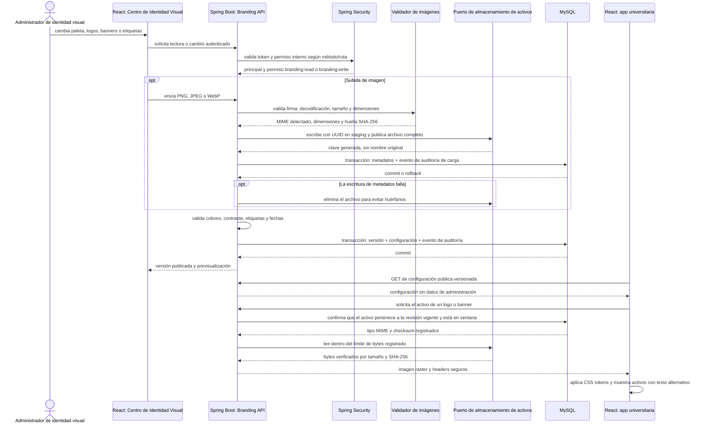
```mermaid
sequenceDiagram
  actor Admin as Administrador de identidad visual
  participant UI as React: Centro de Identidad Visual
  participant API as Spring Boot: Branding API
  participant Auth as Spring Security
  participant Validator as Validador de imágenes
  participant Asset as Puerto de almacenamiento de activos
  participant DB as MySQL
  participant Public as React: app universitaria

  Admin->>UI: cambia paleta, logos, banners o etiquetas
  UI->>API: solicita lectura o cambio autenticado
  API->>Auth: valida token y permiso interno según método/ruta
  Auth-->>API: principal y permiso branding:read o branding:write
  opt Subida de imagen
    UI->>API: envía PNG, JPEG o WebP
    API->>Validator: valida firma, decodificación, tamaño y dimensiones
    Validator-->>API: MIME detectado, dimensiones y huella SHA-256
    API->>Asset: escribe con UUID en staging y publica archivo completo
    Asset-->>API: clave generada, sin nombre original
    API->>DB: transacción: metadatos + evento de auditoría de carga
    DB-->>API: commit o rollback
    opt La escritura de metadatos falla
      API->>Asset: elimina el archivo para evitar huérfanos
    end
  end
  API->>API: valida colores, contraste, etiquetas y fechas
  API->>DB: transacción: versión + configuración + evento de auditoría
  DB-->>API: commit
  API-->>UI: versión publicada y previsualización
  Public->>API: GET de configuración pública versionada
  API-->>Public: configuración sin datos de administración
  Public->>API: solicita el activo de un logo o banner
  API->>DB: confirma que el activo pertenece a la revisión vigente y está en ventana
  DB-->>API: tipo MIME y checksum registrados
  API->>Asset: lee dentro del límite de bytes registrado
  Asset-->>API: bytes verificados por tamaño y SHA-256
  API-->>Public: imagen raster y headers seguros
  Public->>Public: aplica CSS tokens y muestra activos con texto alternativo
```

Si una validación o persistencia falla, no se publica una versión parcial. El API público solo expone configuración visual aprobada; los endpoints de administración requieren permiso comprobado en backend. La lista método/ruta vigente es `GET` y `PUT /api/v1/admin/branding`, `POST /api/v1/admin/branding/rollback` y `POST /api/v1/admin/branding/assets`. Las demás rutas o métodos bajo `/api/v1/admin/**` se deniegan hasta que cada capacidad defina y pruebe su autorización.

## Pregrado presencial y gate de descubrimiento

El alcance de descubrimiento priorizado es pregrado presencial. El catálogo público de trámites del estudiante (registro de asignaturas, renovación, aplazamiento, cancelación, reingreso, transferencia y grado) sigue siendo un inventario, no una secuencia universal. Para admisiones se localizó la cadena pública Acuerdo 130/1998 → Acuerdo 053/2008 (dos opciones y pruebas adicionales) → Resoluciones 19 y 28/2014 (Saber 11, ponderación, equivalencias y llamados), junto con Acuerdo 015/2021, Resolución 2941/2021 y modificación 5362/2025 para cupos especiales. El Acuerdo 031/2021 deroga el artículo 17 del Acuerdo 130; el Acuerdo 015/2021 deroga expresamente los Acuerdos 017/2001 y 120/2006. Además de la actualización SIRA de 2025, el informe UPTC de rendición de cuentas 2025 reporta formulación al 100 % de la Fase III de un nuevo sistema académico alternativo a SIRA y un avance de 50 % frente a la meta de ejecutar el 90 % de las fases de desarrollo ese año; el indicador no expresa porcentaje de producto terminado. Un comunicado de mayo de 2026 reportó que UPTC implementó por separado «Inscríbete», sistema con PIN y repositorio documental para 2026-II. No se ha establecido si forma parte de SIRA o de la Fase III ni qué portal opera en 2027-I. Antes de diseñar sustitución o integración, DTIC, Vicerrectoría Académica, la instancia institucional del proyecto y las áreas funcionales que el patrocinador identifica provisionalmente como ACRA/Registro Académico deben acordar la frontera, sistemas maestros y responsables funcionales/técnicos; la denominación pública de ACRA ya incluye Control de Registro Académico, así que no se presuponen dos propietarios distintos. El proceso técnico permanece futuro hasta validar la matriz consolidada, operación, contratos y datos. El hallazgo y sus límites están en el [descubrimiento de Inscríbete](../discovery/uptc-inscribete-2026.md).

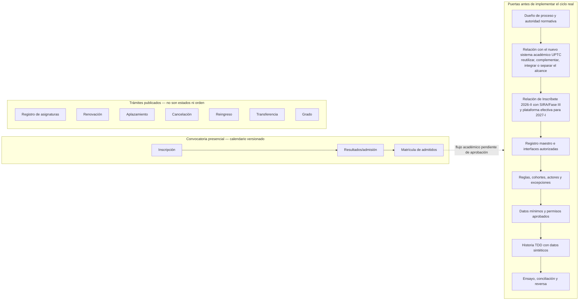
```mermaid
flowchart LR
  subgraph Convocatoria[Convocatoria presencial — calendario versionado]
    Apply[Inscripción]
    Results[Resultados/admisión]
    Enroll[Matrícula de admitidos]
    Apply --> Results --> Enroll
  end

  Enroll -. flujo académico pendiente de aprobación .-> Discovery

  subgraph Discovery[Puertas antes de implementar el ciclo real]
    Owner[Dueño de proceso y autoridad normativa]
    Initiative[Relación con el nuevo sistema académico UPTC<br/>reutilizar, complementar, integrar o separar el alcance]
    Inscribete[Relación de Inscríbete 2026-II con SIRA/Fase III<br/>y plataforma efectiva para 2027-I]
    Source[Registro maestro e interfaces autorizadas]
    Rules[Reglas, cohortes, actores y excepciones]
    Contract[Datos mínimos y permisos aprobados]
    Tests[Historia TDD con datos sintéticos]
    Reconcile[Ensayo, conciliación y reversa]
    Owner --> Initiative --> Inscribete --> Source --> Rules --> Contract --> Tests --> Reconcile
  end

  subgraph StudentServices[Trámites publicados — no son estados ni orden]
    Registration[Registro de asignaturas]
    Renewal[Renovación]
    Defer[Aplazamiento]
    Cancel[Cancelación]
    Reentry[Reingreso]
    Transfer[Transferencia]
    Graduation[Grado]
  end
```

La flecha punteada hacia el gate es una dependencia por descubrir, no un estado confirmado del estudiante. La lista de servicios se mantiene desconectada deliberadamente hasta que los responsables aprueben el proceso y su relación. El detalle de las fuentes y decisiones pendientes está en [descubrimiento del ciclo](../discovery/student-lifecycle-baseline.md).

### Agenda pública de admisiones 2027-I

La ruta `/#admisiones` presenta como respaldo las fechas de pregrado presencial publicadas en el portal de admisiones de UPTC, junto con la fecha de consulta y enlaces para confirmar cambios. Cuando la API versionada no tiene una publicación o no está disponible, se muestra ese respaldo sin borrar la fuente original. La persona puede descargar una instantánea `.ics` con eventos de día completo, fechas finales inclusivas convertidas al formato iCalendar y la fuente oficial incluida en cada evento. El archivo no se sincroniza después de descargarlo. Si el calendario verificado incluye una ruta de inscripción, el CTA abre la página pública de UPTC en otra pestaña e informa que Universiry no recibe ni envía datos. Esta vista no crea postulaciones ni se conecta a PIN, selección, documentos o sistemas académicos.

```mermaid
sequenceDiagram
  actor Aspirante as Persona interesada
  participant UI as React: agenda pública 2027-I
  participant Content as Contenido versionado del frontend
  participant File as Archivo iCalendar local
  participant Route as Ruta pública de inscripción UPTC
  participant News as Comunicado institucional UPTC

  Aspirante->>UI: abre #admisiones
  UI->>Content: carga convocatoria y fechas revisadas
  Content-->>UI: hitos, fecha de consulta, referencias y ruta opcional verificada
  UI-->>Aspirante: presenta la agenda y el CTA de UPTC cuando existe
  Aspirante->>UI: solicita descargar las fechas oficiales
  UI->>Content: genera eventos de día completo con la fuente atribuida
  Content-->>File: crea una instantánea UTF-8 .ics
  File-->>Aspirante: descarga para el calendario personal
  Aspirante->>Route: abre la ruta oficial de inscripción en una pestaña nueva
  Aspirante->>News: consulta el comunicado institucional enlazado
  Note over UI,File: La descarga es local y no sincroniza cambios ni contiene datos personales
  Note over UI,Route: La página de UPTC publica su propio trámite; Universiry no recopila ni envía la información
  Note over UI,Content: Este es el respaldo estático cuando no hay agenda administrada publicada, su consola se muestra en el flujo siguiente
```

El calendario público de aspirantes indica actualización del 15 de septiembre de 2026 y se consultó el 6 de octubre de 2026. La página [Inscripción pregrado presencial](https://www.uptc.edu.co/sitio/portal/sitios/universidad/vic_aca/adm_reg/1aspi/pre/pap_preg.html) indica actualización del 23 de septiembre de 2026 y se expone solo como ruta pública de UPTC; esto no identifica el sistema que procesa la convocatoria ni asigna responsabilidad funcional a un área. El [comunicado institucional 240](https://dsp.uptc.edu.co/sitio/portal/cal_not_eve/noticias/det/UPTC-abre-inscripciones-para-estudiar-un-pregrado-presencial-a-distancia-o-virtual-el-proximo-semestre/) es otra fuente pública para la convocatoria.

### Convocatorias versionadas: consulta, revisión y publicación

Este flujo administra calendarios públicos completos; no tramita una inscripción ni ejecuta selección. La agenda estática 2027-I sigue visible si la API no devuelve una convocatoria publicada o no está disponible. La consulta entrega hasta 100 convocatorias y permite elegir una. En desarrollo local no hay proveedor OIDC ni permisos semilla, así que la consola queda cerrada.

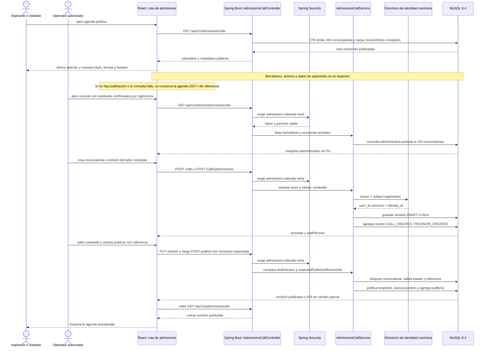
```mermaid
sequenceDiagram
  actor Visitante as Aspirante o visitante
  actor Operador as Operador autorizado
  participant UI as React: ruta de admisiones
  participant API as Spring Boot: AdmissionsCallController
  participant Auth as Spring Security
  participant Service as AdmissionsCallService
  participant Identity as Directorio de identidad canónica
  participant DB as MySQL 8.4

  Visitante->>UI: abre agenda pública
  UI->>API: GET /api/v1/admissions/calls
  API->>DB: CTE limita 100 convocatorias y carga revisión/hitos completos
  DB-->>API: solo revisiones publicadas
  API-->>UI: calendario y metadatos públicos
  UI-->>Visitante: ofrece selector y muestra título, fechas y fuentes
  Note over UI,DB: Borradores, actores y datos de aspirantes no se exponen
  Note over UI: Si no hay publicación o la consulta falla, se conserva la agenda 2027-I de referencia

  Operador->>UI: abre consola con read/write confirmados por /api/v1/me
  UI->>API: GET /api/v1/admin/admissions/calls
  API->>Auth: exige admissions:calendar:read
  Auth-->>API: token y permiso válido
  API->>Service: listar borradores y revisiones actuales
  Service->>DB: consulta administrativa acotada a 100 convocatorias
  DB-->>UI: snapshot administrativo sin PII

  Operador->>UI: crea convocatoria o revisión borrador completa
  UI->>API: POST /calls o POST /calls/{id}/revisions
  API->>Auth: exige admissions:calendar:write
  API->>Service: resolver actor y validar contenido
  Service->>Identity: issuer + subject registrados
  Identity-->>Service: user_id canónico + identity_id
  Service->>DB: guardar revisión DRAFT e hitos
  Service->>DB: agregar evento CALL_CREATED / REVISION_CREATED
  DB-->>UI: borrador y draftVersion

  Operador->>UI: edita contenido y solicita publicar con referencia
  UI->>API: PUT revisión y luego POST publish con versiones esperadas
  API->>Auth: exige admissions:calendar:write
  API->>Service: compara draftVersion y expectedPublishedRevisionId
  Service->>DB: bloquea convocatoria, valida estado y referencia
  Service->>DB: publica snapshot, avanza puntero y agrega auditoría
  DB-->>UI: revisión publicada o 409 sin cambio parcial
  UI->>API: relee GET /api/v1/admissions/calls
  API-->>UI: nueva revisión publicada
  UI-->>Visitante: muestra la agenda actualizada
```

Cada publicación exige confirmación explícita, una referencia institucional y las dos versiones observadas; no hay reintento automático en React. Una revisión publicada no se modifica: la corrección crea una revisión completa nueva. El actor se resuelve contra un vínculo federado ya registrado al usuario canónico; si no existe, la mutación falla cerrada. La auditoría y el cambio de puntero público comparten transacción. Los gates G0–G3 de la [especificación de admisiones](../superpowers/specs/2026-09-30-pregrado-admissions-process-discovery.md) siguen pendientes antes de conectar inscripción, documentos, PIN, reglas, resultados o datos reales.

### Laboratorio heredado de admisiones — desconectado del producto

**Estado actual:** `App.tsx` ya no monta este laboratorio; `/#admisiones` muestra el calendario público y su consola autorizada. El diagrama siguiente conserva el prototipo como referencia histórica y no representa una ruta disponible para aspirantes u operadores.

En el prototipo histórico de Vite DEV, `/#admisiones` iniciaba en una vista sintética de aspirante. La persona elegía dos programas ficticios diferentes y confirmaba que leyó el aviso; el formulario no pedía identidad, contacto, PIN ni soportes. La ficha se creaba en un store Zustand no persistido compartido con la bandeja demo del equipo mientras la pantalla permanecía montada. El equipo podía filtrar por referencia/estado, abrir el detalle, iniciar revisión, solicitar uno de dos ajustes fijos y finalizar el ejercicio. Desde la perspectiva aspirante se confirmaba una respuesta ficticia; el equipo podía reanudar y cerrar la revisión. No se representaba admisión, rechazo, puntaje o selección. El calendario y su consola autorizada continúan como la única experiencia vigente de la ruta.

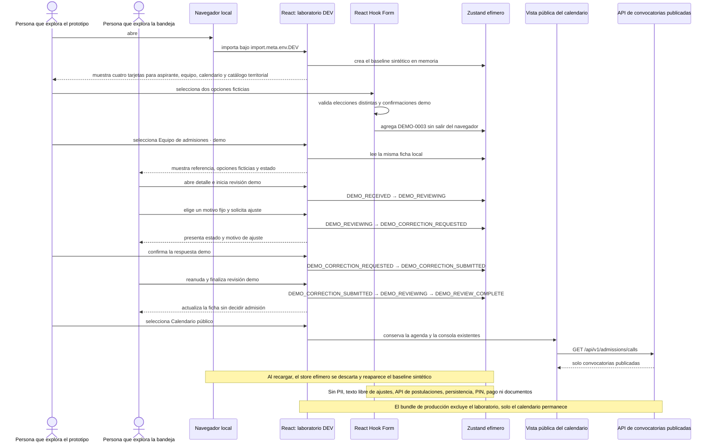
```mermaid
sequenceDiagram
  actor Aspirante as Persona que explora el prototipo
  actor Equipo as Persona que explora la bandeja
  participant Browser as Navegador local
  participant Lab as React: laboratorio DEV
  participant Form as React Hook Form
  participant Store as Zustand efímero
  participant Calendar as Vista pública del calendario
  participant API as API de convocatorias publicadas

  Aspirante->>Browser: abre #admisiones con Vite DEV
  Browser->>Lab: importa bajo import.meta.env.DEV
  Lab->>Store: crea el baseline sintético en memoria
  Lab-->>Aspirante: muestra cuatro tarjetas para aspirante, equipo, calendario y catálogo territorial
  Aspirante->>Form: selecciona dos opciones ficticias
  Form->>Form: valida elecciones distintas y confirmaciones demo
  Form->>Store: agrega DEMO-0003 sin salir del navegador
  Aspirante->>Lab: selecciona Equipo de admisiones · demo
  Lab->>Store: lee la misma ficha local
  Lab-->>Equipo: muestra referencia, opciones ficticias y estado
  Equipo->>Lab: abre detalle e inicia revisión demo
  Lab->>Store: DEMO_RECEIVED → DEMO_REVIEWING
  Equipo->>Lab: elige un motivo fijo y solicita ajuste
  Lab->>Store: DEMO_REVIEWING → DEMO_CORRECTION_REQUESTED
  Lab-->>Equipo: presenta estado y motivo de ajuste
  Aspirante->>Lab: confirma la respuesta demo
  Lab->>Store: DEMO_CORRECTION_REQUESTED → DEMO_CORRECTION_SUBMITTED
  Equipo->>Lab: reanuda y finaliza revisión demo
  Lab->>Store: DEMO_CORRECTION_SUBMITTED → DEMO_REVIEWING → DEMO_REVIEW_COMPLETE
  Lab-->>Equipo: actualiza la ficha sin decidir admisión
  Aspirante->>Lab: selecciona Calendario público
  Lab->>Calendar: conserva la agenda y la consola existentes
  Calendar->>API: GET /api/v1/admissions/calls
  API-->>Calendar: solo convocatorias publicadas
  Note over Browser,Store: Al recargar, el store efímero se descarta y reaparece el baseline sintético
  Note over Form,Store: Sin PII, texto libre de ajustes, API de postulaciones, persistencia, PIN, pago ni documentos
  Note over Lab,API: El bundle de producción excluye el laboratorio, solo el calendario permanece
```

Este prototipo de recorrido no es un formulario oficial ni concede identidad, rol o permiso administrativo. Las decisiones de admisión, expedientes, integraciones y reglas siguen sujetas a los gates G0–G3 y a la aprobación del dueño institucional del proceso.

### Semana y asignaturas sintéticas — módulo desconectado

**Estado actual:** `/#estudiante-demo` no está registrada como ruta; el componente y sus fixtures no se montan desde `App.tsx`. El diagrama siguiente describe solo el prototipo histórico.

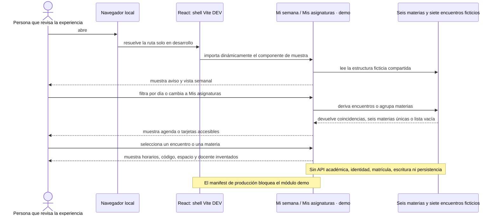
```mermaid
sequenceDiagram
  actor Reviewer as Persona que revisa la experiencia
  participant Browser as Navegador local
  participant Shell as React: shell Vite DEV
  participant StudentDemo as Mi semana / Mis asignaturas · demo
  participant Fixtures as Seis materias y siete encuentros ficticios

  Reviewer->>Browser: abre #estudiante-demo
  Browser->>Shell: resuelve la ruta solo en desarrollo
  Shell->>StudentDemo: importa dinámicamente el componente de muestra
  StudentDemo->>Fixtures: lee la estructura ficticia compartida
  StudentDemo-->>Reviewer: muestra aviso y vista semanal
  Reviewer->>StudentDemo: filtra por día o cambia a Mis asignaturas
  StudentDemo->>Fixtures: deriva encuentros o agrupa materias
  Fixtures-->>StudentDemo: devuelve coincidencias, seis materias únicas o lista vacía
  StudentDemo-->>Reviewer: muestra agenda o tarjetas accesibles
  Reviewer->>StudentDemo: selecciona un encuentro o una materia
  StudentDemo-->>Reviewer: muestra horarios, código, espacio y docente inventados
  Note over StudentDemo,Fixtures: Sin API académica, identidad, matrícula, escritura ni persistencia
  Note over Shell,StudentDemo: El manifest de producción bloquea el módulo demo
```

El prototipo era una evaluación visual, no la consulta real de materias de una persona. Sus datos constantes ficticios usaban códigos `DEMO-*`; la semana y la vista de asignaturas compartían una estructura para que una materia con varios encuentros no apareciera duplicada. El módulo no consulta permisos académicos, horarios ni matrícula. Una futura consulta propia exige fuente maestra, autorización por usuario, aislamiento verificable y aprobación institucional.

### Captura de calificaciones sintética — módulo desconectado

**Estado actual:** `/#calificaciones-demo` no está registrada como ruta; el componente y las pruebas aisladas no representan carga o registro institucional. El diagrama siguiente describe solo el prototipo histórico.

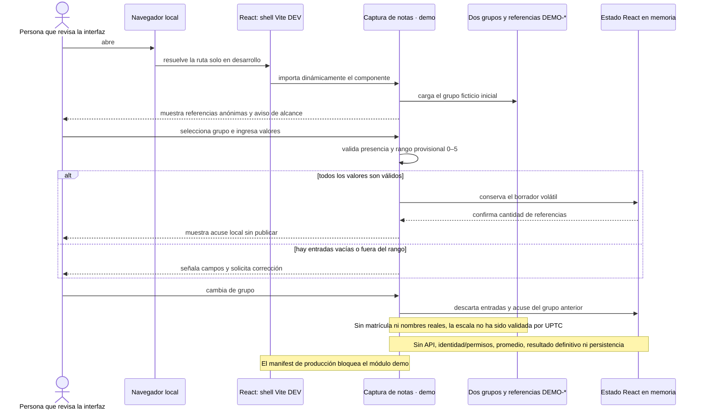
```mermaid
sequenceDiagram
  actor Reviewer as Persona que revisa la interfaz
  participant Browser as Navegador local
  participant Shell as React: shell Vite DEV
  participant Gradebook as Captura de notas · demo
  participant Fixtures as Dos grupos y referencias DEMO-*
  participant Draft as Estado React en memoria

  Reviewer->>Browser: abre #calificaciones-demo
  Browser->>Shell: resuelve la ruta solo en desarrollo
  Shell->>Gradebook: importa dinámicamente el componente
  Gradebook->>Fixtures: carga el grupo ficticio inicial
  Gradebook-->>Reviewer: muestra referencias anónimas y aviso de alcance
  Reviewer->>Gradebook: selecciona grupo e ingresa valores
  Gradebook->>Gradebook: valida presencia y rango provisional 0–5
  alt todos los valores son válidos
    Gradebook->>Draft: conserva el borrador volátil
    Draft-->>Gradebook: confirma cantidad de referencias
    Gradebook-->>Reviewer: muestra acuse local sin publicar
  else hay entradas vacías o fuera del rango
    Gradebook-->>Reviewer: señala campos y solicita corrección
  end
  Reviewer->>Gradebook: cambia de grupo
  Gradebook->>Draft: descarta entradas y acuse del grupo anterior
  Note over Gradebook,Fixtures: Sin matrícula ni nombres reales, la escala no ha sido validada por UPTC
  Note over Gradebook,Draft: Sin API, identidad/permisos, promedio, resultado definitivo ni persistencia
  Note over Shell,Gradebook: El manifest de producción bloquea el módulo demo
```

El prototipo mostraba captura sintética, no registro de notas oficial. Sus referencias y grupos eran ficticios y locales; el acuse permanecía en memoria. No calculaba promedios ni resultados. El rango 0–5 no es una escala institucional validada. Una operación real exige confirmar fuente, asignación docente-grupo, periodo/calendario, escala, precisión, intentos, cierres, reclamos y auditoría con UPTC.

### Flujo público de inscripción y selección para 2027-I

El mapa separa fechas y reglas que aparecen en actos públicos de los puntos operativos pendientes. Es una guía para el taller, no una máquina de estados ni autorización para automatizar decisiones. UPTC reportó la implementación de «Inscríbete» para 2026-II; la Resolución 111/2026 nombra SIRA en el proceso 2027-I. El diagrama conserva esos nombres separados: no afirma que sean el mismo sistema ni que el portal descrito en el comunicado sea el de 2027-I. ISE, pago y matrícula/asignaturas quedan fuera del primer corte funcional.

```mermaid
flowchart LR
  Call[ACRA publica convocatoria y calendario]
  Register[Venta PIN e inscripción web<br/>21 sep–23 oct<br/>primera y segunda opción]
  ICFES[Verificación ICFES<br/>28–29 oct]
  Assess{Programa o condición<br/>requiere evaluación?}
  Aptitude[Prueba adicional/aptitud<br/>según programa y convocatoria]
  Support[Examen médico/discapacidad<br/>y lengua de señas<br/>según calendario]
  Correction[Revisar errores y actuaciones<br/>hasta 10 nov]
  SIRA[Proceso de admisión SIRA<br/>11–12 nov, estado actual por validar]
  Rank[Aplicar ponderación Saber 11<br/>y reglas/cupos versionados<br/>aprobar prueba adicional si aplica]
  First[Selección de primera opción]
  RegularSecond[Lista de opcionados a segunda opción<br/>si no admitido en primera y hay cupo]
  Special[Lista de casos especiales<br/>primera y segunda opción<br/>según actos aprobados]
  Results[Publicar admitidos<br/>13 nov]
  SpecialSecond[Asignar cupo especial<br/>en segunda opción<br/>14 dic]
  Calls[Llamados de opcionados<br/>9–15 dic]
  Next[ISE, pagos y registro de asignaturas<br/>etapas posteriores]
  Normalista[Inscripción normalista publicada<br/>4 ciclos + diploma<br/>vía, convenio y semestre por validar]
  Inscribete[«Inscríbete», reportado como implementado por UPTC<br/>sistema para 2026-II<br/>PIN + formulario + documentos]
  PlatformGate[Confirmar plataforma de inscripción y archivo<br/>Inscríbete / SIRA / Fase III / SGDEA<br/>cobertura e integración por validar]
  SGDEA[SGDEA institucional<br/>gestión documental electrónica]
  Gate[Redondeo, empates, apelaciones,<br/>pruebas y excepciones completas<br/>por validar]

  Call --> Register --> ICFES --> Assess
  Register --> Assess
  Assess -->|aptitud| Aptitude --> Correction
  Assess -->|condición especial| Support --> Correction
  Assess -->|ninguna adicional| Correction
  Correction --> SIRA --> Rank --> First --> Results
  Rank --> Special --> Results
  First -->|no obtiene cupo primera opción| RegularSecond --> Calls
  Special -->|no obtiene cupo primera opción| SpecialSecond
  Results --> SpecialSecond --> Calls --> Next
  Results --> Next
  Register -. vía diferenciada publicada .-> Normalista
  Normalista -. no integrar a selección ordinaria sin validación .-> Gate
  Inscribete -. sin relación técnica presumida .-> PlatformGate
  SGDEA -. alcance estudiantil e interfaz por confirmar .-> PlatformGate
  SIRA -. proceso nombrado en Resolución 111/2026 .-> PlatformGate
  PlatformGate -. cerrar frontera antes de construir .-> Gate
  Gate -. define antes de automatizar .-> SIRA
  Renewal[Actualización SIRA reportada por UPTC en 2025<br/>productos y estado actuales por confirmar]
  Renewal -. alinear antes de sustituir .-> Gate
```

El [Acuerdo 053 de 2008](https://apps3.uptc.edu.co/compilacion-normativa-web/#/compilaciones-normativas/detalle-documento/11) resuelve la antigua diferencia del artículo 14 sin modificar: permite primera y segunda opción. El [simulador y tabla que ACRA enlaza actualmente](https://uptc.edu.co/sitio/portal/sitios/universidad/vic_aca/adm_reg/1aspi/pas/asp_simpunt.html) se basan en Saber 11; las [Resoluciones 19 y 28 de 2014](https://www.uptc.edu.co/secretaria_general/consejo_academico/resoluciones_2014/index.html) también describen pruebas adicionales, empates, equivalencias y tres llamados. La relación exacta de esos llamados con el calendario 2027-I se confirma con ACRA.

La [Resolución 111 de 2026](https://apps3.uptc.edu.co/compilacion-normativa-web/#/compilaciones-normativas/detalle-documento/9906) fija verificación por ICFES (28–29 oct.), verificación/anulación por información errada (hasta 10 nov.), proceso SIRA (11–12 nov.), resultados (13 nov.) y asignación de cupos especiales de segunda opción (14 dic.). Para condición especial de discapacidad fija examen/certificación el 27 oct. y prueba de lengua de señas para discapacidad auditiva; para Educación Física fija examen médico y aptitud física en sede del programa el 28–29 oct. Artes Plásticas y Visuales y Música aparecen en el listado de pruebas de aptitud, sin rúbrica o modalidad especificada en esa resolución.

La [Resolución 5362 de 2025](https://apps3.uptc.edu.co/compilacion-normativa-web/#/compilaciones-normativas/detalle-documento/9313) coloca la asignación de segunda opción especial después de admisión/matrícula de admitidos y antes de admitir opcionados; la ventana de opcionados (9–15 dic.) se solapa con la fecha puntual especial (14 dic.). El Acuerdo 015/2021 enumera ocho grupos de política en su artículo 3 y seis categorías de cupo en el artículo 7; la Resolución 2941/2021 describe además una disposición de discapacidad. ACRA/Jurídica deben confirmar cómo operan estas disposiciones sin duplicar cupos ni mezclar caracterización de apoyos con selección. La página ACRA actualizada el 30 de septiembre de 2026 publica además inscripción normalista para 2027-I; las Resoluciones 026/2009, 1577/2019 y 3418/2019 y la Ley 2481/2025 apuntan a una vía diferenciada de articulación/ingreso que debe mapearse por convenio, programa, sede y semestre. El diagrama la separa de la selección ordinaria hasta aclarar sus reglas. También se debe confirmar el orden de segunda opción especial frente a opcionados, y la mención de segundo semestre de 2026 en un considerando de la Resolución 111, cuyo título y artículo primero dicen primer semestre de 2027. El detalle de fuentes, cronograma completo y decisiones pendientes está en la [especificación de descubrimiento de admisiones](../superpowers/specs/2026-09-30-pregrado-admissions-process-discovery.md) y el [plan de implementación propuesto](../superpowers/plans/2026-09-30-pregrado-admissions.md).

## Catálogo académico — importar, revisar y publicar

Este es el flujo académico que sí existe en v1. Representa planes de estudio y asignaturas versionados para pregrado presencial; no da de alta estudiantes ni matrícula. El flujo presupone un principal autorizado en un entorno con el proveedor institucional ya configurado. En Compose las rutas administrativas responden 401 porque no hay proveedor ni token de prueba. El formato de intercambio está en [la plantilla de encabezados CSV](../templates/academic-curriculum-template.csv); no contiene registros oficiales ni filas de ejemplo.

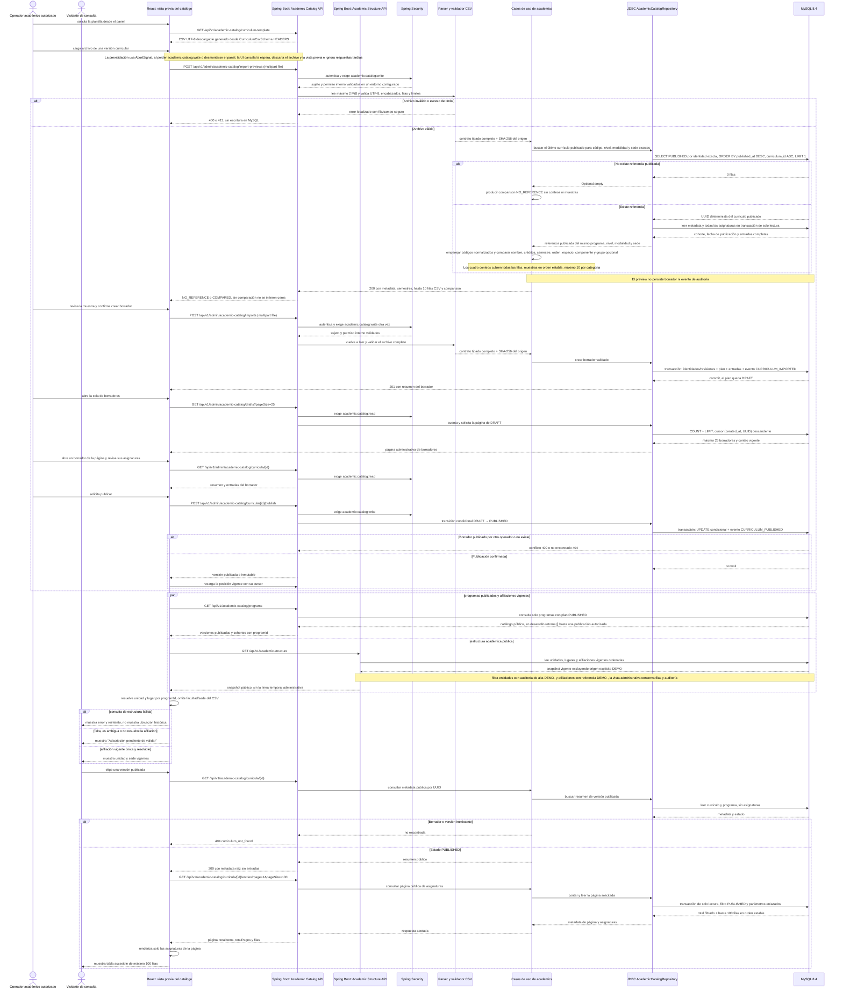
```mermaid
sequenceDiagram
  actor Operador as Operador académico autorizado
  actor Comunidad as Visitante de consulta
  participant UI as React: vista previa del catálogo
  participant API as Spring Boot: Academic Catalog API
  participant StructureAPI as Spring Boot: Academic Structure API
  participant Auth as Spring Security
  participant CSV as Parser y validador CSV
  participant UseCase as Casos de uso de academics
  participant Repo as JDBC AcademicCatalogRepository
  participant DB as MySQL 8.4

  Operador->>UI: solicita la plantilla desde el panel
  UI->>API: GET /api/v1/academic-catalog/curriculum-template
  API-->>UI: CSV UTF-8 descargable generado desde CurriculumCsvSchema.HEADERS
  Operador->>UI: carga archivo de una versión curricular
  Note over UI,API: La prevalidación usa AbortSignal, al perder academic:catalog:write o desmontarse el panel, la UI cancela la espera, descarta el archivo y la vista previa e ignora respuestas tardías
  UI->>API: POST /api/v1/admin/academic-catalog/import-previews (multipart file)
  API->>Auth: autentica y exige academic:catalog:write
  Auth-->>API: sujeto y permiso interno validados en un entorno configurado
  API->>CSV: lee máximo 2 MiB y valida UTF-8, encabezados, filas y límites
  alt Archivo inválido o exceso de límite
    CSV-->>API: error localizado con fila/campo seguro
    API-->>UI: 400 o 413, sin escritura en MySQL
  else Archivo válido
    CSV-->>UseCase: contrato tipado completo + SHA-256 del origen
    UseCase->>Repo: buscar el último currículo publicado para código, nivel, modalidad y sede exactos
    Repo->>DB: SELECT PUBLISHED por identidad exacta, ORDER BY published_at DESC, curriculum_id ASC, LIMIT 1
    alt No existe referencia publicada
      DB-->>Repo: 0 filas
      Repo-->>UseCase: Optional.empty
      UseCase->>UseCase: producir comparison NO_REFERENCE sin conteos ni muestras
    else Existe referencia
      DB-->>Repo: UUID determinista del currículo publicado
      Repo->>DB: leer metadata y todas las asignaturas en transacción de solo lectura
      DB-->>Repo: cohorte, fecha de publicación y entradas completas
      Repo-->>UseCase: referencia publicada del mismo programa, nivel, modalidad y sede
      UseCase->>UseCase: emparejar códigos normalizados y comparar nombre, créditos, semestre, orden, espacio, componente y grupo opcional
      Note over UseCase: Los cuatro conteos cubren todas las filas, muestras en orden estable, máximo 10 por categoría
    end
    Note over UseCase,DB: El preview no persiste borrador ni evento de auditoría
    UseCase-->>API: 200 con metadata, semestres, hasta 10 filas CSV y comparison
    API-->>UI: NO_REFERENCE o COMPARED, sin comparación no se infieren ceros
    Operador->>UI: revisa la muestra y confirma crear borrador
    UI->>API: POST /api/v1/admin/academic-catalog/imports (multipart file)
    API->>Auth: autentica y exige academic:catalog:write otra vez
    Auth-->>API: sujeto y permiso interno validados
    API->>CSV: vuelve a leer y validar el archivo completo
    CSV-->>UseCase: contrato tipado completo + SHA-256 del origen
    UseCase->>Repo: crear borrador validado
    Repo->>DB: transacción: identidades/revisiones + plan + entradas + evento CURRICULUM_IMPORTED
    DB-->>Repo: commit, el plan queda DRAFT
    Repo-->>UI: 201 con resumen del borrador
    Operador->>UI: abre la cola de borradores
    UI->>API: GET /api/v1/admin/academic-catalog/drafts?pageSize=25
    API->>Auth: exige academic:catalog:read
    API->>Repo: cuenta y solicita la página de DRAFT
    Repo->>DB: COUNT + LIMIT, cursor (created_at, UUID) descendente
    DB-->>Repo: máximo 25 borradores y conteo vigente
    Repo-->>UI: página administrativa de borradores
    Operador->>UI: abre un borrador de la página y revisa sus asignaturas
    UI->>API: GET /api/v1/admin/academic-catalog/curricula/{id}
    API->>Auth: exige academic:catalog:read
    API-->>UI: resumen y entradas del borrador
    Operador->>UI: solicita publicar
    UI->>API: POST /api/v1/admin/academic-catalog/curricula/{id}/publish
    API->>Auth: exige academic:catalog:write
    API->>Repo: transición condicional DRAFT → PUBLISHED
    Repo->>DB: transacción: UPDATE condicional + evento CURRICULUM_PUBLISHED
    alt Borrador publicado por otro operador o no existe
      DB-->>API: conflicto 409 o no encontrado 404
    else Publicación confirmada
      DB-->>Repo: commit
      API-->>UI: versión publicada e inmutable
    UI->>API: recarga la posición vigente con su cursor
    end
  end
  par programas publicados y afiliaciones vigentes
    UI->>API: GET /api/v1/academic-catalog/programs
    API->>DB: consulta solo programas con plan PUBLISHED
    DB-->>API: catálogo público, en desarrollo retorna [] hasta una publicación autorizada
    API-->>UI: versiones publicadas y cohortes con programId
  and estructura académica pública
    UI->>StructureAPI: GET /api/v1/academic-structure
    StructureAPI->>DB: lee unidades, lugares y afiliaciones vigentes ordenadas
    DB-->>StructureAPI: snapshot vigente excluyendo origen explícito DEMO-
    Note over StructureAPI,DB: filtra entidades con auditoría de alta DEMO- y afiliaciones con referencia DEMO-, la vista administrativa conserva filas y auditoría
    StructureAPI-->>UI: snapshot público, sin la línea temporal administrativa
  end
  UI->>UI: resuelve unidad y lugar por programId, omite facultad/sede del CSV
  alt consulta de estructura fallida
    UI-->>Comunidad: muestra error y reintento, no muestra ubicación histórica
  else falta, es ambigua o no resuelve la afiliación
    UI-->>Comunidad: muestra "Adscripción pendiente de validar"
  else afiliación vigente única y resoluble
    UI-->>Comunidad: muestra unidad y sede vigentes
  end
  Comunidad->>UI: elige una versión publicada
  UI->>API: GET /api/v1/academic-catalog/curricula/{id}
  API->>UseCase: consultar metadata pública por UUID
  UseCase->>Repo: buscar resumen de versión publicada
  Repo->>DB: leer currículo y programa, sin asignaturas
  DB-->>Repo: metadata y estado
  alt Borrador o versión inexistente
    UseCase-->>API: no encontrada
    API-->>UI: 404 curriculum_not_found
  else Estado PUBLISHED
    UseCase-->>API: resumen público
    API-->>UI: 200 con metadata raíz sin entradas
    UI->>API: GET /api/v1/academic-catalog/curricula/{id}/entries?page=1&pageSize=100
    API->>UseCase: consultar página pública de asignaturas
    UseCase->>Repo: contar y leer la página solicitada
    Repo->>DB: transacción de solo lectura, filtro PUBLISHED y parámetros enlazados
    DB-->>Repo: total filtrado + hasta 100 filas en orden estable
    Repo-->>UseCase: metadata de página y asignaturas
    UseCase-->>API: respuesta acotada
    API-->>UI: página, totalItems, totalPages y filas
    UI->>UI: renderiza solo las asignaturas de la página
    UI-->>Comunidad: muestra tabla accesible de máximo 100 filas
  end
```

La API pública lista programas con un plan publicado y ofrece sus versiones por programa; nunca expone borradores. Para mostrar la organización actual, React carga en paralelo esa lista y `GET /api/v1/academic-structure`, enlaza afiliación, unidad y sede mediante `programId`, y no usa `faculty`, `campus_name` ni `campus_code` del CSV como ubicación actual. Si la afiliación no es única o resoluble, muestra "Adscripción pendiente de validar"; si falla la consulta de estructura, bloquea el catálogo y permite reintentar. El detalle público obtiene metadata separada de entradas y consulta páginas filtradas por código/nombre o semestre; solo `PUBLISHED` puede producir conteos o filas, y borradores y UUID inexistentes comparten 404 en ambos endpoints. La consulta de página fija el tamaño máximo en 100, enlaza parámetros, escapa los comodines SQL y mantiene orden `(semester, row_order)`. La interfaz pide la metadata y su primera página en paralelo; espera 250 ms para búsqueda de texto, vuelve a página 1 al cambiar filtros y cancela solicitudes anteriores con `AbortSignal`. `GET` administrativo de borradores y detalle requiere `academic:catalog:read`; la cola de revisión usa cursores anclados en fecha y UUID para que publicar una fila anterior no desplace borradores pendientes. La prevalidación, importación y publicación requieren `academic:catalog:write`. `POST /import-previews` valida el mismo contrato, devuelve metadata, semestres y como máximo 10 filas sin persistir datos ni eventos; `POST /imports` vuelve a validar antes de la transacción de escritura. Durante una vista previa, el cliente entrega `AbortSignal`; al perder `academic:catalog:write` o desmontarse el panel, aborta la espera, borra el archivo y el resultado local, e ignora respuestas tardías. Cada método/ruta administrativa debe estar allowlisted y probado; un token de lectura no permite escritura. Los nombres actuales son permisos internos de producto, no mapeos aprobados de grupos UPTC. Sin issuer, audience y grupos institucionales el Compose local no puede importar ni publicar. La ruta React `/#programas` está disponible como vista previa, mientras `programs.available` continúa `false`; eso no activa el módulo ni demuestra autorización para operación.

El objeto `comparison` compara el archivo validado con la última versión `PUBLISHED` de la identidad exacta `(programCode, academicLevel, studyModality, campusCode)`; el desempate usa `published_at DESC, curriculum_id ASC`. Los códigos de asignatura se emparejan tras quitar espacios externos y normalizar mayúsculas. La comparación cubre nombre, créditos (sin distinguir escala decimal), semestre, orden, espacio de formación, componente y grupo opcional. Devuelve conteos completos, hasta diez ejemplos estables por categoría y los metadatos de la referencia; no produce equivalencias ni modifica planes. Sin referencia, responde `NO_REFERENCE` con conteos nulos. La interfaz oculta el bloque si una versión anterior del backend no entrega `comparison`; el parser y el panel se cargan de forma diferida. El preview consulta el repositorio para esta lectura, pero no escribe en MySQL ni genera auditoría.

## Orden organizacional y periodos académicos

La estructura mantiene dos ejes independientes: las unidades responsables y los lugares donde se ofrece el programa. Las relaciones se fechan y ordenan; la afiliación apunta al programa existente del catálogo. No se usan los nombres libres históricos de facultad/sede como relaciones canónicas.

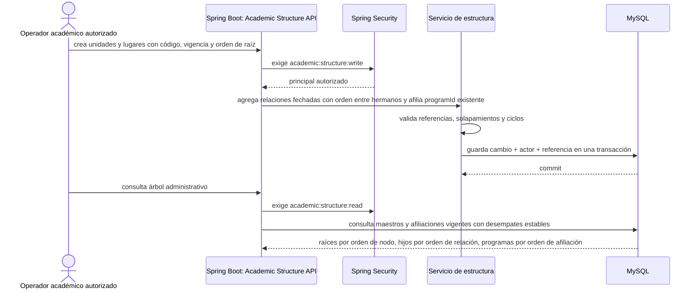
```mermaid
sequenceDiagram
  actor Operator as Operador académico autorizado
  participant API as Spring Boot: Academic Structure API
  participant Auth as Spring Security
  participant Structure as Servicio de estructura
  participant DB as MySQL
  Operator->>API: crea unidades y lugares con código, vigencia y orden de raíz
  API->>Auth: exige academic:structure:write
  Auth-->>API: principal autorizado
  API->>Structure: agrega relaciones fechadas con orden entre hermanos y afilia programId existente
  Structure->>Structure: valida referencias, solapamientos y ciclos
  Structure->>DB: guarda cambio + actor + referencia en una transacción
  DB-->>Structure: commit
  Operator->>API: consulta árbol administrativo
  API->>Auth: exige academic:structure:read
  API->>DB: consulta maestros y afiliaciones vigentes con desempates estables
  DB-->>API: raíces por orden de nodo, hijos por orden de relación, programas por orden de afiliación
```

Las raíces organizacionales y territoriales se presentan por `displayOrder` del nodo. Dentro de cada padre, los vínculos se presentan por su `displayOrder`, con orden/código del hijo como desempate estable. Cada afiliación conserva el `displayOrder` independiente del programa, con código/nombre como desempate. V10 migra el orden que ya tenían las relaciones tomando el orden previo del nodo hijo. El programa muestra el lugar de su afiliación vigente, no el campus legado que quedó en el catálogo. El árbol público muestra únicamente relaciones vigentes a la fecha institucional; la consola administrativa consulta la línea temporal completa mediante el endpoint protegido. El maestro de lugares sigue siendo una sección independiente. La pantalla local `/#academia` incluye cinco editores para actualizar una prioridad por solicitud en unidades, sedes, relaciones organizacionales, relaciones de sedes y afiliaciones de programas. También permite crear una facultad raíz con `FACULTY` fijo, un lugar raíz con tipo explícito y relaciones fechadas entre unidades o lugares existentes; las altas raíz no crean jerarquía/afiliación y los vínculos no asignan programas. No carga datos oficiales. Formularios y editores requieren permisos de lectura y escritura de estructura. Las operaciones envían una referencia institucional; el backend audita cada alta/cambio y, tras un alta o una relación, la pantalla vuelve a consultar el snapshot administrativo.

### Consulta paginada de la bitácora de estructura

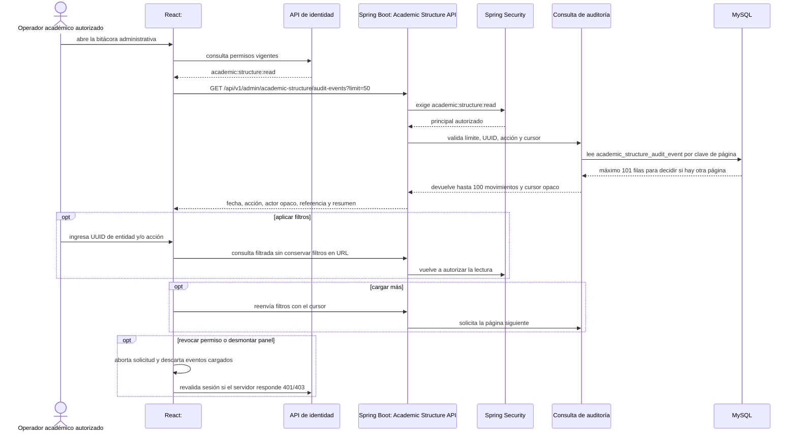
```mermaid
sequenceDiagram
  actor Operator as Operador académico autorizado
  participant UI as React: #academia
  participant Me as API de identidad
  participant API as Spring Boot: Academic Structure API
  participant Auth as Spring Security
  participant Query as Consulta de auditoría
  participant DB as MySQL

  Operator->>UI: abre la bitácora administrativa
  UI->>Me: consulta permisos vigentes
  Me-->>UI: academic:structure:read
  UI->>API: GET /api/v1/admin/academic-structure/audit-events?limit=50
  API->>Auth: exige academic:structure:read
  Auth-->>API: principal autorizado
  API->>Query: valida límite, UUID, acción y cursor
  Query->>DB: lee academic_structure_audit_event por clave de página
  DB-->>Query: máximo 101 filas para decidir si hay otra página
  Query-->>API: devuelve hasta 100 movimientos y cursor opaco
  API-->>UI: fecha, acción, actor opaco, referencia y resumen
  opt aplicar filtros
    Operator->>UI: ingresa UUID de entidad y/o acción
    UI->>API: consulta filtrada sin conservar filtros en URL
    API->>Auth: vuelve a autorizar la lectura
  end
  opt cargar más
    UI->>API: reenvía filtros con el cursor
    API->>Query: solicita la página siguiente
  end
  opt revocar permiso o desmontar panel
    UI->>UI: aborta solicitud y descarta eventos cargados
    UI->>Me: revalida sesión si el servidor responde 401/403
  end
```

La ruta administrativa usa únicamente la auditoría ya creada por mutaciones de estructura; no busca ni une personas, aspirantes, matrículas o expedientes. Los límites, filtros cerrados y cursor se validan también en backend. Los errores y la ausencia de resultados se muestran sin permitir editar o borrar eventos. La vista permanece oculta y no envía la consulta sin permiso de lectura.

### Alta protegida de una facultad raíz

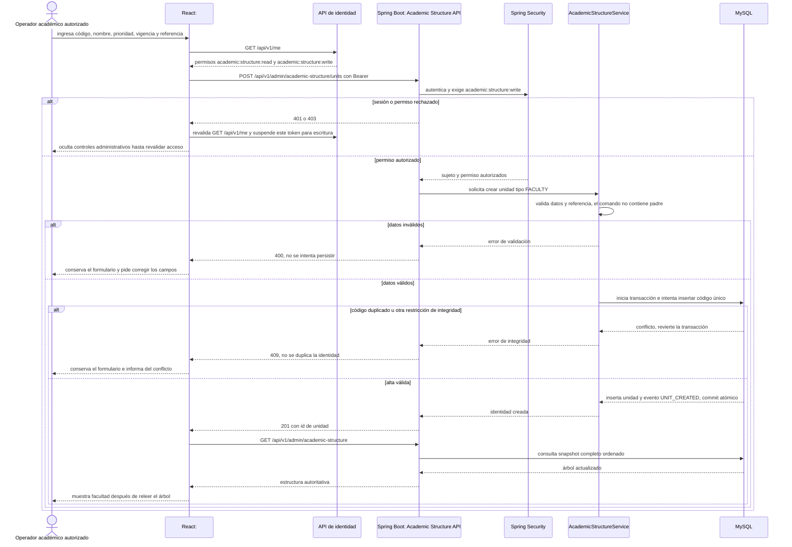
```mermaid
sequenceDiagram
  actor Operator as Operador académico autorizado
  participant UI as React: #academia
  participant Identity as API de identidad
  participant API as Spring Boot: Academic Structure API
  participant Auth as Spring Security
  participant Service as AcademicStructureService
  participant DB as MySQL

  Operator->>UI: ingresa código, nombre, prioridad, vigencia y referencia
  UI->>Identity: GET /api/v1/me
  Identity-->>UI: permisos academic:structure:read y academic:structure:write
  UI->>API: POST /api/v1/admin/academic-structure/units con Bearer
  API->>Auth: autentica y exige academic:structure:write
  alt sesión o permiso rechazado
    API-->>UI: 401 o 403
    UI->>Identity: revalida GET /api/v1/me y suspende este token para escritura
    UI-->>Operator: oculta controles administrativos hasta revalidar acceso
  else permiso autorizado
    Auth-->>API: sujeto y permiso autorizados
    API->>Service: solicita crear unidad tipo FACULTY
    Service->>Service: valida datos y referencia, el comando no contiene padre
    alt datos inválidos
      Service-->>API: error de validación
      API-->>UI: 400, no se intenta persistir
      UI-->>Operator: conserva el formulario y pide corregir los campos
    else datos válidos
      Service->>DB: inicia transacción e intenta insertar código único
      alt código duplicado u otra restricción de integridad
        DB-->>Service: conflicto, revierte la transacción
        Service-->>API: error de integridad
        API-->>UI: 409, no se duplica la identidad
        UI-->>Operator: conserva el formulario e informa del conflicto
      else alta válida
        DB-->>Service: inserta unidad y evento UNIT_CREATED, commit atómico
        Service-->>API: identidad creada
        API-->>UI: 201 con id de unidad
        UI->>API: GET /api/v1/admin/academic-structure
        API->>DB: consulta snapshot completo ordenado
        DB-->>API: árbol actualizado
        API-->>UI: estructura autoritativa
        UI-->>Operator: muestra facultad después de releer el árbol
      end
    end
  end
```

La interfaz muestra el formulario solo con los permisos de lectura y escritura recibidos de `/api/v1/me`, pero el servidor aplica la regla final en cada `POST`. Un fallo al releer tras `201` se informa como alta aceptada con vista pendiente de recarga; no se repite el comando automáticamente. Este formulario crea únicamente una facultad raíz; un formulario protegido separado crea unidad hija y primera relación en una sola transacción.

### Alta protegida de un lugar raíz

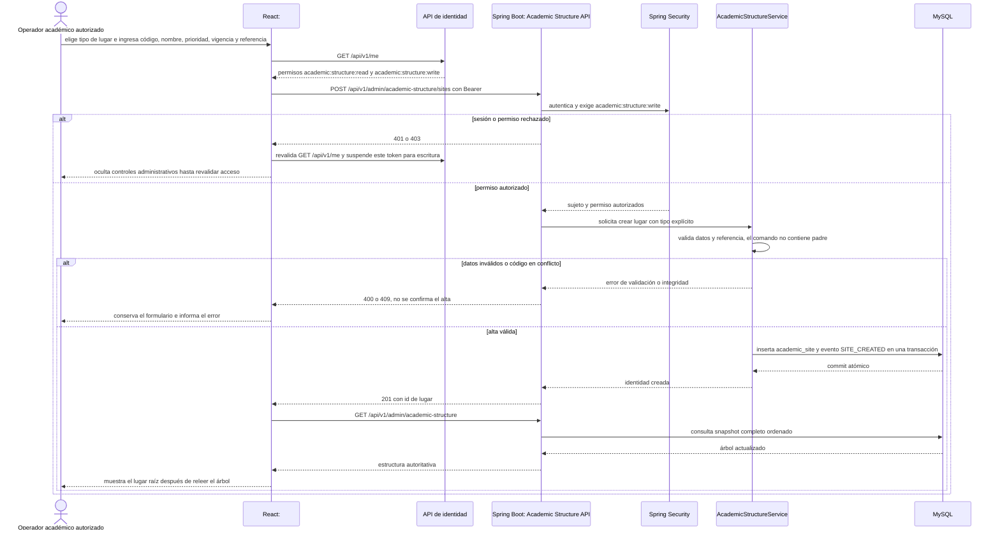
```mermaid
sequenceDiagram
  actor Operator as Operador académico autorizado
  participant UI as React: #academia
  participant Identity as API de identidad
  participant API as Spring Boot: Academic Structure API
  participant Auth as Spring Security
  participant Service as AcademicStructureService
  participant DB as MySQL

  Operator->>UI: elige tipo de lugar e ingresa código, nombre, prioridad, vigencia y referencia
  UI->>Identity: GET /api/v1/me
  Identity-->>UI: permisos academic:structure:read y academic:structure:write
  UI->>API: POST /api/v1/admin/academic-structure/sites con Bearer
  API->>Auth: autentica y exige academic:structure:write
  alt sesión o permiso rechazado
    API-->>UI: 401 o 403
    UI->>Identity: revalida GET /api/v1/me y suspende este token para escritura
    UI-->>Operator: oculta controles administrativos hasta revalidar acceso
  else permiso autorizado
    Auth-->>API: sujeto y permiso autorizados
    API->>Service: solicita crear lugar con tipo explícito
    Service->>Service: valida datos y referencia, el comando no contiene padre
    alt datos inválidos o código en conflicto
      Service-->>API: error de validación o integridad
      API-->>UI: 400 o 409, no se confirma el alta
      UI-->>Operator: conserva el formulario e informa el error
    else alta válida
      Service->>DB: inserta academic_site y evento SITE_CREATED en una transacción
      DB-->>Service: commit atómico
      Service-->>API: identidad creada
      API-->>UI: 201 con id de lugar
      UI->>API: GET /api/v1/admin/academic-structure
      API->>DB: consulta snapshot completo ordenado
      DB-->>API: árbol actualizado
      API-->>UI: estructura autoritativa
      UI-->>Operator: muestra el lugar raíz después de releer el árbol
    end
  end
```

El tipo elegido se valida contra los seis valores del contrato (`CENTRAL`, `SECCIONAL`, `REGIONAL`, `CREAD`, `CAMPUS`, `OTHER`); son categorías técnicas, no un catálogo oficial de sedes aprobado por UPTC. La creación no establece padre ni vincula programas. Un fallo al releer después de `201` se comunica como alta aceptada con actualización visual pendiente; no se repite el comando automáticamente.

### Alta protegida de una unidad hija y su primera relación

El formulario combina el alta y el vínculo para que no quede una unidad huérfana. El intervalo de la relación es el intervalo inicial de la unidad; el backend lo compara con la vigencia del padre. No se define aquí qué combinaciones de tipos de unidad admite cada tipo de padre; esa matriz requiere validación institucional.

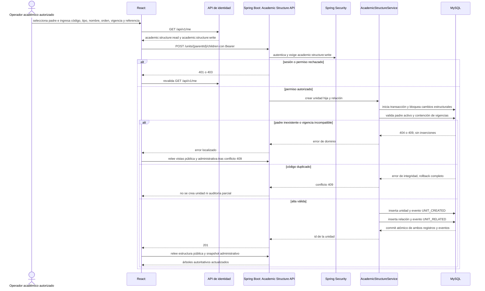
```mermaid
sequenceDiagram
  actor Operator as Operador académico autorizado
  participant UI as React: #academia
  participant Identity as API de identidad
  participant API as Spring Boot: Academic Structure API
  participant Auth as Spring Security
  participant Service as AcademicStructureService
  participant DB as MySQL

  Operator->>UI: selecciona padre e ingresa código, tipo, nombre, orden, vigencia y referencia
  UI->>Identity: GET /api/v1/me
  Identity-->>UI: academic:structure:read y academic:structure:write
  UI->>API: POST /units/{parentId}/children con Bearer
  API->>Auth: autentica y exige academic:structure:write
  alt sesión o permiso rechazado
    API-->>UI: 401 o 403
    UI->>Identity: revalida GET /api/v1/me
  else permiso autorizado
    API->>Service: crear unidad hija y relación
    Service->>DB: inicia transacción y bloquea cambios estructurales
    Service->>DB: valida padre activo y contención de vigencias
    alt padre inexistente o vigencia incompatible
      DB-->>Service: 404 o 409, sin inserciones
      Service-->>API: error de dominio
      API-->>UI: error localizado
      UI->>API: relee vistas pública y administrativa tras conflicto 409
    else código duplicado
      DB-->>Service: error de integridad, rollback completo
      Service-->>API: conflicto 409
      API-->>UI: no se crea unidad ni auditoría parcial
    else alta válida
      Service->>DB: inserta unidad y evento UNIT_CREATED
      Service->>DB: inserta relación y evento UNIT_RELATED
      DB-->>Service: commit atómico de ambos registros y eventos
      Service-->>API: id de la unidad
      API-->>UI: 201
      UI->>API: relee estructura pública y snapshot administrativo
      API-->>UI: árboles autoritativos actualizados
    end
  end
```

La ruta requiere `academic:structure:write`; la consola presenta el formulario solo cuando `/api/v1/me` confirma lectura y escritura. La UI ofrece padres activos y acota fechas a su vigencia, pero el servidor conserva la autoridad final. Tras `409` se actualizan ambas vistas y no se repite automáticamente el comando. Sin OIDC institucional la escritura continúa cerrada.

### Crear una relación jerárquica fechada

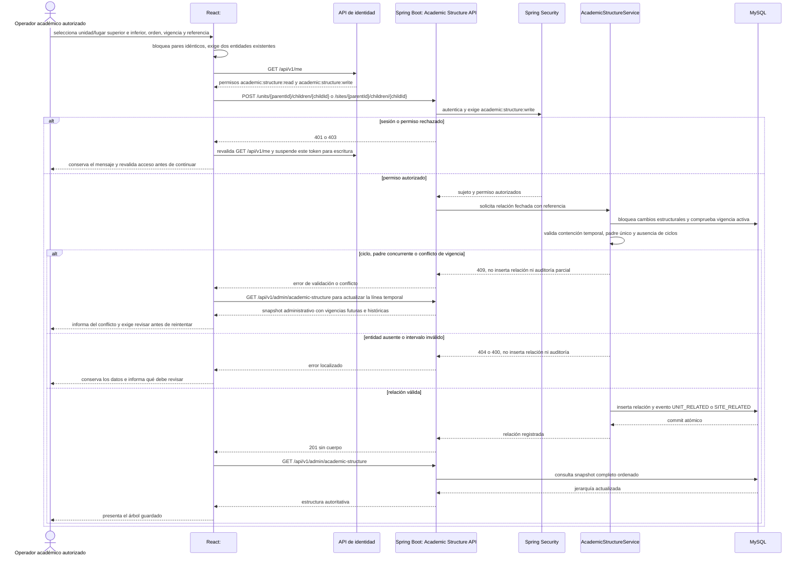
```mermaid
sequenceDiagram
  actor Operator as Operador académico autorizado
  participant UI as React: #academia
  participant Identity as API de identidad
  participant API as Spring Boot: Academic Structure API
  participant Auth as Spring Security
  participant Structure as AcademicStructureService
  participant DB as MySQL

  Operator->>UI: selecciona unidad/lugar superior e inferior, orden, vigencia y referencia
  UI->>UI: bloquea pares idénticos, exige dos entidades existentes
  UI->>Identity: GET /api/v1/me
  Identity-->>UI: permisos academic:structure:read y academic:structure:write
  UI->>API: POST /units/{parentId}/children/{childId} o /sites/{parentId}/children/{childId}
  API->>Auth: autentica y exige academic:structure:write
  alt sesión o permiso rechazado
    API-->>UI: 401 o 403
    UI->>Identity: revalida GET /api/v1/me y suspende este token para escritura
    UI-->>Operator: conserva el mensaje y revalida acceso antes de continuar
  else permiso autorizado
    Auth-->>API: sujeto y permiso autorizados
    API->>Structure: solicita relación fechada con referencia
    Structure->>DB: bloquea cambios estructurales y comprueba vigencia activa
    Structure->>Structure: valida contención temporal, padre único y ausencia de ciclos
    alt ciclo, padre concurrente o conflicto de vigencia
      Structure-->>API: 409, no inserta relación ni auditoría parcial
      API-->>UI: error de validación o conflicto
      UI->>API: GET /api/v1/admin/academic-structure para actualizar la línea temporal
      API-->>UI: snapshot administrativo con vigencias futuras e históricas
      UI-->>Operator: informa del conflicto y exige revisar antes de reintentar
    else entidad ausente o intervalo inválido
      Structure-->>API: 404 o 400, no inserta relación ni auditoría
      API-->>UI: error localizado
      UI-->>Operator: conserva los datos e informa qué debe revisar
    else relación válida
      Structure->>DB: inserta relación y evento UNIT_RELATED o SITE_RELATED
      DB-->>Structure: commit atómico
      Structure-->>API: relación registrada
      API-->>UI: 201 sin cuerpo
      UI->>API: GET /api/v1/admin/academic-structure
      API->>DB: consulta snapshot completo ordenado
      DB-->>API: jerarquía actualizada
      API-->>UI: estructura autoritativa
      UI-->>Operator: presenta el árbol guardado
    end
  end
```

El formulario de jerarquía no afilia programas. El servicio valida ambas entidades y sus vigencias bajo bloqueo, rechaza ciclos y padres simultáneos incompatibles, y guarda relación/auditoría en la misma transacción. El catálogo oficial, la jerarquía aprobada y los permisos de escritura continúan pendientes de validación institucional.

### Afiliar un programa a una unidad y un lugar

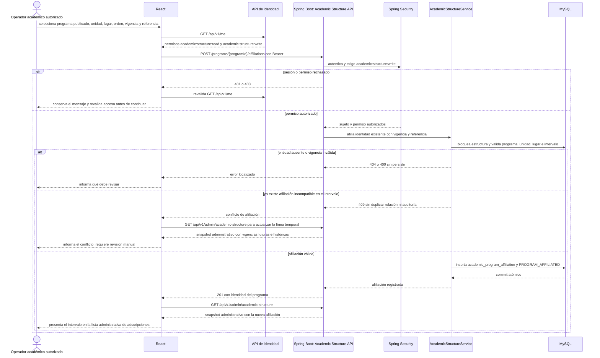
```mermaid
sequenceDiagram
  actor Operator as Operador académico autorizado
  participant UI as React: #academia
  participant Identity as API de identidad
  participant API as Spring Boot: Academic Structure API
  participant Auth as Spring Security
  participant Structure as AcademicStructureService
  participant DB as MySQL

  Operator->>UI: selecciona programa publicado, unidad, lugar, orden, vigencia y referencia
  UI->>Identity: GET /api/v1/me
  Identity-->>UI: permisos academic:structure:read y academic:structure:write
  UI->>API: POST /programs/{programId}/affiliations con Bearer
  API->>Auth: autentica y exige academic:structure:write
  alt sesión o permiso rechazado
    API-->>UI: 401 o 403
    UI->>Identity: revalida GET /api/v1/me
    UI-->>Operator: conserva el mensaje y revalida acceso antes de continuar
  else permiso autorizado
    Auth-->>API: sujeto y permiso autorizados
    API->>Structure: afilia identidad existente con vigencia y referencia
    Structure->>DB: bloquea estructura y valida programa, unidad, lugar e intervalo
    alt entidad ausente o vigencia inválida
      Structure-->>API: 404 o 400 sin persistir
      API-->>UI: error localizado
      UI-->>Operator: informa qué debe revisar
    else ya existe afiliación incompatible en el intervalo
      Structure-->>API: 409 sin duplicar relación ni auditoría
      API-->>UI: conflicto de afiliación
      UI->>API: GET /api/v1/admin/academic-structure para actualizar la línea temporal
      API-->>UI: snapshot administrativo con vigencias futuras e históricas
      UI-->>Operator: informa el conflicto, requiere revisión manual
    else afiliación válida
      Structure->>DB: inserta academic_program_affiliation y PROGRAM_AFFILIATED
      DB-->>Structure: commit atómico
      Structure-->>API: afiliación registrada
      API-->>UI: 201 con identidad del programa
      UI->>API: GET /api/v1/admin/academic-structure
      API-->>UI: snapshot administrativo con la nueva afiliación
      UI-->>Operator: presenta el intervalo en la lista administrativa de adscripciones
    end
  end
```

El formulario protegido consume el listado público del catálogo, por lo que permite elegir programas publicados, y usa únicamente unidades y lugares activos que ya existen. No toma la facultad o el campus de texto legado como relación. El POST reutiliza `academic_program_affiliation` y la auditoría `PROGRAM_AFFILIATED`; el backend exige escritura, valida vigencias y evita afiliaciones simultáneas incompatibles. La vista de gestión exige tanto `academic:structure:read` como `academic:structure:write`: vuelve a consultar el snapshot administrativo completo tras éxito o `409`, así que una afiliación futura o histórica sigue visible en la lista de vigencias con fechas y procedencia. El árbol principal conserva la estructura efectiva del endpoint público; cuando la vigencia comience, la afiliación aparecerá allí automáticamente. Sin permiso de lectura, la aplicación muestra únicamente el árbol público vigente y oculta la línea temporal y los controles de escritura. No repite la mutación automáticamente. Los catálogos y la adscripción oficial siguen pendientes de aprobación institucional.

### Reasignación de programa entre unidad y sede

La reasignación es una operación de afiliación, no la creación de otro programa. El formulario elige una fila concreta del snapshot administrativo y envía las dos fechas esperadas de esa versión, incluso cuando el final esperado es `null`. La vista previa muestra el último día de la afiliación existente y la sucesora propuesta. Una confirmación explícita envía un único POST; no hay reintento automático tras conflictos ni resultados de red ambiguos.

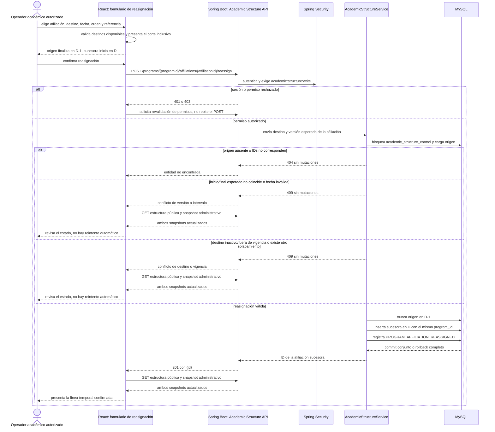
```mermaid
sequenceDiagram
  actor Operator as Operador académico autorizado
  participant UI as React: formulario de reasignación
  participant API as Spring Boot: Academic Structure API
  participant Auth as Spring Security
  participant Structure as AcademicStructureService
  participant DB as MySQL

  Operator->>UI: elige afiliación, destino, fecha, orden y referencia
  UI->>UI: valida destinos disponibles y presenta el corte inclusivo
  UI-->>Operator: origen finaliza en D-1, sucesora inicia en D
  Operator->>UI: confirma reasignación
  UI->>API: POST /programs/{programId}/affiliations/{affiliationId}/reassign
  API->>Auth: autentica y exige academic:structure:write
  alt sesión o permiso rechazado
    API-->>UI: 401 o 403
    UI->>API: solicita revalidación de permisos, no repite el POST
  else permiso autorizado
    API->>Structure: envía destino y versión esperada de la afiliación
    Structure->>DB: bloquea academic_structure_control y carga origen
    alt origen ausente o IDs no corresponden
      Structure-->>API: 404 sin mutaciones
      API-->>UI: entidad no encontrada
    else inicio/final esperado no coincide o fecha inválida
      Structure-->>API: 409 sin mutaciones
      API-->>UI: conflicto de versión o intervalo
      UI->>API: GET estructura pública y snapshot administrativo
      API-->>UI: ambos snapshots actualizados
      UI-->>Operator: revisa el estado, no hay reintento automático
    else destino inactivo/fuera de vigencia o existe otro solapamiento
      Structure-->>API: 409 sin mutaciones
      API-->>UI: conflicto de destino o vigencia
      UI->>API: GET estructura pública y snapshot administrativo
      API-->>UI: ambos snapshots actualizados
      UI-->>Operator: revisa el estado, no hay reintento automático
    else reasignación válida
      Structure->>DB: trunca origen en D-1
      Structure->>DB: inserta sucesora en D con el mismo program_id
      Structure->>DB: registra PROGRAM_AFFILIATION_REASSIGNED
      DB-->>Structure: commit conjunto o rollback completo
      Structure-->>API: ID de la afiliación sucesora
      API-->>UI: 201 con {id}
      UI->>API: GET estructura pública y snapshot administrativo
      API-->>UI: ambos snapshots actualizados
      UI-->>Operator: presenta la línea temporal confirmada
    end
  end
```

`academic_structure_control` serializa esta escritura con otros cambios de estructura. El backend compara `expectedValidFrom` y `expectedValidThrough`, exige `effectiveFrom > validFrom`, mantiene el final inclusivo heredado, valida la vigencia completa de unidad y sede y descarta de la comprobación de cruces únicamente la fila fuente. La fila sucesora obtiene otro `affiliation_id`, mantiene el `program_id` y genera un único evento auditado en la misma transacción. El formulario requiere lectura y escritura administrativas; el backend exige escritura en la ruta. Datos maestros, actos de adscripción y grupos OIDC oficiales siguen pendientes de validación antes de operación institucional.

### Corrección de prioridad organizacional

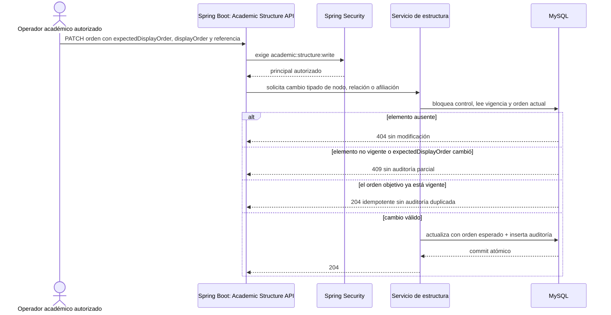
```mermaid
sequenceDiagram
  actor Operator as Operador académico autorizado
  participant API as Spring Boot: Academic Structure API
  participant Auth as Spring Security
  participant Structure as Servicio de estructura
  participant DB as MySQL
  Operator->>API: PATCH orden con expectedDisplayOrder, displayOrder y referencia
  API->>Auth: exige academic:structure:write
  Auth-->>API: principal autorizado
  API->>Structure: solicita cambio tipado de nodo, relación o afiliación
  Structure->>DB: bloquea control, lee vigencia y orden actual
  alt elemento ausente
    DB-->>API: 404 sin modificación
  else elemento no vigente o expectedDisplayOrder cambió
    DB-->>API: 409 sin auditoría parcial
  else el orden objetivo ya está vigente
    DB-->>API: 204 idempotente sin auditoría duplicada
  else cambio válido
    Structure->>DB: actualiza con orden esperado + inserta auditoría
    DB-->>Structure: commit atómico
    Structure-->>API: 204
  end
```

La ruta no edita afiliaciones si el programa/unidad/sede no coincide y solo cambia metadatos de prioridad; un reordenamiento no reasigna unidades o lugares. La referencia se conserva junto con el actor y los valores anterior/nuevo. El resumen identifica también la pareja padre/hijo de una relación o el ID de la afiliación de programa, evitando eventos ambiguos cuando existen vínculos históricos. Las rutas están en la allowlist de `PATCH`; el backend exige escritura y la consola requiere lectura administrativa y escritura para mostrar los editores.

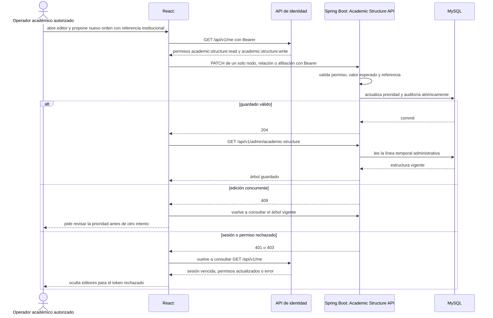
```mermaid
sequenceDiagram
  actor Operator as Operador académico autorizado
  participant UI as React: #academia
  participant Identity as API de identidad
  participant API as Spring Boot: Academic Structure API
  participant DB as MySQL
  Operator->>UI: abre editor y propone nuevo orden con referencia institucional
  UI->>Identity: GET /api/v1/me con Bearer
  Identity-->>UI: permisos academic:structure:read y academic:structure:write
  UI->>API: PATCH de un solo nodo, relación o afiliación con Bearer
  API->>API: valida permiso, valor esperado y referencia
  API->>DB: actualiza prioridad y auditoría atómicamente
  alt guardado válido
    DB-->>API: commit
    API-->>UI: 204
    UI->>API: GET /api/v1/admin/academic-structure
    API->>DB: lee la línea temporal administrativa
    DB-->>API: estructura vigente
    API-->>UI: árbol guardado
  else edición concurrente
    API-->>UI: 409
    UI->>API: vuelve a consultar el árbol vigente
    UI-->>Operator: pide revisar la prioridad antes de otro intento
  else sesión o permiso rechazado
    API-->>UI: 401 o 403
    UI->>Identity: vuelve a consultar GET /api/v1/me
    Identity-->>UI: sesión vencida, permisos actualizados o error
    UI-->>Operator: oculta editores para el token rechazado
  end
```

La interfaz no modifica el árbol de forma optimista. Un fallo al releer después de 204 se informa como escritura aceptada con vista pendiente de recarga; sin permiso de escritura las acciones no aparecen. La recarga del conflicto no repite el comando ni reemplaza la prioridad por una estimación local. Un 401/403 oculta las acciones de inmediato y requiere una sesión nueva para volver a habilitarlas con el mismo token.

### Cerrar una relación fechada de unidad, sede o programa

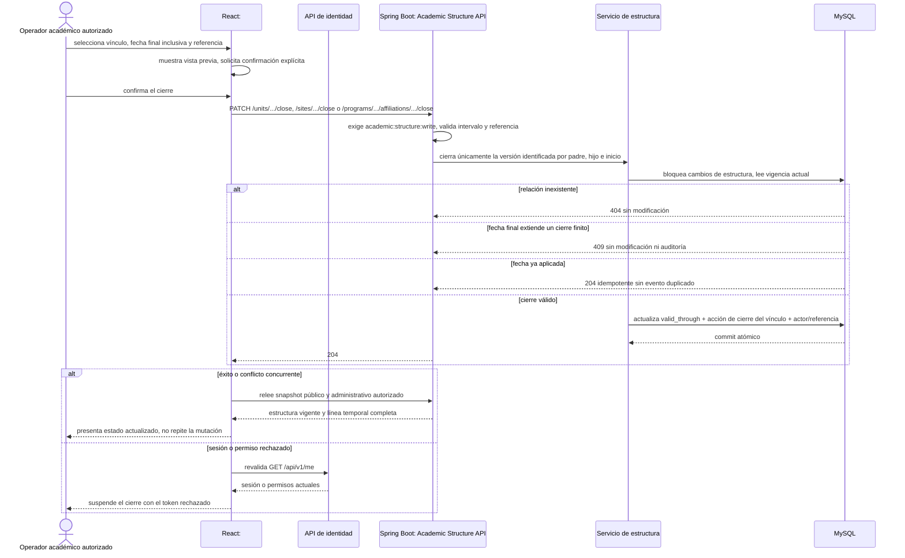
```mermaid
sequenceDiagram
  actor Operator as Operador académico autorizado
  participant UI as React: #academia
  participant Identity as API de identidad
  participant API as Spring Boot: Academic Structure API
  participant Structure as Servicio de estructura
  participant DB as MySQL
  Operator->>UI: selecciona vínculo, fecha final inclusiva y referencia
  UI->>UI: muestra vista previa, solicita confirmación explícita
  Operator->>UI: confirma el cierre
  UI->>API: PATCH /units/.../close, /sites/.../close o /programs/.../affiliations/.../close
  API->>API: exige academic:structure:write, valida intervalo y referencia
  API->>Structure: cierra únicamente la versión identificada por padre, hijo e inicio
  Structure->>DB: bloquea cambios de estructura, lee vigencia actual
  alt relación inexistente
    DB-->>API: 404 sin modificación
  else fecha final extiende un cierre finito
    DB-->>API: 409 sin modificación ni auditoría
  else fecha ya aplicada
    DB-->>API: 204 idempotente sin evento duplicado
  else cierre válido
    Structure->>DB: actualiza valid_through + acción de cierre del vínculo + actor/referencia
    DB-->>Structure: commit atómico
    API-->>UI: 204
  end
  alt éxito o conflicto concurrente
    UI->>API: relee snapshot público y administrativo autorizado
    API-->>UI: estructura vigente y línea temporal completa
    UI-->>Operator: presenta estado actualizado, no repite la mutación
  else sesión o permiso rechazado
    UI->>Identity: revalida GET /api/v1/me
    Identity-->>UI: sesión o permisos actuales
    UI-->>Operator: suspende el cierre con el token rechazado
  end
```

El formulario compartido solo aparece con lectura y escritura de estructura. El selector React limita la operación a vínculos actuales o futuros cuyo intervalo pueda acortarse; para adscripciones solo lista programas publicados y unidades/sedes identificables. La fecha final no puede preceder `validFrom` ni ampliar un finito existente. Los endpoints `/api/v1/admin/academic-structure/units/{parentId}/children/{childId}/close`, `/api/v1/admin/academic-structure/sites/{parentId}/children/{childId}/close` y `/api/v1/admin/academic-structure/programs/{programId}/affiliations/{affiliationId}/close` aceptan una referencia institucional y registran actor, instante y `UNIT_RELATION_CLOSED`, `SITE_RELATION_CLOSED` o `PROGRAM_AFFILIATION_CLOSED` en la misma transacción que actualiza `valid_through`. La misma fecha es idempotente, un intervalo finito nunca se extiende y los registros relacionados no se borran. Ante `409`, React descarta la confirmación y actualiza ambas vistas sin reintentar; los vínculos vencidos no se ofrecen desde este formulario. La reasignación compuesta sigue pendiente. Esta capacidad local no habilita OIDC ni valida reglas o maestros oficiales de UPTC.

```mermaid
sequenceDiagram
  actor Operator as Operador de calendario autorizado
  participant UI as React: estructura y periodos
  participant API as Spring Boot: Academic Period API
  participant Auth as Spring Security
  participant Period as Servicio de periodo
  participant DB as MySQL
  Operator->>UI: ingresa tipo, código y rango de instrucción
  UI->>API: POST /api/v1/admin/academic-periods
  API->>Auth: exige academic:period:write
  API->>Period: crea borrador con fechas y actor
  Period->>DB: periodo DRAFT + PERIOD_CREATED
  API-->>UI: periodo DRAFT
  Operator->>UI: crea revisión con referencia y actividades
  UI->>API: POST /{periodId}/calendars
  API->>Auth: exige academic:period:write
  API->>Period: valida fechas propias de las actividades, ventanas independientes del rango lectivo
  Period->>DB: nueva revisión DRAFT + auditoría
  Operator->>UI: confirma publicar la revisión
  UI->>API: POST /{periodId}/calendars/{revisionId}/publish
  API->>Auth: exige academic:period:write
  Period->>DB: revisión PUBLISHED inmutable + auditoría
  Operator->>UI: selecciona revisión publicada e ingresa acto aprobatorio
  UI->>API: POST /{periodId}/approve con revisión y referencia
  API->>Auth: exige academic:period:write
  Period->>DB: DRAFT → APPROVED + actor/instante/referencia
  Operator->>UI: solicita abrir y confirma explícitamente
  UI->>API: POST /{periodId}/open
  API->>Auth: exige academic:period:write
  Period->>DB: APPROVED → OPEN + auditoría atómica
  API-->>UI: periodo abierto
  API->>DB: GET público consulta solo OPEN con calendario publicado
  Operator->>UI: abre el control de periodos con permiso de lectura
  UI->>API: GET /api/v1/admin/academic-periods con Bearer
  API->>Auth: exige academic:period:read
  API-->>UI: REGULAR e INTERSEMESTRAL con estados actuales
  Operator->>UI: solicita consultar calendario y auditoría de un periodo
  UI->>API: GET /api/v1/admin/academic-periods/{periodId}/history con Bearer
  API->>Auth: exige academic:period:read
  API-->>UI: revisiones, actividades y eventos auditados
  Note over UI: Carga bajo demanda, se cancela y oculta al cerrar o perder lectura
  Operator->>UI: solicita cerrar el periodo OPEN y confirma explícitamente
  UI->>API: POST /{periodId}/close con Bearer
  API->>Auth: exige academic:period:write
  API->>Period: valida el estado actual y la transición solicitada
  Period->>DB: actualiza estado + actor + instante + auditoría
  API-->>UI: periodo con estado nuevo
  Note over UI,DB: La transición solo cambia estado, no publica oferta ni abre matrícula
```

El permiso administrativo se valida en Spring Security por ruta. React habilita la creación, edición de borradores de calendario, publicación y aprobación solo con `academic:period:read` y `academic:period:write`; una revisión publicada requiere confirmación explícita y queda inmutable. Aprobar y abrir requieren la revisión publicada más reciente y la referencia aprobatoria separada del acto del calendario. El cierre requiere `OPEN`; cancelar solo se permite antes de abrir y registra su referencia. Las mutaciones usan bloqueo transaccional por periodo y comparan la revisión de calendario observada; si otra solicitud la cambia antes de la transición, la solicitud antigua recibe conflicto sin revertir la enmienda ni escribir auditoría parcial. Ante `409`, React vuelve a consultar los periodos dentro del alcance autorizado, descarta la confirmación antigua y pide revisar el estado antes de intentar otra vez; ante `401/403`, revalida `/api/v1/me` y suspende el token rechazado para escritura. El historial con todas las revisiones, actividades y eventos se consulta bajo demanda mediante una ruta administrativa de solo lectura protegida por `academic:period:read`; cerrar el panel cancela la consulta y perder lectura oculta la vista. React solo ofrece abrir para estados `APPROVED` y cerrar para `OPEN`, pide confirmación y conserva denegadas ambas acciones si falta el permiso de escritura. Sin permiso de lectura, solo muestra periodos públicamente abiertos; el backend sigue siendo la autoridad final.

```mermaid
flowchart LR
  Current[Revisión publicada activa]
  Draft[Crear nueva revisión con referencia del cambio]
  Validate[Validar cada actividad y su intervalo propio]
  Publish[Publicar revisión nueva e inmutable]
  Activate[Activar revisión con permiso y auditoría]
  Keep[Conservar revisión anterior publicada]
  Status[Conservar estado actual del periodo]
  Current --> Draft --> Validate --> Publish --> Activate --> Keep
  Activate --> Status
```

La modificación de calendario cambia la revisión activa, no reescribe el historial ni reabre/cierra automáticamente el periodo. `INTERSEMESTRAL` identifica un tipo operativo de periodo en el sistema; las fechas, oferta de grupos, cupos y reglas concretas se cargan únicamente después de validación institucional. Los acuerdos públicos sobre cursos intersemestrales se documentan como insumo de descubrimiento en [fuentes y límites](../discovery/academic-structure-and-periods-sources.md), no se automatizan en este incremento.

Las fechas de las actividades no se limitan al inicio/final de instrucción. En el calendario de estudiantes de pregrado 2026-2, ACRA publicó inscripción web del 22 de junio al 10 de julio y clases presenciales desde el 10 de agosto; la implementación conserva esa separación entre ventana de proceso y rango lectivo ([ACRA](https://uptc.edu.co/sitio/portal/sitios/universidad/vic_aca/adm_reg/2estu/est_pre.html)).

El calendario de cursos intersemestrales 2024 dejó este recorrido fechado: solicitud del estudiante al Comité de Currículo → análisis/recomendación curricular → aprobación del Consejo de Facultad → pago e inscripción → verificación/programación e inscripción de asignaturas por las Escuelas en SIRA → desarrollo del curso → ingreso de notas → cierre académico ([Resolución 015 de 2024](https://www.uptc.edu.co/export/sites/default/secretaria_general/consejo_academico/resoluciones_2024/res_015_2024.pdf)). Este diagrama registra el ejemplo 2024 y su uso de SIRA; no afirma que los actores, sistema o secuencia sean los actuales.

```mermaid
flowchart LR
  Student[Solicitud del estudiante] --> Curriculum[Comité de Currículo analiza y recomienda]
  Curriculum --> Faculty[Consejo de Facultad aprueba]
  Faculty --> Payment[Pago e inscripción al curso]
  Payment --> School[Escuelas verifican y programan en SIRA]
  School --> Course[Desarrollo del curso]
  Course --> Grade[Ingreso de notas]
  Grade --> Close[Cierre académico]
```

El Acuerdo 027 de 2024 también autorizó, exclusivamente para los cursos de junio-julio de 2024, hasta dos cursos por estudiante si uno era en calidad de repitente; la disposición no fue declarada permanente. No se automatizan esta excepción ni otras reglas por analogía entre cohortes ([Acuerdo 027 de 2024](https://www.uptc.edu.co/export/sites/default/secretaria_general/consejo_superior/acuerdos_2024/Acuerdo_027_2024.pdf)).

## Administración de borradores de oferta académica

El primer corte deja registrar grupos propuestos por periodo y por asignatura de un currículo publicado. La pantalla vive en `/#academia`. Lee los periodos que la página ya consultó y reutiliza los endpoints públicos existentes para programas, currículos publicados y sus asignaturas; no añade un catálogo paralelo. El operador aporta el código de grupo, fechas propuestas, capacidad propuesta y referencia institucional. Esta acción no cambia el estado del periodo.

```mermaid
sequenceDiagram
  actor Operator as Operador académico autorizado
  participant UI as React: #academia · borradores
  participant Me as GET /api/v1/me
  participant Catalog as API pública del catálogo
  participant API as Spring Boot: AcademicOfferingDraftController
  participant Auth as Spring Security
  participant Service as AcademicOfferingDraftService
  participant DB as MySQL

  Operator->>UI: abre Borradores de oferta
  UI->>Me: valida permisos en la sesión
  Me-->>UI: academic:offerings:read / academic:offerings:write
  UI->>API: GET /api/v1/admin/academic-offerings?periodId=…&limit=25
  API->>Auth: requiere academic:offerings:read
  Auth-->>API: principal autorizado
  API->>Service: drafts(periodId, limit, cursor)
  Service->>DB: SELECT por periodo, cursor de fecha e ID
  DB-->>Service: filas del periodo y fila centinela
  Service-->>API: borradores y cursor opaco
  API-->>UI: borradores y cursor opaco

  opt preparar un borrador con permiso de escritura
    UI->>Catalog: consulta currículos publicados del programa
    Catalog-->>UI: versiones publicadas
    UI->>Catalog: consulta entradas publicadas del currículo
    Catalog-->>UI: asignaturas y código/nombre/versiones
    Operator->>UI: ingresa grupo, fechas, capacidad y referencia
    UI->>API: POST /api/v1/admin/academic-offerings
    API->>Auth: requiere academic:offerings:write
    Auth-->>API: principal autorizado
    API->>Service: create(command, actorSub)
    Service->>DB: valida referencias y persiste borrador + evento
    DB-->>Service: commit de la misma transacción
    Service-->>UI: ID y versión 1 · DRAFT
  end

  opt editar un borrador
    Operator->>UI: guarda cambios con versión observada
    UI->>API: PUT /api/v1/admin/academic-offerings/{id} · expectedVersion
    API->>Auth: requiere academic:offerings:write
    Auth-->>API: principal autorizado
    API->>Service: compara y revisa el borrador
    Service->>DB: bloqueo, comparación y actualización + evento
    alt la versión sigue vigente
      DB-->>Service: commit
      Service-->>API: nueva versión
      API-->>UI: nueva versión
    else otra operación ya cambió el borrador
      Service-->>API: conflicto de versión
      API-->>UI: 409, sin reintento automático ni evento parcial
    end
  end

  opt consultar historial
    Operator->>UI: solicita historial del borrador
    UI->>API: GET /api/v1/admin/academic-offerings/{id}/audit-events?limit=25
    API->>Auth: requiere academic:offerings:read
    Auth-->>API: principal autorizado
    API->>Service: history(offeringId, limit, cursor)
    Service->>DB: pagina eventos por ID descendente
    DB-->>Service: eventos y fila centinela
    Service-->>API: eventos y cursor opaco
    API-->>UI: actor opaco, acción, referencia y snapshots tipados
  end

  opt se revoca lectura o se desmonta el panel
    UI->>UI: aborta lecturas y oculta resultados
    UI->>Me: revalida permisos ante 401/403
  end

  Note over UI,DB: Capacidad propuesta solamente, no hay publicación, cupos disponibles, inscripción ni matrícula
  Note over API,DB: Fechas y periodo viven en entidades existentes, el ciclo OPEN/CLOSED no se modifica
```

La lista y el historial aceptan páginas de 1 a 100 filas. React carga inicialmente 25, valida las respuestas, aplica cursores opacos y solo agrega la página siguiente bajo la misma autorización. Crear y editar requieren lectura y escritura; cada ruta backend vuelve a autorizar. Un currículo o periodo inexistente y un currículo no publicado se rechazan antes de insertar; las claves foráneas duplicadas regresan conflicto y no guardan evento parcial. Una respuesta 409 termina el intento, actualiza la lectura y pide al operador revisar la nueva versión antes de editar.

Este registro técnico no define reglas de programación intersemestral, matrícula, disponibilidad, prerrequisitos, docente, aula, horario semanal, capacidad oficial ni publicación. La fuente maestra, responsables, solapamiento con SIRA/Fase III/UPTConecta y autorización de uso real continúan como gates institucionales.

## Consulta de identidad propia

```mermaid
sequenceDiagram
  actor User as Persona usuaria
  participant UI as React
  participant IdP as Proveedor OIDC institucional
  participant API as Spring Boot: GET /api/v1/me
  participant Auth as Spring Security

  User->>UI: selecciona iniciar sesión
  UI->>UI: genera state, nonce y PKCE verifier en sessionStorage
  UI->>IdP: redirección Authorization Code + PKCE
  IdP-->>UI: callback local con code y state
  UI->>IdP: canjea code con PKCE verifier
  IdP-->>UI: access token
  UI->>UI: elimina code/state de la URL y conserva usuario y tokens solo en memoria
  UI->>API: GET /api/v1/me con Authorization Bearer
  API->>Auth: valida firma, issuer y audience, resuelve o registra idempotentemente el vínculo OIDC mínimo
  Auth->>Auth: consulta asignaciones por user_id canónico + mapa explícito de permisos externos
  Auth-->>API: userId canónico + subject opaco + permisos internos efectivos
  API-->>UI: userId, subject y permisos, Cache-Control no-store
  UI->>UI: presenta controles según permisos del backend
```

La respuesta no reproduce claims de perfil ni datos de otras personas. Sin issuer/audience configurados, el backend responde 401; con autenticación válida y sin rol mapeado, `/api/v1/me` devuelve permisos vacíos y las mutaciones responden 403. React no interpreta grupos ni claims. El callback acepta solo hashes locales conocidos, limpia `code`/`state` de la URL y elimina refresh tokens y claims de perfil no usados. El estado OIDC necesario durante la redirección permanece en `sessionStorage`, pero el usuario y sus tokens se guardan solo en memoria; una recarga exige iniciar sesión otra vez. Antes de habilitar expedientes personales reales deben aprobarse la arquitectura de sesión de producción y los headers/CSP de su punto de entrada. La única excepción de revisión local es el perfil `local-preview` descrito a continuación; no es una cuenta/grupo OIDC ni cambia el cierre institucional.

## Sesión temporal para el preview de desarrollador

```mermaid
sequenceDiagram
  actor Dev as Desarrollador en localhost
  participant React as Vite DEV + React
  participant API as Spring Boot: perfil local-preview
  participant Store as Sesiones opacas en memoria
  participant Me as GET /api/v1/me
  participant Identity as Identidad canónica local
  participant DB as MySQL Compose

  Dev->>React: pulsa «Entrar al preview local»
  React->>API: POST /api/v1/dev/local-preview-session sin cookie
  API->>Store: emite bearer aleatorio de 256 bits, TTL 4 h
  Store-->>API: token de proceso no persistido
  API-->>React: accessToken + expiresAt, Cache-Control no-store
  React->>React: conserva token solo en memoria, muestra banda de preview
  React->>Me: GET /api/v1/me con bearer
  Me->>Store: el decoder acepta solo token activo del perfil
  Store-->>Me: issuer/subject sintético local
  Me->>Identity: registra vínculo mínimo y resuelve permisos allowlisted
  Identity->>DB: crea/lee solo user_id y vínculo local
  Me-->>React: userId, subject y permisos actuales
  React->>React: presenta capacidades según /api/v1/me
  opt El desarrollador sale
    Dev->>React: pulsa «Salir del preview local»
    React->>API: DELETE /api/v1/dev/local-preview-session con bearer
    API->>Store: revoca token
    React->>React: descarta token y permisos en memoria
  end
```

El backend ofrece esta ruta solo bajo `local-preview`, activado por Compose local con los puertos unidos a loopback. La sesión dura cuatro horas, admite como máximo 16 tokens vivos, no se restaura tras recargar y se invalida al salir o reiniciar backend. Cada permiso proviene del conversor del servidor y luego de `/api/v1/me`; React no puede elevarlo. Si el perfil backend no está activo, la emisión/validación falla cerrada. El manifest de producción excluye el cliente HTTP y la lógica React de la sesión local. Puede modificar únicamente los datos existentes en la base de desarrollo local; usa datos sintéticos. No representa SSO, MFA, perfiles UPTC, permisos por ámbito ni acceso institucional. Ver [ADR-0004](decisions/ADR-0004-local-preview-developer-session.md).

## Administración de perfiles y ámbitos

```mermaid
sequenceDiagram
  actor Operator as Operador de acceso
  participant UI as React: #accesos
  participant Me as Spring Boot: GET /api/v1/me
  participant Auth as Spring Security
  participant API as Spring Boot: Admin Access API
  participant UseCase as RoleAssignmentService
  participant DB as MySQL
  participant Audit as Auditoría de acceso

  Operator->>UI: inicia sesión con el proveedor configurado
  UI->>Me: consulta permisos y asignaciones activas
  Me->>Auth: valida JWT, resuelve/crea user_id mínimo y combina mapeo explícito con roles vigentes
  Auth-->>Me: userId canónico, subject opaco y permisos efectivos
  Me-->>UI: resumen de sesión con Cache-Control no-store
  UI->>UI: oculta #accesos si falta identity:roles:read
  Operator->>UI: busca prefijo de subject opaco ya autenticado
  UI->>API: GET vínculos OIDC, userId y perfiles con bearer en memoria
  API->>Auth: exige identity:roles:read
  Auth-->>API: permiso efectivo del servidor
  API->>DB: consulta vínculos del directorio y asignaciones por user_id
  DB-->>API: userId, subjects opacos y roles/ámbitos
  API-->>UI: resultados mínimos, seleccionar/query por userId, sin correo ni perfil personal
  alt La página llega al tope de 100 coincidencias
    UI-->>Operator: avisa que muestra las primeras 100 y pide afinar el prefijo
  end
  opt Concesión o revocación autorizada
    Operator->>UI: confirma perfil, ámbito, vigencia y referencia
    UI->>API: POST asignación o PATCH revocación con versión esperada
    API->>Auth: exige identity:roles:write
    Auth-->>API: actor userId canónico y permiso efectivo del servidor
    API->>UseCase: valida alcance, autoasignación por userId, fechas y referencia
    UseCase->>DB: transacción de asignación o revocación
    UseCase->>Audit: registra userId, identityId, referencia y transición de versión
    DB-->>UseCase: commit conjunto o rollback
    API-->>UI: resultado o conflicto 409, nunca reintenta la escritura
  end
```

Los perfiles aspirante, admitido y estudiante no se conceden manualmente; dependen de una vinculación verificada con el ciclo estudiantil. El registro canónico crea solo `user_id` y vínculo OIDC opaco, sin PII; varios vínculos pueden apuntar a un usuario, pero no existe endpoint para asociarlos o fusionarlos. `ADMINISTRATOR` se limita a gestionar roles con alcance universitario y no adquiere permisos sobre otros módulos. La consola y las rutas siguen cerradas para identidades institucionales hasta aprobar matriz y provisión; Compose local dispone de la excepción temporal `local-preview` documentada arriba, sin usuarios semilla ni asignación de rol.

## Desarrollo local y selección de idioma

```mermaid
sequenceDiagram
  actor Dev as Desarrollador
  participant Compose as Docker Compose
  participant Front as Vite + React
  participant Back as Spring Boot
  participant DB as MySQL local
  Dev->>Compose: compose up --build
  Compose->>DB: inicia y espera healthcheck
  Compose->>Back: inicia API con conexión de desarrollo
  Compose->>Front: inicia Vite con proxy API interno
  Dev->>Compose: compose watch
  Dev->>Front: guarda componente o SCSS
  Front-->>Dev: Vite HMR actualiza el navegador
  Dev->>Back: guarda fuente Java
  Back->>Back: Compose Watch sincroniza y reinicia Maven/Spring
  Front->>Back: request REST con Accept-Language
  Back-->>Front: mensaje del catálogo en el idioma negociado
```

El encabezado `Accept-Language` elige el bundle del backend; sin preferencia, se usa `es-CO`. Compose Watch y la base persistente son exclusivamente locales de desarrollo.

## CI del monorepo

```mermaid
flowchart TD
  Trigger[Push a develop, PR hacia develop o ejecución manual]
  Repo[Repositorio open-university-os]
  Workflow[Platform CI\n.github/workflows/ci.yml]
  FrontendJob[Job frontend]
  Node[Node 24 + npm ci]
  FrontTests[npm test]
  FrontBuild[npm run build + presupuestos]
  FrontLint[npm run lint]
  BackendJob[Job backend]
  Java[Java 25 desde .sdkmanrc]
  MySQL[Servicio MySQL 8.4 efímero]
  Maven[Maven verify + contratos MySQL sintéticos]
  FrontResult[Resultado del job frontend]
  BackResult[Resultado del job backend]
  Trigger --> Repo --> Workflow
  Workflow --> FrontendJob --> Node --> FrontTests --> FrontBuild --> FrontLint --> FrontResult
  Workflow --> BackendJob --> Java --> MySQL --> Maven --> BackResult
```

El workflow único recibe el mismo SHA del monorepo y ejecuta los dos jobs de forma independiente. Usa acciones fijadas por SHA, permisos `contents: read` y no consume secretos de producción. MySQL existe solo durante el job backend. El perfil de latencia `<50 ms` queda fuera de esta señal: se mide con el protocolo reproducible descrito en el runbook y no se presenta como SLA institucional.

## Reemplazo y corte de un dominio

```mermaid
flowchart LR
  Inventory[Inventariar proceso, dueño, sistema y datos]
  Rules[Validar reglas, estados, calidad y requisitos]
  Mapping[Mapear datos y ejecutar ensayos repetibles]
  Reconcile[Conciliar conteos, claves y totales de control]
  Accept[Pruebas/UAT y aprobación del dueño de dominio]
  Shadow[Paralelo de lectura/sombra\nuna sola fuente de escritura]
  Cutover[Corte reversible\nnueva fuente oficial]
  Stabilize[Monitoreo y estabilización]
  Retire[Retiro planificado del legado\nsegún retención documental]
  Reject[Corregir y repetir ensayo]

  Inventory --> Rules --> Mapping --> Reconcile
  Reconcile -->|no cuadra| Reject --> Mapping
  Reconcile -->|cuadra| Accept
  Accept -->|rechazo| Reject
  Accept -->|aprobado| Shadow --> Cutover --> Stabilize --> Retire
```

## Consulta del catálogo territorial de referencia

La pestaña DEV del laboratorio de admisiones muestra un selector de referencia con datos atribuidos a DANE. La selección no se mezcla con el formulario ni con el store sintético; estos endpoints no registran una postulación.

```mermaid
sequenceDiagram
  actor Reviewer as Revisor local
  participant React as Selector territorial DEV
  participant API as Spring Boot
  participant Port as TerritorialCatalog
  participant Snapshot as JSON DIVIPOLA en classpath

  Port->>Snapshot: lee el archivo al iniciar el backend
  Snapshot-->>Port: snapshot validado en memoria
  Reviewer->>React: abre la pestaña Catálogo territorial · demo
  React->>API: GET /api/v1/territorial-catalog/departments
  API->>Port: snapshot()
  Port-->>API: snapshot inmutable con fuente y versión
  API-->>React: lista de departamentos con códigos de texto
  Reviewer->>React: selecciona un departamento
  React->>API: GET /api/v1/territorial-catalog/departments/{code}/entities
  API->>Port: snapshot()
  Port-->>API: snapshot inmutable
  API->>API: filtra por departamento
  API-->>React: entidades del departamento seleccionado
  React-->>Reviewer: selector, búsqueda local y atribución DANE
  Note over React,API: Sin POST, MySQL, solicitud de inscripción ni llamada externa en tiempo de ejecución
  Note over React,Snapshot: Solo Vite DEV, actualizar el snapshot exige revisar la publicación DANE
```

Si cambia el departamento, React limpia la entidad seleccionada y aborta la consulta anterior; las respuestas obsoletas se descartan. El fallo de carga ofrece reintento y una búsqueda vacía permite limpiar el filtro. El snapshot de DANE DIVIPOLA/MGN 2025 contiene 33 departamentos y 1.122 entidades (1.103 municipios, una isla y 18 áreas no municipalizadas); las filas mantienen `dataYear` 2024 o 2025. Esta referencia territorial no reemplaza el directorio oficial de colegios ni habilita inscripción o selección de aspirantes.

## Propuesta local de asignación de aulas (solo DEV)

La vista deja claro que aulas, grupos y horas son datos ficticios. Sin una sesión temporal local, el botón de cálculo está inactivo. Al generar una propuesta, React envía solo el escenario fijo seleccionado; el servidor vuelve a exigir autenticación, valida forma y límites, y llama al algoritmo determinista. Un escenario inválido se rechaza con `400`; una búsqueda que excede el presupuesto responde `422` y no devuelve una propuesta parcial.

```mermaid
sequenceDiagram
  actor Reviewer as Revisor local
  participant React as React: #aulas-demo
  participant Client as RoomAllocationClient
  participant Security as Spring Security
  participant API as RoomAllocationProposalController
  participant Planner as RoomAssignmentPlanner

  Reviewer->>React: selecciona un escenario sintético
  alt No hay sesión local autenticada
    React-->>Reviewer: desactiva el cálculo e indica cómo iniciar el preview
  else Hay sesión local autenticada
    Reviewer->>React: pulsa Calcular propuesta
    React->>Client: scenario + bearer en memoria + AbortSignal
    Client->>Security: POST /api/v1/dev/room-allocation/proposals
    Security->>Security: exige sesión autenticada en Spring local-preview
    Security-->>API: request autenticada
    API->>API: valida formato y límites del escenario
    API->>Planner: propose(scenario)
    Planner->>Planner: comprueba capacidad, equipo y cruces [inicio, fin)
    Planner-->>API: máximo de grupos, desempate por menor holgura
    API-->>Client: propuesta efímera o 400/422
    Client-->>React: respuesta validada
    React-->>Reviewer: muestra asignaciones y causas sin aula
  end
  Note over React,Planner: No consulta ni modifica MySQL, inventario, calendario, oferta, matrícula o auditoría
  Note over React,Client: Al cerrar la sesión o desmontar, aborta la consulta y descarta el resultado
```

Los intervalos son semiabiertos: una clase que termina a las 10:00 no bloquea la que empieza a las 10:00. Los límites se aplican antes y durante el cálculo (12 grupos, 24 aulas, 8 reuniones por grupo y máximo 100.000 estados explorados); si se agota el presupuesto, el algoritmo no afirma optimalidad. El endpoint/controlador solo se registran con Spring `local-preview`, y la ruta React, el cliente y las fixtures se excluyen del manifest productivo. El laboratorio no expresa una regla oficial de asignación ni confirma reservas.

## Consulta de la guía pública de espacios

La pantalla combina búsqueda local con una instantánea versionada de ubicaciones y rutas de orientación. No se consulta el sitio UPTC en tiempo de ejecución, no se guardan espacios en MySQL y no se solicita ubicación del navegador. La guía ofrece enlaces a canales institucionales; no recibe solicitudes ni confirma disponibilidad.

```mermaid
sequenceDiagram
  actor Visitor as Visitante
  participant React as React: #espacios
  participant API as Spring Boot: GET /api/v1/spaces
  participant Catalog as JSON versionado en classpath
  participant Source as Páginas oficiales UPTC
  participant OSM as OpenStreetMap

  Visitor->>React: abre la guía pública
  React->>API: GET anónimo con Accept: application/json
  API->>Catalog: consulta PublicSpaceDirectory.snapshot()
  Catalog-->>API: 22 ubicaciones y 5 rutas oficiales con sus fuentes
  API-->>React: instantánea de solo lectura
  React->>React: busca texto sin tildes en lugares y rutas por separado
  React->>React: aplica tipo y municipio solo a lugares; actualiza conteos y vacíos independientes
  React-->>Visitor: lugares y rutas oficiales que coinciden con la búsqueda
  opt La ficha incluye capacidades anunciadas
    React-->>Visitor: presenta cada área y capacidad por separado con una advertencia de vigencia
    React-->>Visitor: muestra el conflicto de ubicación y las referencias oficiales
  end
  Visitor->>Source: activa enlace de una fuente UPTC
  Source-->>Visitor: confirma ubicación y detalles actuales
  opt La entrada incluye dirección postal publicada
    Visitor->>React: activa búsqueda de mapa
    React-->>OSM: navega a búsqueda externa con texto de dirección
  end
```

El corte enumera 6 sedes, 11 CREAD y 5 puntos de servicio, además de cinco rutas de orientación pública respaldadas por páginas y actos oficiales; es un catálogo parcial. La búsqueda textual normaliza tildes y filtra ambas listas por separado: título, audiencia, resumen, nota publicada y etiquetas de fuentes para las rutas; tipo y municipio solo afectan lugares. Los conteos y vacíos distinguen lugares de recorridos, y limpiar el texto conserva los filtros de lugar. Las tarjetas enlazan a fuentes distintas para préstamo/alquiler académico, deporte, bibliotecas, aulas de informática y Break Room de personal. La ficha de Música presenta por separado las capacidades anunciadas de 30, 8 y 25 personas, mantiene el conflicto publicado entre primer y segundo piso y no genera dirección, mapa, total agregado, disponibilidad ni reserva. No se consolidan reglas incompatibles ni se presentan cupos actuales. Departamento y fecha de actualización quedan nulos cuando la fuente no los declara. En Rondón, la fuente describe un segundo piso dentro de la biblioteca municipal, pero no publica dirección postal: la ficha muestra esa referencia y omite el enlace cartográfico. Branding `spaces.available/visible` controla la navegación lateral, no la lectura pública directa. Los errores de API ofrecen reintento y el catálogo vacío informa que no hay coincidencias. La lista de fuentes y sus fechas están en [la especificación](../superpowers/specs/2026-10-01-space-guide-design.md).

## Portada unificada y navegación por capacidades

`/#resumen` es la entrada predeterminada. El shell reutiliza la configuración pública de identidad visual para construir enlaces institucionales y mostrar el banner vigente. Si existe una sesión autenticada, usa los permisos efectivos de `/api/v1/me`; React no infiere permisos por rol, nombre o datos de la persona. Cada destino vuelve a autorizar en el backend.

```mermaid
sequenceDiagram
  actor Persona
  participant Browser as Shell React
  participant Branding as API pública de marca
  participant Identity as GET /api/v1/me
  participant Home as WorkspaceHomePage
  participant Module as Ruta de módulo
  participant Security as Spring Security

  Persona->>Browser: abre la plataforma sin fragmento o visita #resumen
  Browser->>Branding: reutiliza la configuración pública ya cargada
  Branding-->>Browser: nombres, visibilidad, activos y fechas de banners
  opt Existe sesión institucional
    Browser->>Identity: consulta identidad y permisos efectivos
    Identity-->>Browser: userId opaco y permisos de la sesión
  end
  Browser->>Home: entrega branding, permisos y estado de preview local
  Home-->>Persona: presenta accesos públicos configurados
  opt La respuesta contiene una capacidad de lectura
    Home-->>Persona: muestra el enlace administrativo correspondiente
  end
  Persona->>Module: abre un enlace
  Module->>Security: realiza su solicitud
  Security-->>Module: valida el permiso en el servidor

  Note over Persona,Home: La portada orienta la navegación, nunca concede permisos
```

`/#inicio` continúa siendo el Centro de Identidad Visual. OIDC puede conservar `#resumen` como retorno interno. Sin sesión, la portada omite los enlaces administrativos. Los módulos sintéticos desconectados no aparecen en la portada ni en la navegación.

## Consulta de los directorios públicos de programas UPTC

`/#programas` ofrece dos instantáneas JSON estáticas desde el mismo origen, con carga diferida según la selección. Pregrado abre por defecto; su instantánea contiene 79 programas consultados el 2 de octubre de 2026 y la página indica actualización al 15 de septiembre. Posgrado contiene 139 fichas consultadas el 4 de octubre de 2026 y la página indica actualización al 3 de agosto. Los datos son informativos y no se incorporan al maestro académico, a una migración ni a MySQL.

```mermaid
sequenceDiagram
  actor Persona as Visitante
  participant Browser as Navegador
  participant Route as React: #programas
  participant UG as Asset JSON pregrado
  participant PG as Asset JSON posgrado
  participant Source as Catálogo público y fichas UPTC

  Persona->>Browser: abre #programas
  Browser->>Route: monta el selector y la sección curricular separada
  Route->>UG: carga por defecto el asset versionado de pregrado
  UG-->>Route: programas, fuente y fechas
  opt La persona cambia a posgrado
    Persona->>Route: selecciona Posgrado
    Route->>PG: carga el asset versionado de posgrado
    PG-->>Route: programas, fuente y fechas
  end
  Route-->>Persona: presenta resultados, procedencia y límites de la instantánea activa
  Persona->>Route: busca y combina filtros
  Route->>Route: normaliza acentos y filtra en memoria
  Route-->>Persona: actualiza resultados o comunica que no hay coincidencias
  Persona->>Browser: activa una ficha oficial
  Browser->>Source: abre el enlace oficial de la ficha publicada

  Note over Route,Snapshot: Sin API backend, MySQL, seed ni consulta runtime al sitio UPTC
  Note over Persona,Source: La marca no confirma convocatoria abierta, fechas, cupos ni admisión
```

El [registro de procedencia](../discovery/uptc-undergraduate-directory-snapshot-2026-10.md) documenta conteos, fuente y actualización. La sección de currículos continúa separada y usa el API interno de versiones publicadas.

## Directorio público de servicios estudiantiles

El directorio `/#estudiantes` presenta once fichas estáticas de Bienestar, Biblioteca, sistemas institucionales, gestiones académicas y calendario de pregrado. Bienestar Virtual y Apoyo socioeconómico permanecen como servicios separados. La búsqueda y el filtro por categoría operan en memoria del navegador; ningún texto se envía al backend o se persiste. La misma página contiene los 18 hitos de la instantánea pública de pregrado 2026-II, consultada el 5 de octubre de 2026, e indica la fecha de actualización visible en ACRA. Por defecto presenta los eventos cuyo último día publicado es hoy o posterior, usando `America/Bogota` y un límite inclusivo. Dos controles accesibles permiten alternar entre fechas vigentes/próximas y la instantánea completa; el estado vacío ofrece mostrar todas las fechas. La descarga `.ics` siempre incluye los 18 eventos, independiente del filtro. El enlace a ACRA permite verificar cambios; el filtro local no determina si una fecha aplica a una persona.

```mermaid
sequenceDiagram
  actor Visitor as Visitante
  participant React as React: #estudiantes
  participant Source as Portal oficial UPTC

  Visitor->>React: abre el directorio
  React->>React: presenta once fichas tipadas con fuente y fecha
  React-->>Visitor: muestra servicios institucionales en cinco categorías
  React->>React: calcula la fecha actual de Colombia y compara con el fin inclusivo de cada evento
  React-->>Visitor: muestra hitos con endsOn >= hoy y anuncia el total
  opt La persona consulta el calendario completo
    Visitor->>React: selecciona «Todas las fechas»
    React->>React: muestra los 18 hitos sin alterar la instantánea
  end
  alt La instantánea no tiene fechas vigentes o próximas
    React-->>Visitor: muestra un mensaje y una acción para abrir todas las fechas
    Visitor->>React: selecciona «Mostrar las fechas publicadas»
    React->>React: presenta los 18 hitos originales
  end
  opt La persona guarda las fechas en su calendario personal
    Visitor->>React: solicita la descarga .ics
    React->>React: valida y serializa los 18 hitos originales y la fuente ACRA, sin usar el filtro de pantalla
    React-->>Visitor: descarga eventos de día completo con límites inclusivos
  end
  Visitor->>React: escribe texto o elige una categoría
  React->>React: normaliza tildes y mayúsculas, filtra localmente
  React-->>Visitor: anuncia el total de coincidencias
  alt Sin coincidencias
    React-->>Visitor: explica el estado vacío y ofrece limpiar filtros
    Visitor->>React: restablece búsqueda y categoría
    React-->>Visitor: vuelve a mostrar las cinco fichas y enfoca la búsqueda
  end
  Visitor->>Source: activa el enlace HTTPS de una ficha
  Source-->>Visitor: presenta la información institucional vigente
  Visitor->>Source: abre la fuente ACRA desde la agenda
  Source-->>Visitor: muestra el calendario y sus cambios vigentes
```

Las fichas orientan y no confirman requisitos, cupos ni disponibilidad. Aunque el título mencione préstamo o consulta, Universiry no presta recursos ni reserva espacios. El navegador abre las páginas públicas en otra pestaña con `noopener noreferrer`. La agenda es una copia estática: no consulta API ni determina si una fecha aplica a una persona. El filtro aplica únicamente sobre las cadenas ISO de fecha de esta instantánea y toma la fecha del navegador en `America/Bogota`; no modifica los datos publicados. Cuando ACRA solo publica una fecha límite («hasta»), la vista no inventa el comienzo del intervalo. La descarga conserva las 18 fechas independientemente de la vista; la serialización `.ics` reutiliza el adaptador compartido con admisiones, conserva las fechas finales inclusivas de la publicación y las codifica como `DTEND` exclusivo. Las áreas de Bienestar y Biblioteca deben validar el catálogo y su mantenimiento antes de tratarlo como contenido institucional vigente. Ver [el registro de fuentes](../discovery/uptc-student-services-directory-2026-10.md).

## Catálogo y circulación de biblioteca

La consola `/#biblioteca` es administrativa y separada: solo se monta con `library:read` de `/api/v1/me` y revalida la sesión ante 401/403. El alta de títulos y ejemplares, el retiro de circulación y la devolución exigen además `library:write`. El préstamo no se ofrece en la interfaz porque no existe una búsqueda autorizada del `user_id` del lector.

```mermaid
sequenceDiagram
  actor Librarian as Bibliotecario
  participant React as React: #biblioteca
  participant API as API /api/v1/admin/library
  participant DB as MySQL library_*
  participant Clock as Clock institucional

  Librarian->>React: abre la consola
  React->>API: GET /open-loans y GET /titles
  API->>DB: lee préstamos abiertos y catálogo
  API-->>React: pendientes ordenados por vencimiento
  React-->>Librarian: muestra pendientes y catálogo

  Librarian->>React: escribe y envía una búsqueda
  React->>API: GET /titles?query=...
  API->>DB: LIKE sin distinguir mayúsculas, comodines literales
  API-->>React: títulos coincidentes
  React-->>Librarian: limita el catálogo a las coincidencias

  Librarian->>React: escanea el código de barras de un ejemplar
  React->>API: GET /copies/by-barcode/{barcode}
  API->>DB: busca por el código único del ejemplar
  alt El código no corresponde a ningún ejemplar
    API-->>React: 404, sin inventar un ejemplar
  else Ejemplar identificado
    API-->>React: ejemplar con su título y estado de circulación
  end

  Librarian->>React: registra una devolución con referencia
  React->>API: POST /loans/{id}/return
  API->>Clock: sella la fecha con el reloj institucional
  API->>DB: UPDATE ... WHERE returned_on IS NULL
  alt El préstamo ya fue devuelto
    API-->>React: 409 conflicto, sin reintento automático
  else Cierre confirmado
    API-->>React: préstamo devuelto con actor y referencia
  end
  React->>API: relee GET /open-loans
  API-->>React: pendientes actualizados

  Librarian->>React: retira un ejemplar con referencia
  React->>API: POST /copies/{id}/withdraw
  API->>DB: bloquea la fila y escribe el rastro de retiro
  React-->>Librarian: muestra el ejemplar retirado y su referencia
```

Cada escritura exige referencia institucional y registra actor y fecha. El adaptador bloquea la fila del ejemplar antes de prestar o retirar, y exige que el cierre del préstamo afecte exactamente una fila para no reportar como exitosa una devolución que otra transacción ya ganó. La búsqueda trata `%` y `_` como literales, y el retiro conserva la traza completa (actor, referencia e instante) con una restricción que liga el rastro al estado de circulación. La lectura por código de barras identifica el ejemplar que la mesa escanea y responde `404` cuando el código no existe, sin crear ni adivinar un ejemplar. No hay inventario UPTC ni sistema bibliotecario conectado, no se publican cupos ni disponibilidad, y las reglas de préstamo, renovación y multas deben validarse con el responsable institucional antes de operar. Ver [el alcance ampliado](../discovery/sponsor-university-platform-scope-2026-10.md).

## Notificaciones institucionales

Un aviso se publica completo y queda inmutable; una corrección es otro aviso. La consola `/#avisos-admin` publica con `notices:write` y una referencia institucional, y oculta el formulario sin ese permiso; la página `/#avisos` —solo lectura y solo con sesión— consulta «mis avisos», que resuelve las audiencias de la persona desde sus asignaciones de rol activas a la fecha del reloj institucional.

```mermaid
sequenceDiagram
  actor Editor as Editor institucional
  participant Console as Consola #avisos-admin
  participant API as API admin notices
  participant DB as MySQL institutional_notice_*
  actor Person as Persona autenticada
  participant Mine as Página #avisos

  Editor->>Console: redacta título, cuerpo, vigencia y audiencias
  Console->>API: POST /admin/notices con referencia institucional
  API->>DB: inserta aviso, audiencias y evento NOTICE_PUBLISHED
  API-->>Console: aviso publicado e inmutable

  Person->>Mine: abre #avisos
  Mine->>DB: resuelve asignaciones de rol activas a la fecha institucional
  Mine-->>Person: avisos UNIVERSITY más los de sus ámbitos vigentes
  Note over Mine,Person: la página es de solo lectura y no expone quién publicó
```

Un ámbito `SITE`, `FACULTY` o `PROGRAM` solo alcanza a quien tiene ese ámbito vigente, y `JOB_APPOINTMENT` queda excluido; un aviso dirigido a toda la comunidad no puede apuntar a una unidad, sede o programa concretos, porque el alcance universitario se guarda como referencia vacía. Ninguna tabla almacena correo, teléfono ni identificadores del lector, y no existe preferencia, acuse de lectura ni vencimiento automático: la entrega por canal y el responsable editorial todavía no están decididos.
