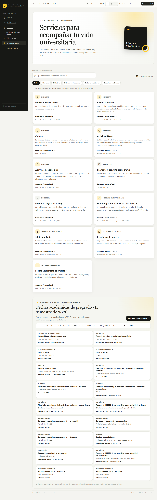
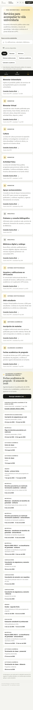
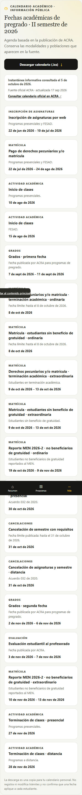

# Evidencia: agenda académica pública 2026-II

## Fuente y alcance

- ACRA · [Estudiante de pregrado](https://uptc.edu.co/sitio/portal/sitios/universidad/vic_aca/adm_reg/2estu/est_pre.html), publicación visible como actualizada el 17 de septiembre de 2026.
- Consulta del contenido publicada: 5 de octubre de 2026.
- Vista revisada: `/#estudiantes`; 18 hitos, con distinciones de modalidad y población conservadas.
- Descarga real desde el botón: [uptc-pregrado-2026-ii.ics](uptc-pregrado-2026-ii.ics), 9.644 bytes, 18 `VEVENT`, atribución ACRA y límites inclusivos codificados como `DTEND` exclusivo.
- Pruebas de contenido focalizadas: 22/22; prueba manual de ancho móvil: viewport/documento 390/390 px y 18 hitos.

## Verificación técnica

Comandos ejecutados desde `frontend/`:

```text
npm test
Test Files  4 failed | 74 passed (78)
Tests       4 failed | 523 passed (527)
Result      Four tests reached the configured 30-second timeout.

npx vitest run --maxWorkers=1
Test Files  78 passed (78)
Tests       527 passed (527)

node --test scripts/check-bundle-budget.node-test.mjs scripts/check-dark-theme-feedback.node-test.mjs scripts/check-responsive-shell.node-test.mjs scripts/check-test-timeouts.node-test.mjs scripts/check-text-contrast-tokens.node-test.mjs scripts/check-touch-targets.node-test.mjs scripts/check-theme-palette.node-test.mjs scripts/check-boot-state.node-test.mjs scripts/check-error-states.node-test.mjs scripts/check-api-surface.node-test.mjs
Node guards 75 passed (75)

npm run build
✓ built in 4.63s
Presupuestos de bundle verificados.

npm run lint
oxlint: exit 0, sin diagnósticos
```

Las cuatro suites que expiraron en la ejecución predeterminada pasaron al repetirlas con `--maxWorkers=1` (43/43); después pasó Vitest completo en serie. La guarda Node, el build y el lint también pasaron.

## Capturas Playwright

Capturadas desde `http://127.0.0.1:5177/#estudiantes` en Vite DEV conectado al backend local.






